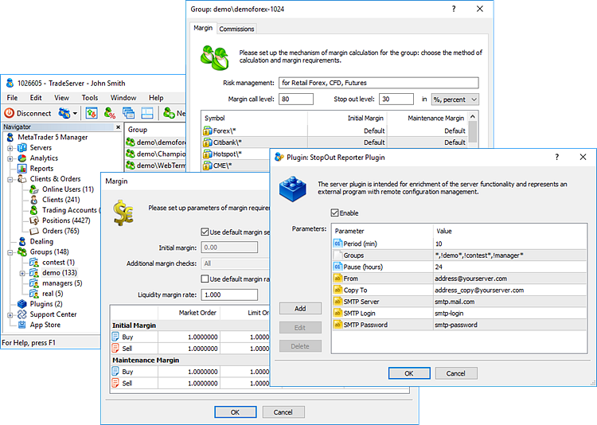

[🏠 Document Start](../README.md) / Managing Trade Server Settings

[Previous](../Dealing-and-Risk-Management/Exposure.md) | [Next](Spread-Commission-and-Swap.md)

# Managing Trade Server Settings

With appropriate rights, managers are able to modify client groups and plugins settings on the trade server. For example, a manager can specify new [margin ratios (discounts) (#margin)](Margin.md#margin) for trading symbols, [change commission amount (#commission)](Spread-Commission-and-Swap.md#commission) charged from customers for deals, as well as enable or disable a [plugin](Managing-Plugins.md) running on the server.

To control the platform operation, managers are able to [request the trade server journal](Trade-Server-Journal.md). It provides data on accounts, trade operations, as well as changes in the platform settings, system and network events and much more.
