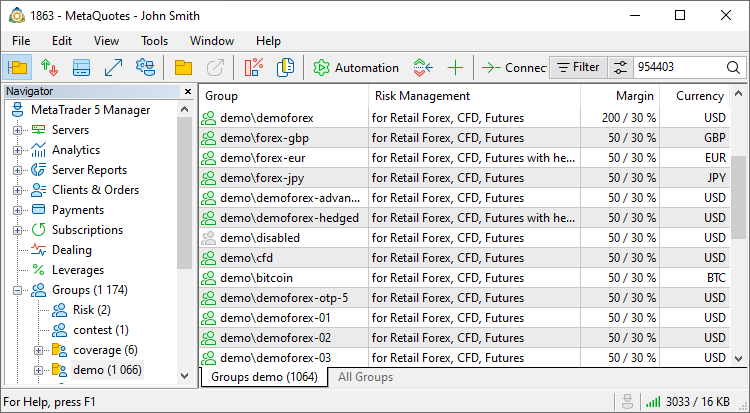
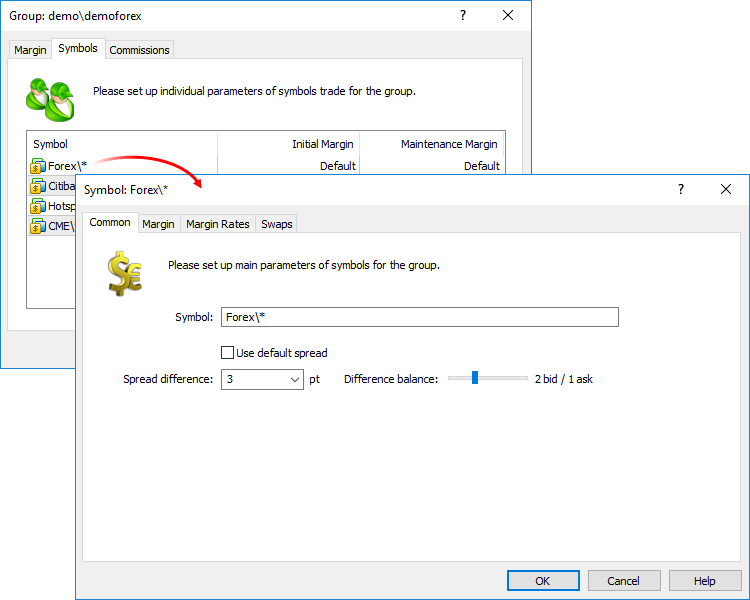
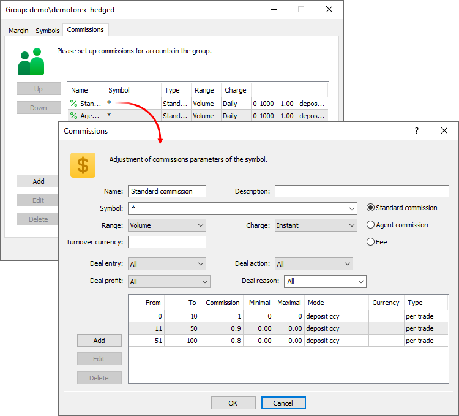
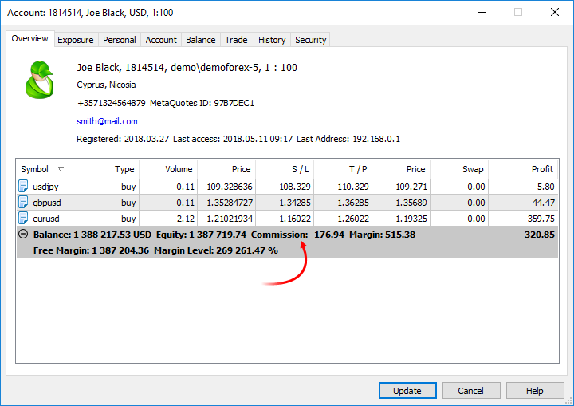
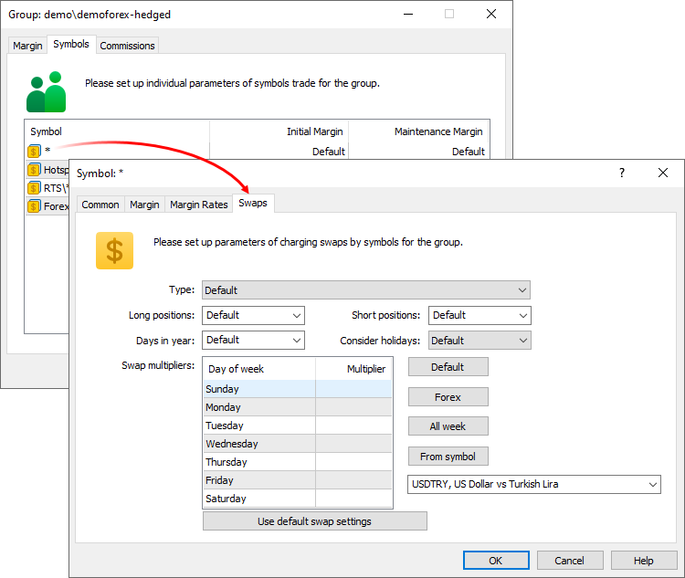

[🏠 Document Start](../README.md) / [Managing Trade Server Settings](README.md) / Spread, Commission and Swap

[Previous](README.md) | [Next](Margin.md)

# Spread, Commission and Swap Setup (#spread-commission-and-swap-setup)

Managers working in the platform within White Label and having no full access to its configuration are able to manage client's [spread (#spread)](Spread-Commission-and-Swap.md#spread), [commission (#commission)](Spread-Commission-and-Swap.md#commission) and [swap settings (#swap)](Spread-Commission-and-Swap.md#swap) in the Manager terminal. These settings are set separately for each group of clients. Select the " Groups" section in the Navigator and then choose a necessary group.

  * The list of available groups is defined in the manager account configuration via the MetaTrader 5 Administrator terminal. The "Edit groups" permission defines the availability of the group settings editing option.
  * To change the settings of several groups at once, double click on the subgroup name in the tree, for example, "real", "demo", etc.

  
---  
  

## Managing spread settings (#spread)

Using spread settings, it is possible to add markups to Bid and Ask prices provided to clients.

The trading platform receives prices from data feeds (liquidity providers) and forwards then to clients in accordance with spread settings applicable for the client group. Clients perform trading operations using converted prices. By increasing the selling price and reducing the buying price (markup) a White Label broker receives their profit share from each performed deal.

Spread settings are specified for symbol groups available to an account group. The list of available groups can only be changed from MetaTrader 5 Administrator. Managers can only re-define symbol settings for a certain client group.

To start the setup, select the symbol group in the Symbols tab and navigate to the Common section:

The following parameters are available here:

  * Use default spread settings — use spread parameters configured for each symbol in the Administrator terminal (without re-defining settings for a certain group).
  * Symbol — the name of the financial instrument or a group of instruments.
  * Spread difference — the difference of the financial instrument spread for a certain user group and the basic symbol spread (determined by the liquidity provider and symbol settings on the platform side).
  * Difference balance — the balance of spread difference distribution between the bid and ask price. The value specified in the "Spread difference" field will be divided between the ask and bid prices as specified here. For example, if the spread difference is set to 3, it can be divided between prices as follows: 3 bid/ 0 ask, 2 bid/ 1 ask etc.

## Managing commission settings (#commission)

Go to the Commissions tab. The list shows previously specified settings, as well as symbols whose trades are affected by the settings. To create a new setting, click Add. To edit an existing setting, double-click on it.

### General settings (#general-settings)

The common settings include the following parameters:

  * Name — commission name.
  * Description — commission description. This text description will be used as a comment in the commission transactions conducted on client accounts.
  * Symbol — select the symbols, for which commission will be charged during trading operations. A standard symbol selection list will open upon a click on this field.

### Commission Type (#commission-type)

There are three types of commissions: standard, agent and fee.

Standard commission

This type of commission is charged by a broker for the clients' trades.

Agent commission

This commission is charged by agents. Each account has the [Agent account (#agent-account)](../Clients-and-Trading-Accounts/Account-Trading-Settings.md#agent-account) field, in which the number of the appropriate agent account can be specified. Commissions of all trades conducted on this trading account will be transfered to the Agent account in accordance with the commission settings.

Fee

The fee is similar to standard commission: it is also charged by a broker per trader’s deals and has the same settings and the calculation principle. The differences are as follows:

  * Fees can only have [the "Instant" calculation mode (#charge)](Spread-Commission-and-Swap.md#charge).
  * The amount is written to the separate "Fee" field, while the standard commission appears in the "Commission" field.

Fees allow splitting deal commissions for a separate accounting. For example, this option can be used when part of commission is charged by the brokerage company, and the other part is payable to an external system (exchange) the broker is integrated with.

  * The standard commission and fees are deducted from the accounts of the clients, who conduct trading operations, and transferred to the brokerage company.
  * Agent commission is not deducted from the accounts of the clients, who conduct trading operations. This commission is charged in a balance operation on agent accounts.

  
---  
  

### Charging commissions (#charging)

Commission can be charged immediately after each trade, or it can be accumulated during a trading day or month and then charged in one operation. Select the desired option in the Charge field:

  * Instant — commissions are charged instantly during execution of each deal. The commission size is displayed in the Commission field of deals. This method of calculation is only available for standard commission. The standard commission charged immediately is displayed in the Commission field of [deals (#deal)](../Trading-Operations/Viewing-and-Editing.md#deal). Agent commissions are charged as separate balance operations (["Agent commission" deals (#action)](../Trading-Operations/Viewing-and-Editing.md#action)). In the instant mode, only commission in volume can be specified, while other options in the Range field are not available.
  * Daily — commission amount is accumulated during a day in a special field of a client record. At the end of the day, the accumulated amount is charged from the account in a separate balance operation (a deal of the Daily commission or Daily agent commission type). For more details, please read the [Commission Calculation (#calculation)](Spread-Commission-and-Swap.md#calculation) section.
  * Monthly — commission amount is accumulated during a month in a special field of a client record. At the end of the month, the accumulated amount is charged from the account with a separate balance operation (a deal of the Monthly commission or Monthly agent commission type). For more details, please read the [Commission Calculation (#calculation)](Spread-Commission-and-Swap.md#calculation) section.

  * The executed volume of trade operation is taken into account when determining the amount of individual trade operation and total turnover. Unexecuted volume of orders is not considered when calculating the commission.
  * Commissions are charged for deals in both directions (when opening/increasing a position and when closing a position or part of it).

  * Commission charging should only be changed from daily/monthly to instant when there are no accumulated commissions on accounts. Otherwise, all accumulated commissions will be reset to zero at the end of the trading day, and will not be deducted from the accounts.

  
---  
  

### Filters by deal types (#deals)

In the instant mode, you can additionally specify the parameters of deals from which the commission will be charged:

  * Deal entry — direction of deals, to which the commission shall apply. This option is only available for instant commissions. If the value is "In", commission will only be charged on entry deals; if "Out" — commission will apply to exit deals; "All" (default) — all deals. For reversal deals with the in/out type, "In" means that commission is only charged on the volume of the newly opened position, "Out" means commission on the closed volume. The following rules apply to Close By deals:
    * No commission is charged on Close By deals when "All" or "In" is selected, since the commission is charged on two original deals. For example, a commission of USD 1 is charged on each deal. When a trader performs an entry Buy 1.00 EURUSD deal and an entry Sell 1.00 EURUSD deal, a commission of 2 USD will be charged. When the 1.00 EURUSD position is closed by the Sell 1.00 EURUSD position, the client will not be charged additional commission.
    * If "Out" is selected, commission on both Close By deals will be charged, and the total commission value is written to the main exit deal (in which profit/loss is specified). For example, a commission of USD 1 is charged on each deal. When a trader performs an entry Buy 1.00 EURUSD deal and an entry Sell 1.00 EURUSD deal, no commission will be charged. When the 1.00 EURUSD position is closed by the Sell 1.00 EURUSD position, a commission of USD 2 will be charged. A commission of 2 USD will be specified in the first 'out by' deal, and a zero commission will be specified in the second deal.
  * Deal action — type of deals, to which the commission shall apply: buy, sell, or both. This option is only available for instant commissions.
  * Deal profit — filter deals by their financial result. For example, you can charge a commission only on deals which generated a profit.
  * Deal reason — filter by deal execution [reasons (#deal-reason)](../Trading-Operations/Viewing-and-Editing.md#deal-reason). For example, you can reduce commissions for deals performed by trading robots to encourage algorithmic trading. Alternatively, you can charge an additional commission for deals processed through a dealer.

### Commission levels (#level)

Commissions can be multilevel, i.e. vary depending on the deal volume, turnover, profit, etc. Select the required condition in the "Range parameter":

  * Volume — deal volume (number of lots). For example, if you set levels as 0 — 10 and 12 — 20, a 15-lot deal will be subject to the second level commission.
  * Turnover Money — turnover in money over the period specified in the Charge field (day or month). For example, the levels are set as 0 — 500, 501 — 1000, and commission is charged on a monthly basis. The first-level commission will be charged until the total cost of the client's operations exceeds 500 units. As soon as the money turnover exceeds the value of 500, commission for all deals per period is recalculated according to the second level.  
By default, the money turnover is calculated in the group deposit currency: the price of each trade is calculated and converted into the deposit currency. For example, the price of Buy 1 lot EURUSD with a contract size of 100,000 is EUR 100,000. If the client's deposit currency is USD, the position price is converted at EURUSD at the time of the transaction (in this case, it is the transaction price). If commission is to be charged on the turnover in some certain currency regardless of the group deposit, set it in the Currency field. Commission ranges will be based on the turnover in the specified currency. When calculating commissions, the deal price is also converted into that currency.
  * Turnover Volume — total volume of trading operations (number of lots) for the period specified in the Charge field (day or month).
  * Value — the value of a deal calculated depending on the [symbol's margin/profit calculation method (#calculation)](../Trading-Operations/Market-Watch.md#calculation).  
  
For the symbols with the Forex calculation type, the value is calculated in the base symbol currency and is equal to the product of the contract size and the volume. For example, for EURUSD with the contract size of 100,000, the value of 1 lot is equal to EUR 100,000.  
  
For the symbols with the CFD, CFD Leverage, CFD Index and Futures calculation type, the value is also calculated in the base currency. Since the contract size of such instruments is not expressed in money (it can be expressed, for example, in the amount of assets), the contract size is additionally multiplied by the instrument price to obtain the value in monetary terms. For Futures symbols, the final value is additionally multiplied by the ratio of tick price to tick size. For example, if some Futures symbol has USD as the base currency, the contract size is equal to 100, the cost is 33, and the tick price to tick size ratio is 1/0.1, the value of one lot of the position is equal to 100*33*10 = USD 33,000. For a СFD symbol with the same parameters, one lot size would be 100*33 = USD 3,300.   
  
If the symbol base currency differs from the turnover currency specified in commission settings, the calculated value will be additionally converted using the relevant exchange rate.  
  
Example: levels 0 — 9,999 and 10,000 — 1,000,000 are specified. GBP is specified as the currency. Commission is charged instantly. The trader executes a GBPUSD 1.0 Buy deal at 1.34644, with a contract size 10,000. The deal value is 1 * 10,000 = GBP 10,000. No conversion is needed here, as the base currency matches the selected one. The deal falls into the second range of commission.
  * Profit — profit/loss of the deal or the total profit/loss of a client's deals for a day or month, depending on the selected commission charging mode. The currency in which the level will be indicated and to which the profit will be converted, is specified in the field below.
  * Turnover currency — settlement currency. The group deposit currency is used by default (if no other currency is specified).

  * The value of the client's deals will be converted to this currency when calculating [turnover in money (#turnover-money)](Spread-Commission-and-Swap.md#turnover-money). Accordingly, commission levels will be specified in this currency. 
  * It is used when setting up levels based on the deal value.

Commission levels are configured at the bottom of the window.

First, set the minimum and maximum values for the range. The value is specified in selected commission level units: deal volume, turnover, profit, etc. For example, the Range field is set to "Volume". In this case, a level between 0 to 10 will means that the specified commission will be charged on deals with a volume not more than 10 lots.

If levels are specified based on profit, the range values can be negative. For example, from -1000 to -100 means that the level will be applied to the corresponding loss.

The ranges must not overlap. If the operation falls into several ranges, the commission is charged according to the first suitable range.

If you do not need multilevel commissions, set one level covering the entire range of values for the selected condition.

Next, specify commission calculation parameters:

  * Commission — commission amount. Commission units depend on the commission calculation method, which is selected in the corresponding field.
  * Minimal/Maximal — minimum and maximum amount of commission charged. The units in which the value is specified depend on how the commission is calculated. If commission is calculated as a percentage, the values are specified in the client's deposit currency. In all other cases, the values are indicated according to the calculation method — in the base currency, the group currency, in points, etc. To disable the minimum or maximum commission limit, set the value to 0.
  * Mode — commission calculation units:

  * Deposit currency — commission is calculated in the deposit currency specified for a group.
  * Base currency — commission is calculated in the base currency of a traded symbol.
  * Profit currency — commission is calculated in the profit currency of a traded symbol.
  * Margin currency — commission is calculated in the margin requirements currency specified for a traded symbol.
  * Points — commission is calculated in the points of a traded symbol's price. The point value is calculated as a profit of a position in the same direction, with the volume of 1 lot and the difference between the open and close prices is equal to 1 pip (point).

  * Percents — this calculation method allows charging commission in % of the actual cost of the deal/turnover. The actual cost is calculated in the base currency of the symbol and is equal to the product of its price, contract size and volume in lots (for all [futures and options symbols (#calculation)](../Trading-Operations/Market-Watch.md#calculation): volume in lots * tick size / tick price). The trade/turnover value calculated in the base currency is converted to the group deposit currency, and the final commission (the specified percentage) is calculated based on this value.

  * Specified currency — in this case, commission is calculated in the currency specified in the Currency field.

  * Profit percent — commission is calculated as a percentage of the deal profit (if charged instantly) or of the trader's total profit for the day or month (if charged at the end of the day or month). In case of a loss, the corresponding commission value will not be debited from the trader, but will be credited to the trader's account instead. To avoid such charges, set the minimum commission size to 0 and/or set the [filter by deal profit (#deals)](Spread-Commission-and-Swap.md#deals).
  * Currency — currency for calculating the commission. This field is active only if you select "Specified currency" in the Mode box. The currency has a three-letter representation, e.g. EUR, USD, JPY etc.
  * Type — commission charging type:

  * Per trade — commission is charged for each conducted trade.
  * Per volume — commission is charged per lot (volume) of executed trades. Only the executed volume of trade requests is taken into account.

### Commission calculation (#calculation)

The periodicity of calculation and charging commissions are specified in the [Charge (#charge)](Spread-Commission-and-Swap.md#charge) field. The following options are available:

  * Instant — commissions are charged instantly during execution of each deal. The commission size is displayed in the Commission field of deals. This method of calculation is only available for standard commission. The commission size is displayed in the Commission field of deals. This method of calculation is only available for standard commission. The standard commission charged immediately is displayed in the Commission field of [deals (#deal)](../Trading-Operations/Viewing-and-Editing.md#deal). Agent commissions are charged as separate balance operations (["Agent commission" deals (#action)](../Trading-Operations/Viewing-and-Editing.md#action)).
  * Daily — commission amount is accumulated during a day in a special field of a client record. At the end of the day, the accumulated amount is charged from the account in a separate balance operation (a deal of the Daily commission or Daily agent commission type).
  * Monthly — commission amount is accumulated during a month in a special field of a client record. At the end of the month, the accumulated amount is charged from the account with a separate balance operation (a deal of the Monthly commission or Monthly agent commission type).

This section describes how the daily and monthly calculation of commissions is performed.

### Blocking assets (#blocking)

> The mechanism of asset blocking is implemented only for the standard commissions to guarantee the possibility of paying commission by clients. It is not used for agent commissions since that are not charged from clients that perform trade operations.

Depending on the chosen option, the preliminary calculated amount of commission is blocked at a client account during a day or a month:

  * If commission is charged for volume of a single trade operation, then its size can be calculated immediately. The corresponding volume of assets is blocked at the account.
  * When commissions are calculated by turnover (in monetary or volume terms), the preliminary commission value is calculated with no consideration to the trades performed earlier in that day/month. In other words, trade operation volume is treated as the turnover and then compared with established [commission levels (#level)](Spread-Commission-and-Swap.md#level).

The volume of blocked assets is displayed in the client account status:

Blocked assets are excluded from Equity and Free Margin. Thus, they cannot be used for trading. The commission that will be blocked for a placed order is also considered when checking the free margin.

  * Commission is also blocked when placing all types of pending orders. If a pending order is deleted, the corresponding volume of commission is unblocked. If a pending order is filled, only the commission that corresponds to the filled volume of the order stays blocked.
  * Blocked assets are also released for all deleted, closed and canceled trade requests that did not result in execution of a deal.

  
---  
  

### Charging commissions (#charging)

The final calculation and charging commissions are performed at the end of day or month depending on the [settings (#charge)](Spread-Commission-and-Swap.md#charge). The turnover of trade operations for the specified period is calculated. After that, the final calculation of commissions is performed, and then they are summed up for each client. In case of a standard commission, the total amount of commission is withdrawn from client account as a balance operation.

  * According to each commission configuration, only one balance operation is performed for each client. The entire volume of commissions accumulated during a day/month is charged with a single deal.
  * After the deal of charging the standard commission is performed, assets blocked on the account are set to zero.
  * The final calculation of commissions is performed at the end of day or month depending on the [settings (#charge)](Spread-Commission-and-Swap.md#charge). This peculiarity should be considered when moving accounts between groups with different commission settings. For example, if during a trading day, an account is moved from a group with commissions charged daily to a group without commissions, no commission will be charged from that account for all the operations performed on that day.

  
---  
  
In case of an agent commission, the assets are charged to agent accounts using balance operations. Just the same as the standard commissions, one balance operation is performed according to each commission configuration. Balance operations are performed separately for each account, where an agent account is specified.

Account number, from operations on which an agent gets a commission, is specified as a comment to the corresponding balance deal used for accruing the commission. The comment looks as follows:

agent from #xxxxxxx  
---  
  
Commission deals have the following types:

  * DAILY COMMISSION — standard commission charged daily;
  * MONTHLY COMMISSION — standard commission charged monthly;
  * DAILY AGENT COMMISSION — agent commission charged daily;
  * MONTHLY AGENT COMMISSION — agent commission charged monthly.

The Comment field of the deal contains text specified in the [Description (#description)](Spread-Commission-and-Swap.md#description) field of the commission configuration or the number of an account, from operations on which an agent commission is charged.

## Managing swap settings (#swap)

Swap (Rollover) is an operation of transferring a trader's open position on the next trading day. This operation is performed at the end of the trading day if the position remains open at that moment. A fee is charged for the transfer of the positions. The swap amount is accumulated in a separate field of a trading position and is then added to the received profit/loss during the closing of the position.

Swap settings are specified for symbol groups available to an account group. The list of available groups can only be changed from MetaTrader 5 Administrator. Managers can only re-define symbol settings for a certain client group.

Select the symbol group in the Symbols tab and navigate to the Swaps section:

The following parameters are available here:

  * Type — swap calculation method. To disable swap calculation, select the "Disabled" option.
  * Long positions — swap for Buy positions.
  * Short positions — swap for Sell positions.
  * Days in year — the number of days in a year to be used for [swap percent calculation (#percentage)](Spread-Commission-and-Swap.md#percentage). Depending on the country and market in which the broker operates, as well as on the financial instrument type, different [number of days in a year](https://en.wikipedia.org/wiki/Day_count_convention) can be used when calculating annual percent. This parameter operates with such calculation specifics. The most common option of 360 days is used by default. You can change the value to 365 or 366, as well as specify a different value manually.
  * Swap multipliers — swap multiplier for each day of the week. This multiplier will be applied to the calculated swap value before charging. Specify 1 to charge the regular amount, 3 for triple swap or 0 to cancel swap. Conveniently manage the settings using the following commands:

  * Forex — sets standard settings for Forex instruments: standard single swaps on weekdays and triple swap on Wednesday.
  * All week — standard single swap seven days a week.
  * From symbol — copies swap coefficients from the selected symbol.

The "Default" value can be set for each field. In this case, the group will use the basic symbol configuration specified on the trading server.

### Automatically consider holidays (#automatically-consider-holidays)

If the option is enabled, the platform will check all holiday configurations (specified by the platform administrator) and adjust swaps accordingly. The day before the holiday, the swap is doubled. No swap is charged on the day of the holiday. The calculations still use the swap multipliers specified for the corresponding days. For example:

  * Swap multiplier is set to 1 for Tuesday
  * Wednesday swap multiplier is 3
  * Wednesday is a holiday

On Tuesday, the swap will be charged with a coefficient of 4: a sum of the the multipliers of the current day and of the holiday. No swap will be charged on Wednesday as it is a holiday.

The coefficients are applied similarly if you have multiple holidays in a row. If the holidays are set to Wednesday and Thursday, the platform will add the multipliers for Tuesday, Wednesday and Thursday and will charge the corresponding swap on Tuesday.

  * Swap calculations are globally controlled at the trading server level. If swaps for certain days are disabled on the server, it cannot be enabled for individual symbols. If swaps are enabled on the server, they can be disabled for a specific symbol by specifying a zero multiplier for the certain day. Contact the platform administrator for further details about swap configurations.

  * By default, swap calculations are not performed on Saturday and Sunday. When work days are shifted to weekend, swap calculation on weekends can be enabled on the trade server. This can be done by the platform administrator.

  
---  
  

### Calculation in points (#calculation-in-points)

Swap size is set in points and calculated by the following formula:

Swap size * Point price

Depending on the position direction, a swap size is taken from the "Long positions" or "Short positions" field. The calculation is performed in the following order:

  * Calculating the point price in a symbol profit currency considering a position volume
  * Converting the obtained price into a client's deposit currency
  * Calculating a swap sum using the formula shown above

A single point price is a profit obtained when the price moves one point for a position of a specified volume. The price calculation (including converting to the deposit currency) is performed according to the type of the profit calculation by symbol depending on the position direction.

For example, in case of Buy 5.00 USDTRY with the contract volume of 100 000 and Forex profit calculation type, the point price is calculated as follows:

5 * 100,000 * 0.00001 = 5 TRY

If the deposit currency is USD, the price is converted at the current rate:

5 * 0.2274587 = 1.14 USD (with rounding)

If the swap for long positions is -11.35, the total sum is as follows:

1.14 * (-11.35) = 12.94 USD

  * The swap may be equal to zero, if the sum is below the minimum estimated currency unit at one of the stages. This may happen on small volume trades at micro-accounts (with a reduced contract size). For example, in case of Buy 0.01 EURUSD and the contract size of 1 000, the point price is calculated as follows: 0.01 * 1 000 * 0.00001 = 0.0001 USD. When rounding, the result is 0, thus the final swap value is also zero.
  * If swaps are calculated in points, while the symbol calculation type is Futures, the final swap value is multiplied by the ratio [Tick Price (#tick-price)](../Trading-Operations/Market-Watch.md#tick-price)/[Tick Size (#tick-size)](../Trading-Operations/Market-Watch.md#tick-size).

  
---  
  

### Calculation in money (#calculation-in-money)

If you select swap charging in money, the amount of money charged for the transfer of each lot of a position is specified in fields "Long positions" and "Short positions". Three types of currencies can be used for specifying swap amount:

  * Using base currency — charging in the [base currency (#specification)](../Trading-Operations/Market-Watch.md#specification) of the symbol a position is opened for;
  * Using margin currency — charging in the [margin currency (#margin-currency)](../Trading-Operations/Market-Watch.md#margin-currency) of the symbol a position is opened for;
  * Using profit currency — charging in the [profit currency (#profit-currency)](../Trading-Operations/Market-Watch.md#profit-currency) of the symbol a position is opened for;
  * Using group currency — charging in the deposit currency of the group the account belongs to.

In all cases except for charging the swaps in deposit currency, the swap size is converted into deposit currency. The conversion is performed using the unfavorable price for trader: if the swap is positive, a trader has to sell the swap currency for the deposit currency; if the swap is negative, a trade has to buy the swap currency for the deposit currency.

### Calculation in percentage (#swap-percentage)

In this case the annual interest rate is specified for long and short positions. Since swaps are calculated and charged every day at the end of day time, the calculated amount of the annual interest rate is divided by the [number of days in a year](Spread-Commission-and-Swap.md).

When charging swaps, first the cost of one symbol lot is calculated (the symbol of the opened position), and then the specified percent is calculated, the obtained amount is multiplied by the position volume (in lots) and the result is divided by the number of days in a year. There are two calculation methods:

  * In percentage terms, using current price — in this case the swap is calculated as the percent from the current position cost: (cost of 1 lot of position * volume in lots * specified swap size /100)/[days in year];
  * In percentage terms, using open price — in this case the swap is calculated as the percent from the position cost at the moment of its opening: (cost of 1 lot of position * volume in lots * specified swap size /100)/[days in year].

The calculation of the cost of 1 lot of a position depends on the [type of profit/margin calculation](../Trading-Operations/For-Advanced-Users/Margin-Calculation-Basic.md) of the symbol:

  * For the symbols with the Forex type of calculation the cost of 1 lot of a position is calculated in the [base currency (#specification)](../Trading-Operations/Market-Watch.md#specification) and is equal to the contract size. For example, for the EURUSD symbol that has contract size 100 000 the cost of 1 lot of a position is equal to 100 000 EUR. The feature of Forex symbols is the cost of 1 lot of a position in the base currency for them does not change in time. Thus, both modes of charging swaps in percentage terms work identically for the Forex symbols.
  * For the symbols with CFD, CFD Leverage, CFD Index and Futures type of calculation the cost of 1 lot of a position is also calculated in the base currency. Since the contract size of such symbols is not represented in money (but in the number of securities for example), then to represent the position cost in money the contract size is additionally multiplied by the symbol price. For symbols of the Futures type, the resulting value is multiplied by the tick value to tick size ratio. For example, if a Futures symbol has the base currency USD, contract size 100, its price is equal to 33 and the tick value/tick size ratio is 1/0.1, then the cost of 1 lot of the position is equal to 100*33*10 = 33 000 USD. For a CFD symbol with the same parameters, one lot size would be 100*33 = 3300 USD. 

If the currency of swap calculation (the base currency of the symbol) is different from the client group currency, it is conversed using the current rate when charging swaps. For Buy positions, the Bid price of the currency pair [swap currency|deposit currency] is used; Ask price is used for Sell positions.

### Charging swaps by reopening positions (#charging-swaps-by-reopening-positions)

In this case all positions are forcedly closed at the end of a trading day, and on the next day they will be reopened. Reopen conditions depend on the swap settings:

  * In points, reopen position by close price — all positions will be opened at their close price +/- specified swap (in points);
  * In points reopen position by bid price — all positions will be opened at the current Bid price +/- specified swap (in points).

Thus swap is charged by way of adjusting the reopen price.

  * Position close time at the end of the trading day and new open time (for reopened positions) depend on trading server settings. Position opening time can be set in accordance with the current day closing time or the time of the next trading day beginning. If the opening time does not fall within the symbol trading session, then the beginning of the nearest trading session is set as the position open time. In this case, if a position is reopened at the current Bid price, then the price as of the moment of opening is used, not as of the trading session beginning.

  * When re-opening a position, the new position has the same ticket as the old one. This position ticket is also written to the deals, which close the old position and open a new one (in the "Position" field of the deals).

  
---
