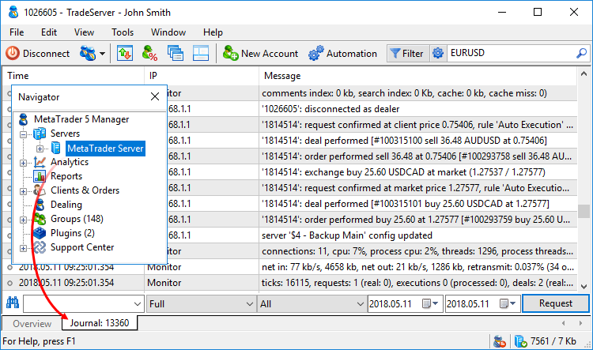

[🏠 Document Start](../README.md) / [Managing Trade Server Settings](README.md) / Trade Server Journal

[Previous](Managing-Plugins.md) | [Next](../Server-Reports/README.md)

# Trade Server Journal (#trade-server-journal)

Managers are able to control the trade server operation requesting its journal. It provides data on accounts, trade operations, as well as changes in the platform settings, system and network events and much more. Open the Navigator, select the Servers section and go to the Journal tab.

Enter the search word or phrase, set the time interval you want to get the journal entries for, and click Request. Additionally, you can specify the time period and event type you want to receive.

Entry types:

  * Full — all types of journal entries;
  * Without logins — all messages except the information about the connections of users to a server;
  * Errors only — only error messages.

Event types:

  * All — all events except for LiveUpdate.
  * Configuration — changes in the server settings.
  * System — system events.
  * Network — events related to the network activities.
  * History — events related to history data.
  * Accounts — events related to [accounts](../Clients-and-Trading-Accounts/README.md) on the server.
  * Trades — events related to [trade operations](../Clients-and-Trading-Accounts/Trading-Operations.md) on the server.
  * API — events related to working via API.
  * LiveUpdate — events related to the [update](../MetaTrader-5-Manager/For-Advanced-Users/Auto-Update.md) of the platform components.

Occurrence time, IP address (for example, a client's address) and a description are displayed for each event. Messages of different types have appropriate icons for more convenience:

  *  — error message.
  *  — warning.
  *  — information message.
  *  — separator of days in the journal. In the IP field of such entries, the amount of generated logs for a selected day is specified.

The context menu allows you to easily apply refined queries for already found entries. Select a journal entry and click one of the available commands in the Search submenu:

  *  Account — copy an account from the found entry to the request field of the journal.
  *  Order — copy an order ticket from the found entry to the request field of the journal.
  *  Deal — copy a deal ticket from the found entry to the request field of the journal.
  *  Symbol — copy a symbol name from the found entry to the request field of the journal.
  *  Computer ID — copy a unique computer identifier (CID) of a detected entry to the request field of the journal.
  *  IP — copy an IP address the found entry to the request field of the journal.

After that, click Request.

The context menu also allows you to search for any text detected in entries, copy them to clipboard and save as HTML, CSV and LOG files.

  * For more accurate query, use [keywords (#keywords)](Trade-Server-Journal.md#keywords) and [logical operators (#operators)](Trade-Server-Journal.md#operators).
  * The platform update log (LiveUpdate) does not appear when you select All as an event type, because it is stored in a separate file.
  * If the log file was manually edited on the server, the first edited entry and all of the following ones will be highlighted in red.

  
---  
  

## Keywords (#keywords)

For the analysis of the server log, you can use any words or phrases that can be found in the server journal. It should be borne in mind that the request of the entire journal without the request string will not lead to the receipt of the entire server log, because the maximum amount of the given data is limited (to about 30 000 lines of the server log).

For the analysis of specific situations, you can use the following keywords:

  * Startup — information about the initialization and restart of the server.
  * Exit — information about the server stops.
  * Synchronization — history synchronization. Possible errors: no connection to the server, synchronization with which is required.
  * Users — information about working with the database of [accounts](../Clients-and-Trading-Accounts/README.md). Possible errors: invalid header of the database, error writing to disk/reading from disk, not enough memory.
  * History — information about working with history data of a symbol. Possible errors: invalid header of the database, error writing/reading, invalid quotes in the database.
  * datafeed or "Name of a data feed" — activation and operation of data feeds. Possible errors: error creating feeder, wrong timeout stop, error reading data from the feeder.
  * Filter — filtering of quotes (quotes not let through to the server).
  * Mail — work with the [mail database (#mail)](../User-Interface/Toolbox.md#mail). Possible errors: invalid header of the database, error writing/reading, not enough memory.
  * Monitor — measurement of performance and work with the database of the server operation monitoring. Possible errors: invalid header of the database, inability to obtain information about the computer performance.
  * News — [news database (#news)](../User-Interface/Toolbox.md#news). Possible errors: invalid header or database version.
  * Access, Common, Feeders, Groups, Managers, SymbolGroups, HistorySync, Holidays — files of server configurations. Possible errors: error reading/writing.
  * Network — operation of the server. Possible errors: the port is already in use.
  * LiveUpdate — operation of the [LiveUpdate](../MetaTrader-5-Manager/For-Advanced-Users/Auto-Update.md) system.
  * block — blocking and unblocking by the anti-flood control.
  * '...' — to analyze actions by a specific account number, specify it in single quotes. For example: '12345'.
  * #... — to analyze actions by a specific [order](../Trading-Operations/Working-with-Trading-Orders.md) or [deal (#deals)](../Clients-and-Trading-Accounts/Account-History.md#deals), specify this order with character "#". For example: #111222.

## Logical operators (#operators)

As a line in the request field, you can specify keywords combined using logical operators.

  * | (or) — logical operator OR, allows selecting log rows that contain either the first or the second keyword;
  * & (and) — logical operator AND, allows selecting only the log rows that contain both the first and the second words; a space between keywords is considered as the operator AND;
  * ^ (-, not) — logical operator of exclusion NOT, allows selecting log rows that do not contain an excluded keyword.

Making an exact search line using logical operators allows you to more effectively select the desired log entries. For example, the search line "'5'& login" allows you to select the journal entries about the logging in of the manager with login 5.

> Search is case sensitive. For example, searching for "Session" and "session" will give different results.
