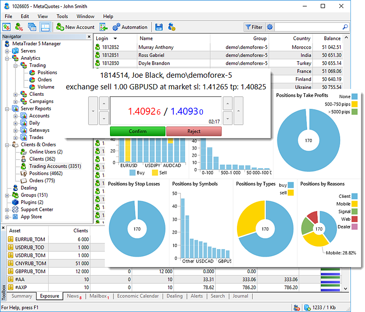
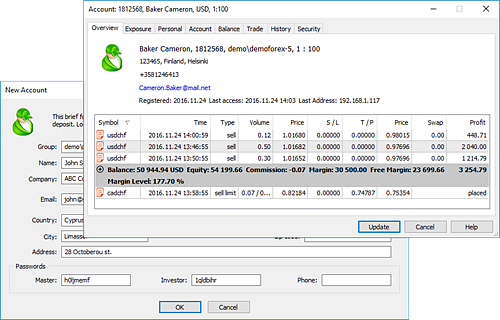
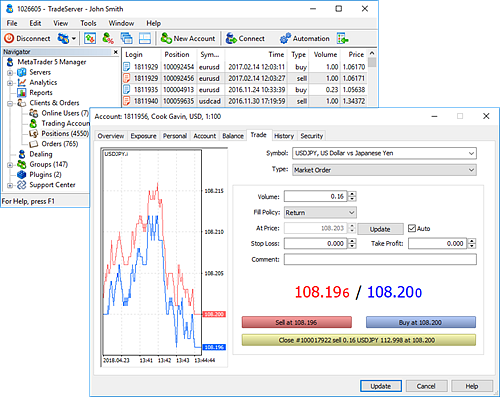
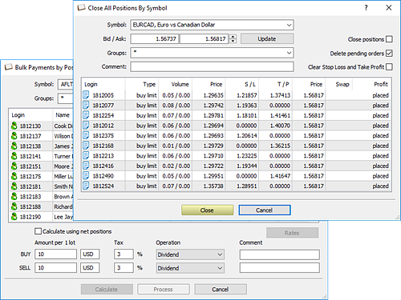
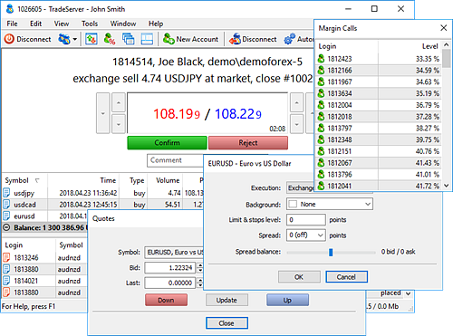
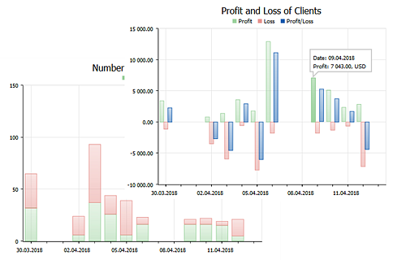
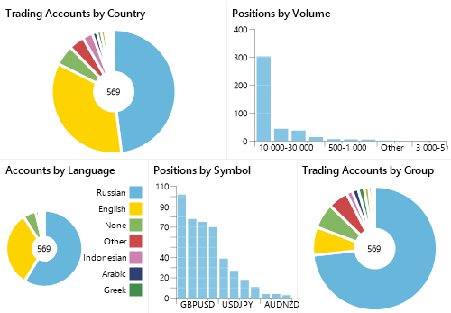
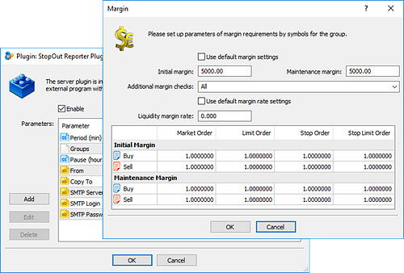

[🏠 Document Start](README.md) / MetaTrader 5 Manager

[Next](MetaTrader-5-Manager/Terminal-Start.md)

# MetaTrader 5 Manager — User Guide

MetaTrader 5 Manager allows working with brokerage company values, processing trade requests and reporting activities. Dealers can process incoming orders manually and automatically, risk managers are able to change financial symbol settings and view data on uncovered positions, while accountants can conduct balance operations and create all kinds of reports. The MetaTrader 5 Manager features are numerous.

Managing trading accounts MetaTrader 5 Manager features many functions for working with clients. It allows [opening trading accounts](Clients-and-Trading-Accounts/Creation-of-Accounts.md), managing existing ones, as well as [bulk import accounts](Clients-and-Trading-Accounts/Importing-Accounts.md) from files. Complete information is available for each client: the entire personal data, trade settings, current financial status and full trading history. Also, managers have real-time data on all clients currently connected to the server: connection address and terminal type. Besides, managers are able to [deposit and withdraw funds](Clients-and-Trading-Accounts/Balance-Operations.md) from client accounts, as well as send [push notifications](Clients-and-Trading-Accounts/Push-Notifications-SMS-and-Mail.md) to clients' mobile devices. [Find out more >>](Clients-and-Trading-Accounts/README.md) |   
---|---  
 | Managing orders and positions of clients The Manager terminal allows you to conduct any [trade operations on clients' accounts](Trading-Operations/README.md): open and close positions, as well as place, modify, remove and activate pending orders. Managers always have the full list of [open positions](Trading-Operations/Working-with-Trading-Positions.md) and active [pending orders](Trading-Operations/Working-with-Trading-Orders.md) of their clients.  There are many additional functions for trading in the terminal: [Market Watch](Trading-Operations/Market-Watch.md) with quotes in real time, [Depth of Market](Trading-Operations/Market-Depth.md) with Level II data, [Economic calendar](Trading-Operations/Economic-Calendar.md) with news in real time and [trading notifications](Trading-Operations/Trading-Notifications.md) not to miss important market developments. When having sufficient rights, managers can change almost any data in trading operations directly at the platform database side. [Find out more >>](Trading-Operations/README.md)  
Corporate actions and bulk operations A brokerage company's client base contains hundreds and thousands of traders, and it is impossible to imagine a modern terminal without bulk operations. MetaTrader 5 Manager allows performing [balance operations](Corporate-Actions-and-Bulk-Operations/Bulk-Operations.md) for an unlimited number of accounts, [close positions](Corporate-Actions-and-Bulk-Operations/Bulk-Closing.md) or remove pending orders in bulk in just a few clicks. In addition, the terminal allows performing corporate actions: [pay dividends](Corporate-Actions-and-Bulk-Operations/Bulk-Payments-by-Positions.md) on shares, charge taxes, as well as [split and consolidate securities](Corporate-Actions-and-Bulk-Operations/Splitting-Positions.md). [Find out more >>](Corporate-Actions-and-Bulk-Operations/README.md) |   
 | Processing trade operations and managing risks One of the main functions of the Manager terminal is accepting and [processing trade requests](Dealing-and-Risk-Management/Dealing.md) received from clients. Upon receipt of a request, a dealer can confirm, reject or requote it. When processing requests, dealers have a detailed client data: name, group, financial status, open positions and pending orders. MetaTrader 5 Manager also features [automated request processing (#automation)](Dealing-and-Risk-Management/Dealing.md#automation). It is possible to configure request types and volumes that are to be processed this way.  Risk managers possess multiple tools in the terminal: list of accounts in Margin Call, data on [total and uncovered positions](Dealing-and-Risk-Management/Summary-Positions-and-Coverage.md), ability to manage trade symbol settings during important news releases and much more. [Find out more >>](Dealing-and-Risk-Management/README.md)  
Detailed reports on clients and trading operations The standard delivery of the trading platform includes dozens of reports. Managers can obtain data on customer dynamics, completed trades for any period, agents and gateways operations, balance operations and much more. The reports are implemented as separate file modules and installed in the trade server. These modules can be created independently using MetaTrader 5 Report API. Thus, the ability to create reports in the platform is almost unlimited. [Find out more >>](Server-Reports/README.md) |   
 | Analytics and Management of Advertising Campaigns Directly in the Manager terminal, you can analyze broker's audience and manage marketing campaigns. Built-in tools will help you to determine the geographical client distribution, create reports on their running balances and profitability of operations, analyze trading statistics and much more. Integration of the trading platform with the [Finteza advertising analytics system](https://www.finteza.com/) will allow you to create sales funnels, track potential clients' reaction to ad campaigns and their behavior on your sites, as well as evaluate conversion to real accounts. Also, the analytics system provides detailed statistics on marketing campaigns, including data on clicks, views, CTR and targeted actions. [Find out more >>](Analytics/README.md)  
Managing trade server settings With sufficient rights, managers have access to deeper trading platform settings. It is possible to manage [plugins](Managing-Trade-Server-Settings/Managing-Plugins.md) functioning on a trade server directly from the terminal. For example, a manager can disable automatic processing of requests on the server prior to important news releases. Managers working in the platform within White Label and having no full access to its configuration are able to manage client's [margin](Managing-Trade-Server-Settings/Margin.md) and [commission settings (#commission)](Managing-Trade-Server-Settings/Spread-Commission-and-Swap.md#commission). [Find out more >>](Managing-Trade-Server-Settings/README.md) |   
  
© 2000-2025, [MetaQuotes Ltd](https://www.metaquotes.net/en)
