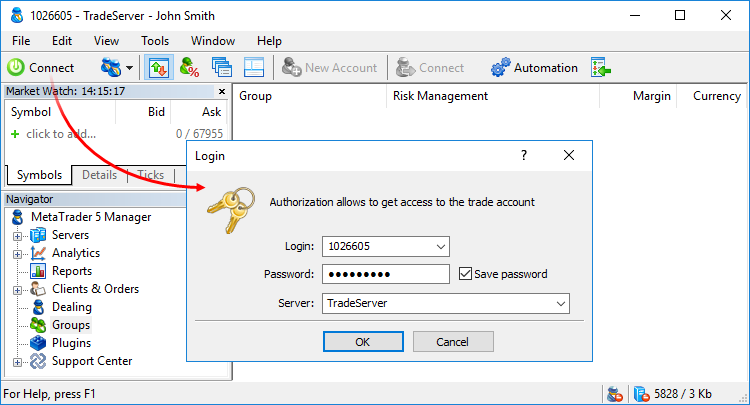
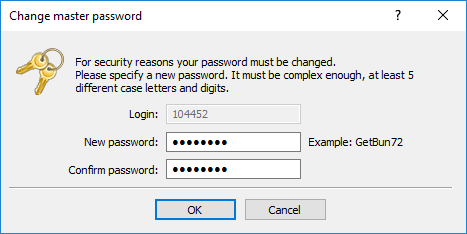

[🏠 Document Start](../README.md) / [MetaTrader 5 Manager](../MetaTrader-5-Manager.md) / Connecting to the Server

[Previous](Terminal-Start.md) | [Next](Terminal-Settings.md)

# Connecting to the Server (#connecting-to-the-server)

Connect to the server to commence work. To do this, select " Connect" in the [File (#file)](../User-Interface/Main-Menu.md#file) menu or in the [toolbar](../User-Interface/Toolbar.md). After that, the authorization window will appear:

The following data is specified in the login window:

  * Login — manager's account (login) used to connect to the server. If no such account is created on the server, connection is not possible.
  * Password — manager's password.
  * Server — server you are going to connect to. You can select any of the servers previously used in the terminal or specify an address and a port of another server, separated by a colon.

Enable the "Save password" option, and the next time you start the terminal, the last used account will be automatically connected to the server. Option "Keep personal settings and data at startup" in the [terminal settings (#keep-personal)](Terminal-Settings.md#keep-personal) performs the same action.

  * If [extended authentication](For-Advanced-Users/Extended-Authentication.md) mode is enabled, a certificate and a password are required for connection.
  * If connection to servers is performed via a proxy server, set its parameters in the [terminal settings (#proxy)](Terminal-Settings.md#proxy).

  
---  
  
Upon a successful authentication, the connection indicator  will appear in [the status bar](../User-Interface/Status-Bar.md) and two entries will appear in the [journal (#journal)](../User-Interface/Toolbox.md#journal):

  1. 'login number' authorized on 'server name';
  2. 'login number' manager synchronized with 'server name'.

After a successful authorization, you can begin to work with the server. If any problems occur while connecting, and you do not get one of the above messages, check all the connection settings, specified address and port of the server.

## Forced change of password (#change-password)

Upon authorization, you may be requested to change the master password of the account. Forced password change can be enabled in the trading server group or [account settings (#change-password)](../Clients-and-Trading-Accounts/Account-Trading-Settings.md#change-password). The mechanism of forced change of the master password, when you first connect or on a regular basis, increases safety.

Enter the new password, and then enter it again to confirm. The password should meet the following requirements:

  * It must be no shorter than the length requirement displayed in the password change dialog. The minimum password length is determined by group settings on the server, while the lowest possible value is 8 characters. The maximum length is 16 characters.

  * It must contain four character types: lowercase letters, uppercase letters, numbers, and [special characters](https://learn.microsoft.com/en-us/style-guide/a-z-word-list-term-collections/term-collections/special-characters) (#, @, ! etc.). For example, 1Ar#pqkj.

  * It should not be the same as the previous password.

