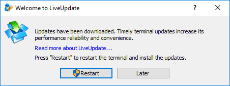
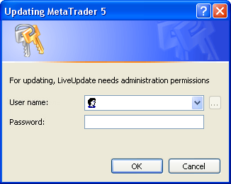
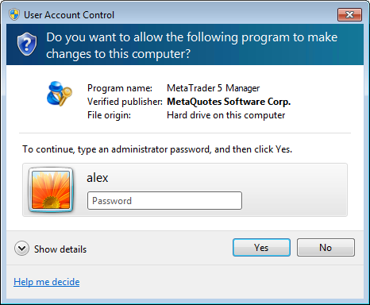

[🏠 Document Start](../../README.md) / [MetaTrader 5 Manager](../../MetaTrader-5-Manager.md) / [For Advanced Users](../For-Advanced-Users.md) / Auto Update

[Previous](One-Time-Passwords-2FATOTP.md) | [Next](Data-Export.md)

# Auto Update

The system of the live update is embedded in the Manager terminal. It provides timely updates to new versions. This system cannot be disabled.

## Updating procedure

When connecting to a trade server, the system checks for updates of the terminal. If the terminal update is found, it will be automatically downloaded in the background mode.

The updates are downloaded to the following default folder (depending on the operating system used):

Microsoft Windows XP SP3:

  * C:\Documents and Settings\username\Application Data\MetaQuotes\WebInstall

Microsoft Windows Vista and higher:

  * C:\Users\username\AppData\Roaming\MetaQuotes\WebInstall

Here "C" is the letter of a logical disk, where the operating system is installed, "username" is an account in the operating system, under which the terminal has been installed. Downloaded updates are available to all platforms, the updates are not re-downloaded for other instance of the platform.

After the update is downloaded, the following dialog appears prompting you to update the terminal:

Click one of the buttons:

  * Restart — the terminal window is closed, it is updated and the terminal is re-opened automatically.
  * Later — the dialog is hidden and the terminal is updated during its further start.

  * All the update stages are reflected in the [journal (#journal)](../../User-Interface/Toolbox.md#journal) of the Manager terminal. LiveUpdate is specified in the Server column of such entries.
  * If the platform update fails (connection to server is lost), the next attempt is made after one hour. Only missing data is downloaded during this attempt.

  
---  
  
## Update in the guest mode

If the Manager terminal was launched in the [guest mode (#guest)](../Terminal-Start.md#guest) (if the OS user has not enough rights), and you try to upgrade the terminal, a window asking you to increase the user's rights appears. 

### Microsoft Windows XP

In this case, you should specify the details of the administrator account that has sufficient rights to write files in the directory of the terminal installation.

### Microsoft Windows Vista

Depending on the user's rights in MS Windows Vista, you must either give permission to perform the operation (if the user is an administrator), or specify the details of the administrator's account.
