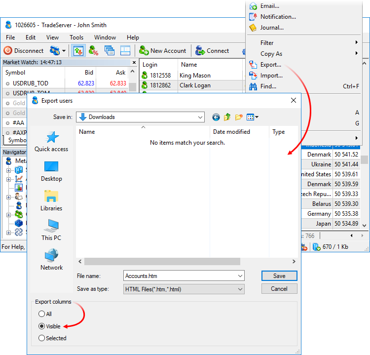
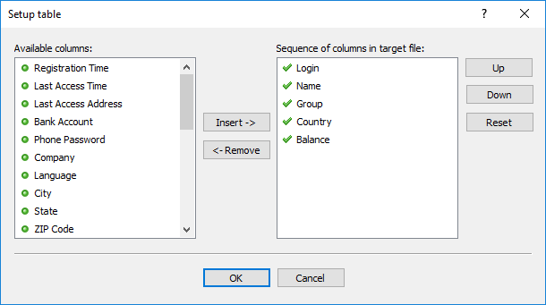

[🏠 Document Start](../../README.md) / [MetaTrader 5 Manager](../../MetaTrader-5-Manager.md) / [For Advanced Users](../For-Advanced-Users.md) / Data Export

[Previous](Auto-Update.md) | [Next](Terminal-Deinstallation.md)

# Data Export

[Online Users](../../Clients-and-Trading-Accounts/Online-Accounts.md), [Trading Accounts](../../Clients-and-Trading-Accounts/README.md), [Positions](../../Trading-Operations/Working-with-Trading-Positions.md) and [Orders](../../Trading-Operations/Working-with-Trading-Orders.md) sections provide the possibility to export information to external files to use it in other applications. Click  Export... in the context menu of the respective section or in the [File menu (#file)](../../User-Interface/Main-Menu.md#file). A window appears where you can specify the directory for saving the file and configure the export:

The following export options are available here:

  * All — export all information, regardless of the currently selected columns, except for the columns of the Account Columns menu in [server reports](../../Server-Reports/README.md). The latter are exported only in Visible mode and only if enabled.
  * Visible — export only those columns that are currently enabled.
  * Selected — open the below described window to manually specify columns for export. 

In the "Save as type" field, select the format of the destination file: *.HTML or *.CSV. Set the file name and click Save.

### Selecting columns to export

Available columns are located in the left part, selected ones are in the right part. The following commands are available in this window:

  * Add — add a selected column to selected ones. A similar action is performed by double-clicking the column.
  * Remove — remove a selected column from the list of selected ones. A similar action is performed by double-clicking the column. Some of the fields are required in export, they cannot be removed.
  * Up — move an added column upward relative to other columns. The order of selected columns determines the sequence of data in the exported file.
  * Down — move an added column downward relative to other columns.
  * Reset — return the default column settings.

