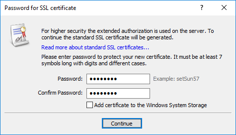
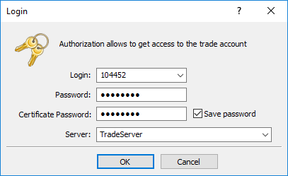

[🏠 Document Start](../../README.md) / [MetaTrader 5 Manager](../../MetaTrader-5-Manager.md) / [For Advanced Users](../For-Advanced-Users.md) / Extended Authentication

[Previous](Files-and-Folders.md) | [Next](One-Time-Passwords-2FATOTP.md)

# Extended Authentication (#extended-authentication)

The trading platform provides the option of extended authorization using SSL certificates, which greatly increases the safety of the system. The extended authentication can be enabled on the server. When it is enabled, [the standard authorization](../Connecting-to-the-Server.md) is still active. In any case, users need to enter their account details.

  * The authorization algorithm is standard and highly reliable, it is completely similar to SSL authentication.
  * Connection between the client and server is held over its own protocol with the encryption of all data transmitted.
  * A public key can be freely distributed and used to authenticate the message, which is signed using a secret key. It is guaranteed that knowing the public key, it is impossible to compute the secret key within a reasonable time. Calculation of the secret key based on the public one, even on powerful up-to-date computers, can take tens or hundreds of years.

  
---  
  

## Generating and receiving a certificate (#generation)

When trying to authorize using an account with the extended authorization enabled, you will need to go through [standard authorization](../Connecting-to-the-Server.md) first. After that, the trade server sends a request to the manager terminal to generate two keys: private and public. The public key is sent to the trade server. 

Based on the account data, the server generates a certificate and signs it with its private key (the server's private key signature guarantees that the certificate cannot be falsified). After that, a window appears in the terminal, in which you need to specify a password to protect the certificate:

The following fields and settings are available in this window:

  * Password — password for the certificate installation;
  * Confirm password — confirmation of the password to avoid mistyping;
  * Add the certificate to the Windows storage — if enabled, the certificate is automatically installed to the operating system storage. If you install the certificate to the system storage, you can choose not to keep the PFX file of the certificate on the hard disk in [terminal folder]/base/[server name]/certificates. The terminal checks the certificate in the system storage or in the specified folder on the hard disk.

> A password set to the certificate should contain at least two types of characters (lower case letters, upper case letters, numbers or special characters) and consist of not less than five characters.

After all of the required data are specified, tap Continue. After that, the certificate is packed and protected by the specified password. The resulting *.pfx file of the certificate is saved in [[terminal folder]/bases/[server name]/certificates](Files-and-Folders.md#certificate) to enable its further transfer. Names to the certificate files are assigned according to the following rule: Login_ID_Name.pfx, where:

  * Login is an account number;
  * ID — short name of a company an account was created in;
  * Name — name of a manager specified when creating an account.

  * Even getting *.pfx file of the certificate, one will not be able to use it without the password.
  * Certificates are generated only the first time an account is connected, or if the certificate was intentionally reset on the server.
  * The certificate is not checked, if an [Investor Password (#invest)](../../Clients-and-Trading-Accounts/Security-and-Certificates.md#invest) is used.

  
---  
  

## Authentication (#authorization)

Further, each time you connect in the extended authentication mode, you will need to enter the certificate password together with the main account details:

## Confirmation of certificates (#confirm)

An additional mode of certificate confirmation can be enabled on the server - this greatly increases the safety of the platform. Connection will be impossible until the generated certificate is confirmed.

In this mode, after a certificate is received, a special letter is sent to the terminal, describing actions to be taken to confirm the certificate (for example, call the number specified and confirm your identity). The letter can be viewed on the [Mailbox (#mail)](../../User-Interface/Toolbox.md#mail) tab of the Toolbox window.

Once the certificate is confirmed, the manager can connect to the server and start working.

## Moving certificates to another computer (#moving-certificates-to-another-computer)

To connect to an account with an extended authentication, a user requires a certificate. To work with the account on several computers or on a new computer, you need to move/copy the certificate.

To move the certificate, copy its pfx file from [terminal folder]/bases/[server name]/certificates of a source computer to the same folder on a target computer.
