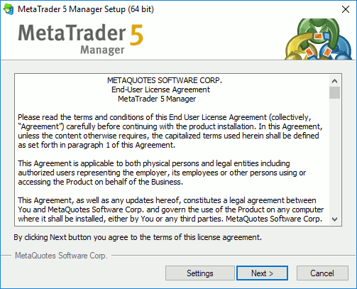

[🏠 Document Start](../../README.md) / [MetaTrader 5 Manager](../../MetaTrader-5-Manager.md) / [For Advanced Users](../For-Advanced-Users.md) / Installing the Terminal

[Previous](../For-Advanced-Users.md) | [Next](Files-and-Folders.md)

# Installing the Terminal

To install the Manager terminal, [download mt5managersetup.exe installer](https://support.metaquotes.net/en/download/mt5) and launch it.

  * The Manager terminal installation software is a web installer. This means that most of the components are downloaded from the Internet during installation.
  * The terminal installer determines the bit characteristics of the operating system and installs the appropriate version of the terminal.
  * The terminal can run under Microsoft Windows 10/11 or Windows Server 2008R2/2012/2012R/2016. A processor with SSE2 support (Pentium 4/Athlon 64 or higher) is also required. The remaining hardware requirements are limited by operating system requirements.

  * The terminal can run on devices with ARM64 (for examples, on Microsoft Surface tablets), but in this case, the minimum OS version is Windows 11.

  
---  
  
Review the software description and the end-user license agreement. If you agree with all terms of the agreement, click on the Next button. If you do not agree with the Agreement, exit the terminal installation program.

> A click on Next starts the background download of the terminal distribution package from one of the developer's servers. A server that is closest to the user is chosen for downloading.

Click Settings to select installation options:

  * Installation folder — directory you want to install the Manager terminal to. You can specify a different directory, by setting the path to it manually, or by clicking the Browse button.
  * Program folder — name of a program group that to be created in the Start menu.
  * Open MQL5.community — open the most popular traders' community website after installation. [MQL5.community](https://www.mql5.com/) features multiple useful services, from automated copy trading to the possibility of purchasing ready-made trading robots from the Market and running them 24/7 on a virtual platform.

  * The Manager terminal can be installed on top of an existing one. All the previous platform settings are preserved.
  * If you need to work with multiple manager accounts simultaneously, install the appropriate number of the terminals in different directories.

  
---  
  
Click Next to start the installation. When finished, click Finish and [run](../Terminal-Start.md) the terminal.
