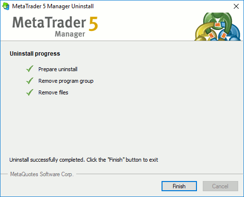

[🏠 Document Start](../../README.md) / [MetaTrader 5 Manager](../../MetaTrader-5-Manager.md) / [For Advanced Users](../For-Advanced-Users.md) / Terminal Deinstallation

[Previous](Data-Export.md) | [Next](../../User-Interface/README.md)

# Terminal Deinstallation

To remove the Manager terminal from a computer, run the Uninstall.exe file from the platform installation folder or select Uninstall in the appropriate program group in the Start menu.

Specify the folder the terminal is to be deleted from. Option "Delete user personal data" can be additionally enabled to delete all user data (terminal settings, emails, news etc.) in addition to the [unchangeable files](Files-and-Folders.md).

If you are sure you want to continue, click Next and wait for the completion of the uninstallation process.

  * You should be careful deleting the terminal. After you delete user data, the platform recovery will be impossible.
  * If you do not tick the option "Remove user's personal data" when uninstalling the terminal, later you will be able to restore the terminal with all its previous settings and information by installing it in the same directory.

  
---
