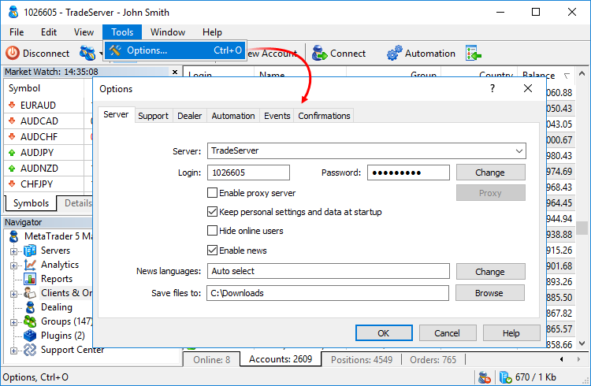
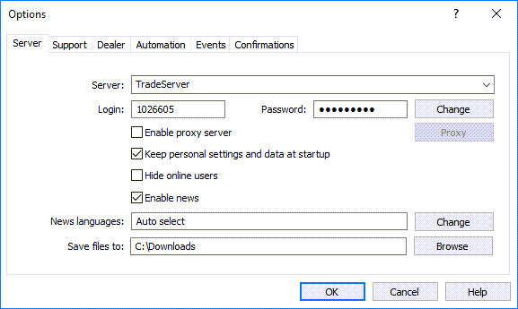
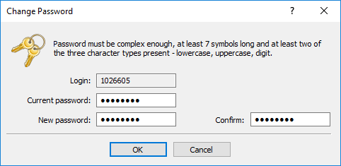
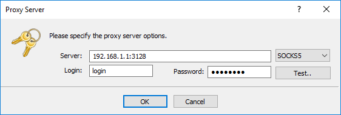
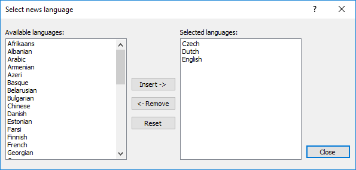
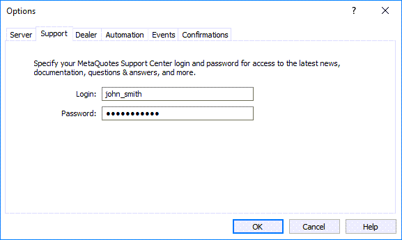
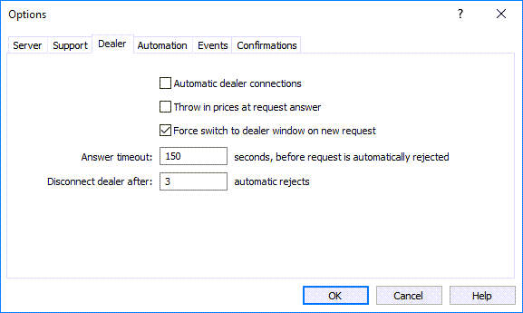
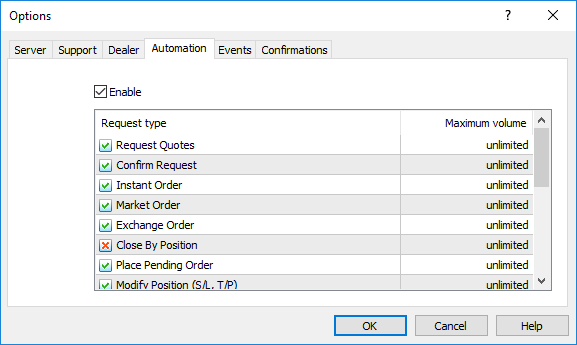
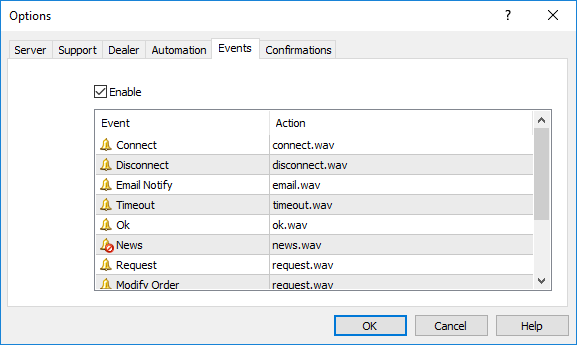
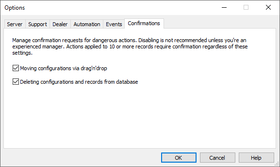

[🏠 Document Start](../README.md) / [MetaTrader 5 Manager](../MetaTrader-5-Manager.md) / Terminal Settings

[Previous](Connecting-to-the-Server.md) | [Next](For-Advanced-Users.md)

# Terminal Settings (#terminal-settings)

The Manager terminal provides multiple settings to help you conveniently customize your work in the development environment. To open the settings, select " Options" in the [Tools (#tools)](../User-Interface/Main-Menu.md#tools) menu (Ctrl+O).

All settings are grouped in several tabs based on what they do:

  * [Server (#server)](Terminal-Settings.md#server) — general settings of the Manager terminal.
  * [Dealer (#dealer)](Terminal-Settings.md#dealer) — dealer activity settings.
  * [Automation (#automation)](Terminal-Settings.md#automation) — setting up automatic processing of trade requests.
  * [Support (#support)](Terminal-Settings.md#support) — authorization data for accessing [technical support](../Technical-Support/README.md) section.
  * [Events (#events)](Terminal-Settings.md#events) — setting up notifications on various events in the terminal.

## Server (#server)

The Server tab contains the main settings of the terminal: parameters of connection, received news, etc.

The following settings are available here:

  * Server — name of the trade server the Manager terminal connects to. You can specify the IP address and port number of the server, separated by a colon, instead of its name. For example: 192.168.0.1:443. Added servers become available for selection during [authorization](Connecting-to-the-Server.md).
  * Login — manager's account created on the server.
  * Password — password for connection to the server.
  * Change — [change (#password)](Terminal-Settings.md#password) the account password.
  * Enable proxy server — allow using a proxy server when connecting to the server. If you enable this option, the Proxy... button becomes active.
  * Proxy — setup of connection through a [proxy server (#proxy)](Terminal-Settings.md#proxy).
  * Keep personal settings and data at startup — save data of the account (login and password) to a hard drive after they are specified during authorization. When you restart the terminal, these data will be used to automatically connect to the server. If this option is disabled, then every time you start the terminal, you will need to enter these data manually. This option affects only the current account specified in the Login field.
  * Hide online users — when enabled, the [Online Users](../Clients-and-Trading-Accounts/Online-Accounts.md) tab that displays currently connected accounts is hidden. The changes take effect only after the terminal is restarted.
  * Enable news — enable/disable [news (#news)](../User-Interface/Toolbox.md#news). If this option is disabled, news are not received in the terminal.
  * News languages — sort news by their language. When you click Edit, the [news language (#news-language)](Terminal-Settings.md#news-language) selection dialog appears. If "Any language" is set here, then all news will be received in the terminal, regardless of their language.
  * Save files to — directory files are sent to via the [internal email system (#mail)](../User-Interface/Toolbox.md#mail). When you open an attached file, the terminal checks its extension and the correspondence of file contents to this extension. If the file type is allowed and its contents is checked, the terminal will open the file and save it to the specified directory. Otherwise, a warning is displayed, notifying that the file may harm the computer, and the file is not saved. The following file types are allowed: PNG, JPG/JPEG, BMP, ZIP, 7Z, GIF, DOC, XLS, DOCX, XSLX, ODT, RTF, CSV, TXT and LOG.  
If a file with the same name and a different content exists in the directory, the manager's login and email arrival date/time up to a second will be added to the saved file name: [login]-[file name]-[date and time].[extension]. For example, the log file 20170501.log will be saved as 1001-20170501-20170502-170038.log.  
By default, files are saved to C:\Users\\[Windows username]\Downloads\MetaTrader. You can change the directory by clicking Browse.

> It is strongly recommended not to change the settings of server connection without any special need.

### Changing a password (#password)

To change the account password, click Edit on the Server tab.

The following details are to be indicated in the password changing dialog:

  * Current password — field for entering the current master password;
  * New password — field for entering a new password;
  * Confirm — field for a repeated entering of the new password, to avoid errors.

The login cannot be changed. The password can only be changed for the currently connected account.

  * A password cannot be changed if the current password is not specified.
  * A password should be complex enough: at least two of the three types of representation (lowercase letters, capital letters or digits) and not shorter than required in the password change dialog. The minimum number of characters in the password is determined on the trade server.

  
---  
  

### Proxy server setup (#proxy)

A proxy server is an intermediate link between the manager's computer and the trade server. It is mostly used by internet providers or by local networks. If you have any [connection](Connecting-to-the-Server.md) problems, contact your system administrator or ISP. If you use a proxy server, configure the terminal accordingly. Activate "Enable proxy server" option on the Server tab and click Proxy...

Specify the following parameters:

  * Server — IP address and port separated by a colon. Select the proxy server type to the right of the field: HTTP, SOCKS4 or SOCKS5. In HTTP mode, NTLM authentication is also supported.
  * Login — login to access a proxy server. If no login is required, leave it blank.
  * Password — password to access a proxy server. If no password is required, leave it blank.

Click Test.. to verify proxy server settings. If the settings are correct, you will see a corresponding message.

> Consult your system administrator or internet provider for proxy setup details.

### News language selection (#news-language)

You can use the languages of [news (#news)](../User-Interface/Toolbox.md#news) in the terminal. To do this, click Change in front of the "News languages" on the Server tab.

The left part of the window contains available languages, the right part — selected ones. To add a language, double-click on it in the left part, or select it and click Add. To delete a language, use the Remove button. To reset to initial settings, click Reset.

If "Any language" is set in the "News language" field, then all the news will be received in the terminal, regardless of their language.

## Support (#support)

On this tab, enter information about your account on the MetaQuotes Software Corp. technical support website. This is necessary to access the [technical support](../Technical-Support/README.md) section: news, articles, documentation, Service Desk, etc.

These data will be used for contacting technical support directly from the Manager terminal.

## Dealer (#dealer)

This tab contains settings of the manager terminal that refer to [dealing](../Dealing-and-Risk-Management/Dealing.md).

The following settings are available here:

  * Automatic dealer connections — connect a dealer automatically after [authorization](Connecting-to-the-Server.md) on the server. To be able to [process](../Dealing-and-Risk-Management/Dealing.md) incoming trade requests of clients, a manager should execute the " Start Dealing" command. If you enable this option, this operation will be executed automatically when connecting to the server.
  * Throw in prices at request answer — when enabled: if the dealer confirms a trade request, the price, at which a dealer has confirmed it, will be automatically thrown in to the price flow before that. The same option can be enabled/disabled by command  on the [toolbar](../User-Interface/Toolbar.md).
  * Force switch to dealer window on new request — when enabled: switch to the [dealer window](../Dealing-and-Risk-Management/Dealing.md) when a new trade request is received.
  * Answer timeout — number of seconds a dealer has to answer to client's trade request. If the dealer does not answer within the specified time, the request is rejected automatically. The remaining time is displayed in the quoting field of the [Dealer](../Dealing-and-Risk-Management/Dealing.md) section. The default value is 150 seconds. The valid range of values: 20-180 seconds.
  * Disconnect dealer after [x] automatic rejects — if a dealer does not process a client's trade request during the time specified in "Answer timeout", the request is automatically rejected. The parameter sets how many requests should be automatically rejected in a row before the manager account is disconnected from processing trade requests (disconnected as a dealer). If 0 value is set, the dealer is not disconnected.

## Automations (#automation)

The Manager terminal allows automatically process certain types of trade requests received from clients. On this tab, you can set up the types of requests processed automatically, and enable or disable automation.

Using Enable option, you can enable or disable automatic processing of requests. The same action can be performed by selecting " Automation" on the toolbar.

To enable the processing of a request, it should be ticked . Requests that will not be processed, are marked with a cross .

In the "Maximal volume" column, specify the maximal request volume that can be processed automatically. Requests with a larger volume should be processed manually. Zero means unlimited volume.

Automatic processing of the following types of requests is available:

  * Request Quotes — request of quotes in the Request [execution mode (#execution-type)](../Trading-Operations/Basic-Principles.md#execution-type).
  * Confirm Requests — confirm execution of an [order (#market-order)](../Trading-Operations/Basic-Principles.md#market-order) at the price that a trader has received from a dealer in the Request execution mode.
  * Instant Order — confirmation of an order in the instant execution mode.
  * Market Order — confirmation of an order in the market execution mode.
  * Exchange Order — confirmation of an order in the exchange execution mode.
  * Close By Order — confirmation of an order to close a position using an opposite one.
  * Place Pending Order — placing a [pending order (#pending-order)](../Trading-Operations/Basic-Principles.md#pending-order).
  * Modify Position (S/L, T/P) — request to change levels of [stop loss (#stop-loss)](../Trading-Operations/Basic-Principles.md#stop-loss) or [take profit (#take-profit)](../Trading-Operations/Basic-Principles.md#take-profit).
  * Modify Pending Order — request to [modify (#modify-delete)](../Trading-Operations/Working-with-Trading-Orders.md#modify-delete) a pending order.
  * Delete Pending Order — request to [delete (#modify-delete)](../Trading-Operations/Working-with-Trading-Orders.md#modify-delete) a pending order.
  * Activate Pending Order — [activation (#activate)](../Trading-Operations/Working-with-Trading-Orders.md#activate) of a pending order upon the occurrence of conditions specified in the order.
  * Activate Stop Loss — activation of an order to close a position when reaching a stop loss level.
  * Activate Take Profit — activation of an order to close a position when reaching the take profit level.
  * Activate Stop Limit Order — activation of Buy Stop Limit or Sell Stop Limit;
  * Delete Stopout Pending Order — delete a pending order when a client reaches the [stop out (#stopout-processing)](../Dealing-and-Risk-Management/Accounts-with-Margin-CallStop-Out.md#stopout-processing) level. Only orders with margin requirements (margin is reserved when placing an order) are to be deleted;
  * Close Stopout Position — close a position when a client reaches the [stop out (#stopout-processing)](../Dealing-and-Risk-Management/Accounts-with-Margin-CallStop-Out.md#stopout-processing) level.

  * Automatic processing is carried out only if the current account is [connected as a dealer](../Dealing-and-Risk-Management/Dealing.md).

  * To prevent uncontrolled execution of requests, automation is set to disabled each time the terminal is restarted.

  
---  
  

## Events (#events)

On the Events tab, you can configure audio alerts about various events appearing in the Manager terminal.

All events are accompanied by a sound file played when the event occurs. Notifications of the following events are available:

  * Connect — successful connection to the server.
  * Disconnect — loss of connection with the server.
  * Email Notify — incoming [email (#mail)](../User-Interface/Toolbox.md#mail).
  * Timeout — time is out. Certain time is given for the performance of certain operations (for example, data request from the server or update of settings). If during this period for whatever reason, the operation had not been made, the alert will trigger.
  * Ok — operation successful.
  * News — incoming [news (#news)](../User-Interface/Toolbox.md#news).
  * Request — notification about a new request received from a client (request for prices, buy and sell trade requests, placing pending orders, 'close by' requests).
  * Modify Order — modification of [stop loss (#stop-loss)](../Trading-Operations/Basic-Principles.md#stop-loss)/[take profit (#take-profit)](../Trading-Operations/Basic-Principles.md#take-profit) levels of a position, modification or deletion of a pending order.
  * SL / TP — activation of stop loss/take profit levels.
  * Pending Order — [activation of a pending order (#activate)](../Trading-Operations/Working-with-Trading-Orders.md#activate).
  * Stopout — [closing of a position (#close)](../Trading-Operations/Working-with-Trading-Positions.md#close) or deletion of an order by stop out.

To disable an alert, left-click on its icon  or double-click its name. After that, the icon changes to . To activate an alert, repeat the same operation.

To change a file played when the alert arrives, double-click its name or select it and press Enter. Then select "Choose other" from the drop-down list and specify the necessary file.

> By default, you are offered to choose a sound file with the *.wav extension, but you can specify any file type for the alert. If a *.wav file is selected, it is played when the alert triggers. If you select any other file, it is opened using the application it is associated with in the operating system.

## Confirmations (#confirmations)

From this section, you can enable or disable additional confirmation requests for dangerous actions executed via the Manager terminal.

The dangerous actions include:

  * Moving configurations via drag'n'drop (to protect against accidental actions)
  * Deleting records from databases

When performing any of these actions, the terminal requests additional confirmation. Confirmations can be disabled for experienced administrators, or when performing a large platform reconfiguration.

The confirmation is always requested for actions applied to 10 or more entries.
