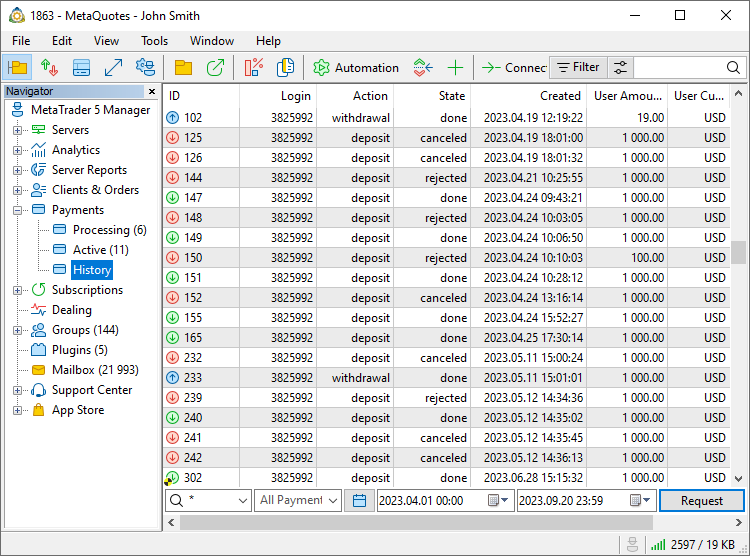
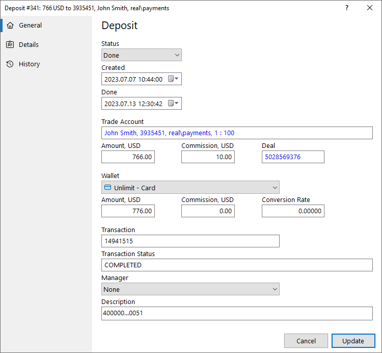
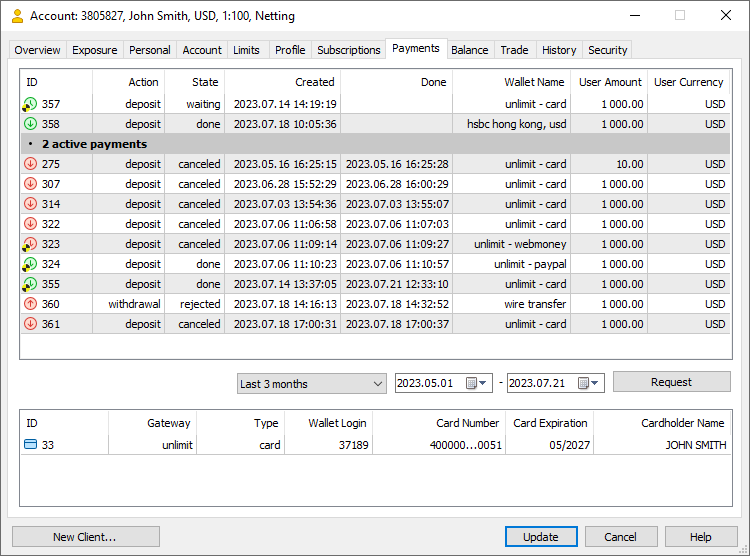
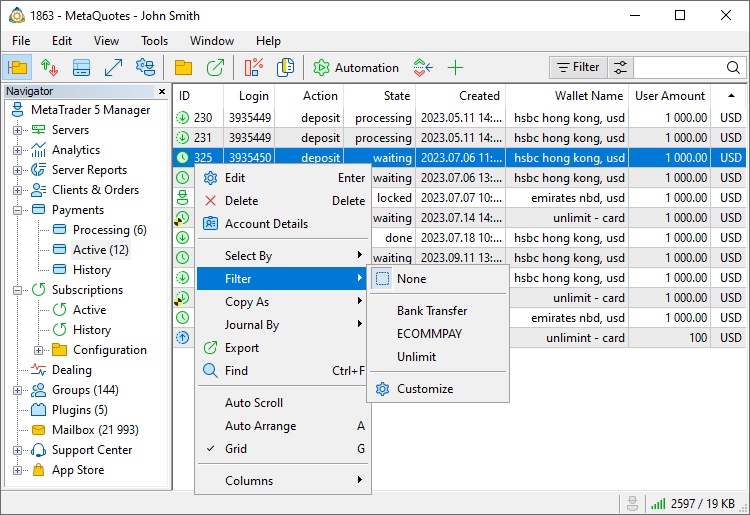
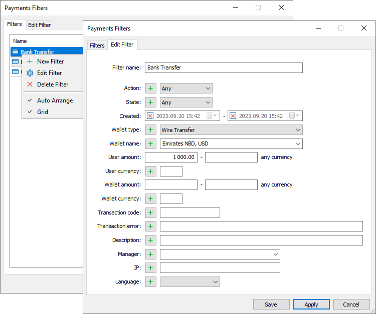

[🏠 Document Start](../README.md) / [Payments](README.md) / Controlling

[Previous](README.md) | [Next](Processing.md)

# Controlling Payments (#controlling-payments)

You can track payments using the 'Active' and 'History' sections. The sections feature the transactions are currently being [processed by managers](Processing.md), as well as the history of completed/rejected transactions, respectively.

To view the history of transactions, request them from the server. Specify the filter to the right of theicon:

  * By accounts — specify one or several account numbers separated by commas.
  * By trader group — select a group from the list or specify the group name manually.
  * By login — specify one or several accounts separated by commas.
  * By wallet — filter records by wallet.
  * By date — select a predefined period using thebutton or specify the dates manually.

Specify the desired filters and press "Request". Select an operation in the list to view its details.

Data on active payments is updated in real time and thus there is no need to request it from the server.

> Access to viewing and managing transactions is determined by the manager account permissions. If the data is not available, please contact your platform administrator.

## General Payment Details (#common)

###  (#)

The following information is shown for each payment:

  * Status — payments can have one of the following statuses:
    * Initial — payment created on the server. Only used for internal purposes.
    * Processing — the operation is being processed by the payment provider.
    * Waiting — the operation is pending to be processed by the manage.
    * Locked — the operation is [captured by the manager](Processing.md) for further processing.
    * Done — the payment was successfully completed.
    * Rejected — the operation was rejected by the manager.

  *     * Rejected without refund — used when rejecting payments made through wallets that do not support automatic refunds. For further details please read "[Refunds (#refund)](Processing.md#refund)".

  *     * Canceled — the transaction was rejected by the payment provider.
    * Failed — an error occurred while processing the payment.
  * Created — the date of the transaction in the client terminal.
  * Trading account— login of the account on which the operation is performed.
  * Amount — the operation amount requested by the client. Specified in the deposit currency.
  * Commission — commission charged by the broker in accordance with the server settings.
  * Deal — ticket of the [balance operation](../Clients-and-Trading-Accounts/Balance-Operations.md) via which funds are credited to or debited from the trading account.
  * Wallet — the name of the wallet via which the operation is performed.
  * Amount — the amount of the transaction on the side of the payment provider. It is specified in the currency selected by the user on the client terminal side when making the operation.
  * Commission — the payment provider's commission for the operation.
  * Conversion Rate — the rate of conversion from the client's currency to the payment system currency (or vice versa). Conversion follows the same rules that are applied for trading profit conversions. For deposits, the conversion is made at the rate of purchasing the account currency for the transaction currency, while the relevant selling rate is used for withdrawals. For example, if the account currency is EUR and the transaction currency is USD, then the deposit amount will be converted at the EURUSD Ask price and the withdrawal amount will be converted at the EURUSD Bid price.
  * Transaction — transaction ID assigned by the payment system.
  * Transaction Status — transaction status transmitted by the payment system.
  * Manager — the login and name of the manager who [processed the operation](Processing.md). It is filled only for manually processed transactions.
  * Description — additional information about the operation. Can be filled in by payment systems or manually by managers.

## Additional Clarification (#details)

Information in this section depends on the payment method: card, e-wallet, or bank transfer. The details depend on the payment system.

  * For cards, these include card number, expiration date and owner's name
  * For wallets, wallet number or ID is shown
  * Bank transfers provide account details: bank name, division and code, account number, client name, etc.

## History (#history)

For efficient employee performance monitoring and secure storage of information, all changes in payment transactions are tracked and displayed in the Versions section. Version support allows you to see all changes made to the transaction. You can revert changes if necessary, since all earlier specified data are stored in the platform.

Information on each change contains the number, date and the manager login. To view more information about changes, click on the line. The details show each changed parameter: its name, previous value and new value.

## Payments in Accounts (#account-payments)

[Account properties](../Clients-and-Trading-Accounts/README.md) store all related transactions and payment accounts. Select a transaction in the list to view the details.

Using the section's context menu command, you can manually create a deposit or withdrawal operation on your account. To do this, specify the amount and currency, ans select the payment system. These operations only create a record in the platform database, while no operations are performed in payment systems.

## Active payment filters (#filter)

Use filters for greater convenience when working with active payments. All transactions available to a manager a shown by default. You may use filters to view the payments corresponding to selected criteria. For example, you can select transactions performed through a certain wallet or payments greater than a certain amount.

To apply a previously created filter, select it from the Filter menu in the list of accounts or clients. To return to the initial list of accounts, click "Not selected".

To create or edit filters, click Customize. The list of all previously created filters is shown in the Filters tab. Click twice on a filter to change its parameters.

Specify the filter name and then set the parameters for filtering payments:

  * Action — type of operation: deposit or withdrawal.
  * Status — transaction status: processing, pending, etc.
  * Created — transaction creation date.
  * Wallet type — the type of the payment method.
  * Wallet name — the name of the wallet configuration.
  * Amount — the transaction amount requested by the client.
  * Currency — client's deposit currency.
  * Amount in the waller — the amount of the transaction on the side of the payment provider.
  * Wallet currency — the currency of the wallet through which the transaction was carried out.
  * Transaction code — transaction identifier.
  * Description — additional information about the operation.
  * Manager — the login of the manager who processed the transaction.
  * IP — the IP address from which the transaction was performed.
  * Language — the language set in the properties of the account from which the transaction was made.

The filter can be immediately enabled from the editing window by clicking "Apply".

Filters enable selection of entries not only based on fields matching the specified value, but also by the "Except" and "Not empty field" parameters. Enter the desired value in the filter field and click , it will change to . The filter will select payments, the parameters of which do not match the specified value. For example, you can use this filter to get a list of payments that are not related to the specified wallet, or payments that were not processed by managers. In the latter case, switch the filter mode and leave the field blank.
