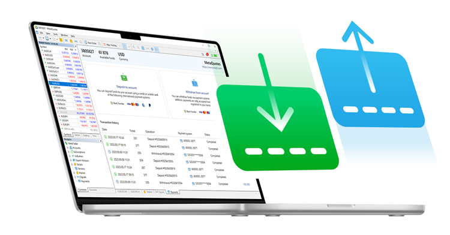

[🏠 Document Start](../README.md) / Payments

[Previous](../Analytics/README.md) | [Next](Controlling.md)

# Integrated Payment Processing System

MetaTrader 5 features a built-in payment receiving and sending system. Your clients do not have to leave the platform in order to deposit or withdraw funds. The relevant operations can be performed straight through the trading terminal. The platform is integrated with various payment providers and thus your traders can access all the necessary deposit/withdrawal methods, including bank cards, popular wallets, and bank transfers. All transactions are securely encrypted and are completely safe.

Payment system integration with the platform ensures that you always work with a single database. All transactions are linked to accounts and client records. For example, by opening client data, you can easily see all payments along with transaction amounts, dates, cards, etc. You won't need complex and expensive integrations with payment systems and third-party CRMs.

The benefits of built-in services for your company:

  * Streamlined onboarding. Since the need for additional registration on your website is eliminated, users can download the trading platform, open an account, make a deposit, and start trading. This accelerates the account opening process for potential customers and enables a seamless transition to real trading for demo users.
  * Cost reduction. You don't need to invest in the development, configuration, and maintenance of infrastructure for customer registration, payment processing and transaction management. This might be especially relevant for start-up companies which possess limited resources.
  * Increased deposit volumes. The natively integrated payment option simplifies the deposit process. Thus, users can faster respond to market situations by adding funds to their accounts. This contributes to overall growth in user deposits.
  * Higher deposit frequency. With all the required features available within the trading environment, your traders can maintain trading focus and engagement for longer periods. By eliminating distractions and the need for additional authentications in third-party resources, These factors will impact decision-making speed and increase the frequency of deposits accordingly.

Configure integrated payments for your traders to avoid extra expenses, to increase demo to real conversion rates, to implement seamless onboarding and to boost existing clients' deposits.

## How it works

  * You set up integration with the payment system on the server side.
  * A special section for deposits and withdrawals will become available in client terminal.
  * Your client makes a payment via the terminal and the transaction is forwarded to your payment provider for processing. Depending on the rules configured on the server, the transaction may be additionally [confirmed by the manager](Processing.md).
  * If the transaction is successfully processed in the payment system, the corresponding balance operation is performed on the client's account in MetaTrader 5.
  * All deposit and withdrawal operations are stored in the platform database and are available in the [Active](Controlling.md) and [History](Controlling.md) sections. Transactions are linked to client records and trading accounts, so you can easily access all the necessary information whenever you need.

The manager terminal is used to control and manually process payments.
