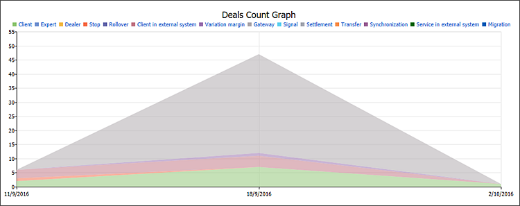

[🏠 Document Start](../README.md) / [Server Reports](README.md) / Execution Type

[Previous](Gateways-White-Label.md) | [Next](Trade-Accounts.md)

# Execution Type Report

Execution Type Report — a report on the number, volume and types of executed trades.

## Configuration in MetaTrader 5 Manager

Specify the report generation period before requesting the report in the Manager terminal. It is formed for the last seven days before the day indicated in the Period field.

## Configuration in MetaTrader 5 Administrator

An additional parameter can be configured in the report configuration in MetaTrader 5 Administrator. It is the currency used when displaying various parameters in the report (Balance, Profit, etc.).

## Report data

The report is divided into four units: information on accounts, a diagram on the number of trades, a diagram on the volume of trades, a summary of trades.

### Account information

This unit provides the following information for each client group:

  * Group name
  * The number of clients in a group
  * The percentage of active accounts
  * The total balance of all accounts
  * The total floating profit/loss
  * The total equity amount
  * The group deposit currency

### Deals count graph

The chart shows the number of executed deals of each type separately: performed by clients, by dealers, executed for rollover and variation margin charges, etc.

### Deals volume graph

The chart shows the volume of executed deals of each type separately: performed by clients, by dealers, executed for rollover and variation margin charges, etc.

### Summary report on trades

This unit features information on the number and volume of each type of trades for separate dates.

  * Client — deal performed by a client manually through the client terminal.
  * Expert — deal performed by a client using an Expert Advisor.
  * Dealer — deal performed by a dealer through the Manager terminal.
  * Stop — deal performed when the client reached the stop out level.
  * Rollover — deal performed when reopening a position for charging swaps.
  * External — deal performed by a client from an external trading system.
  * Variation margin — deal performed for accruing variation margin.
  * Gateway — deal performed by a MetaTrader 5 gateway that had connected to the trading platform.
  * Signal — deal performed as a result of copying a [trading signal](https://www.mql5.com/en/signals) according to a subscription in the client terminal.
  * Settlement — deal performed as a result of performing operations connected with the settlement of a futures contract/option. It is currently not used.
  * Transfer — deal performed as a result of relocating a position at a calculated price to a new symbol with the same underlying asset. It is currently not used.

