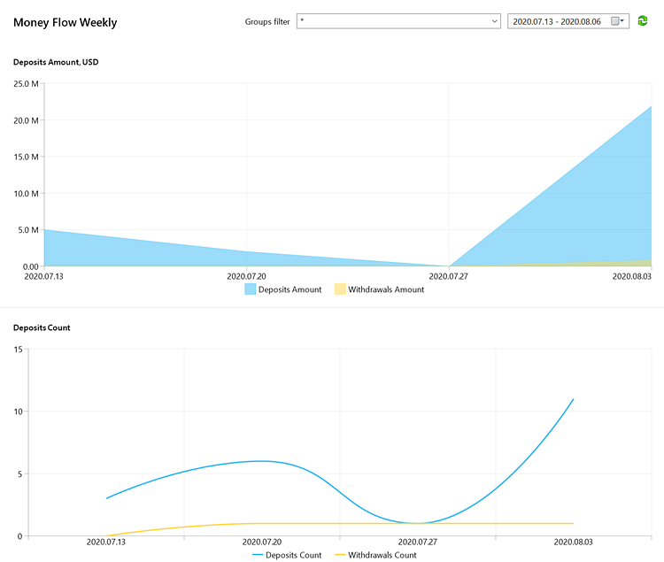

[🏠 Document Start](../README.md) / [Server Reports](README.md) / Money Flow Weekly

[Previous](Money-Flow-Daily.md) | [Next](Lifetime-Value.md)

# Money Flow Weekly

The report enables the evaluation of financial operations on customer accounts. It reflects the distribution of deposits and withdrawals by week and the difference between the two operation types. Data can be filtered by groups.

### Filters

Data requested for the report can be filtered. Specify the following parameters before requesting a report in the manager terminal:

  * Groups — the groups containing the accounts, on which the report must be created. You can specify one or several accounts separating them by commas.
  * Period — starting and ending date of the period, for which the report will be generated.

### Charts in the report

The report includes multiple charts:

  * Deposits Amount — distribution of deposit and withdrawal amounts by time.
  * Deposits Count — distribution of the number of deposits and withdrawals by time.
  * Deposits Average — the average deposit and withdrawal amount by time.
  * Deposits-Withdrawals — the difference between deposit and withdrawal amounts by time.
  * Deposits-Withdrawals Accumulated — the accumulated difference between deposit and withdrawal amounts by time.

> Balance operation values reflected in charts are automatically converted to the same currency in accordance with current quotes. The report currency is configured on the trade server side.

### Setup in MetaTrader 5 Administrator

The additional 'Currency' parameter can be set in the report configuration in MetaTrader 5 Administrator. Appropriate values in reports will be displayed in this currency. Conversion to the specified currency is performed in accordance with the current quotes in the platform. For example, EURUSD quotes are used to convert an amount in EUR to USD.
