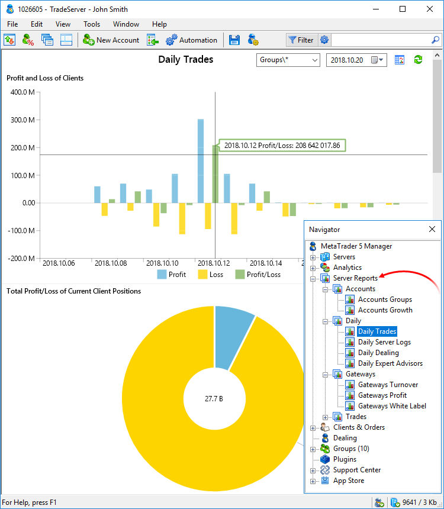
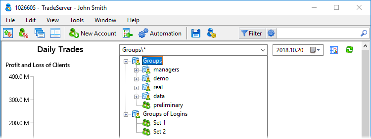
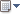
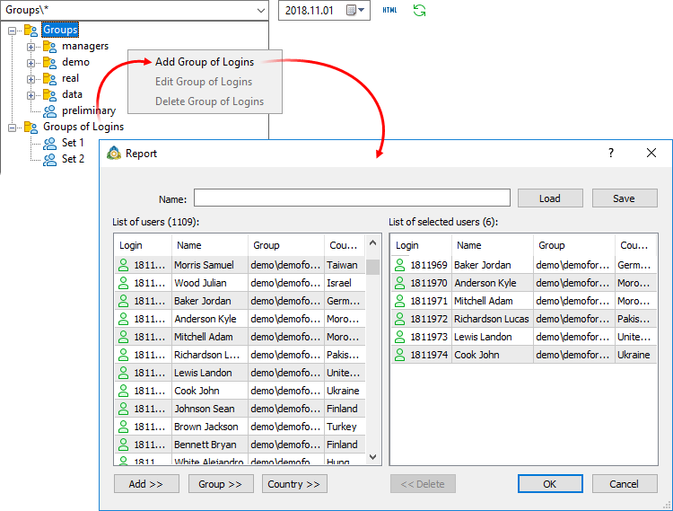
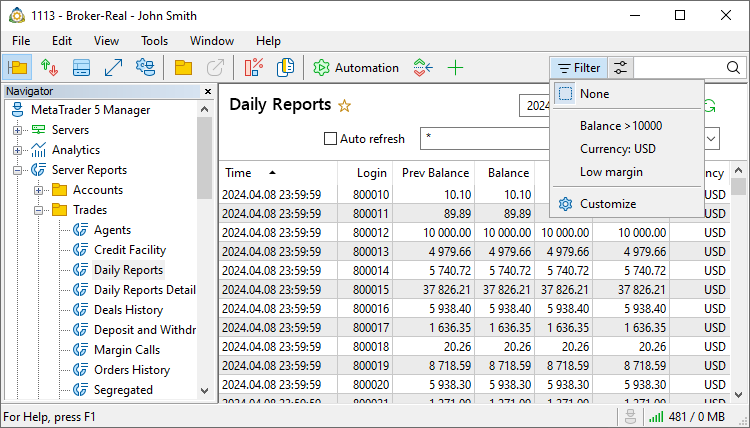
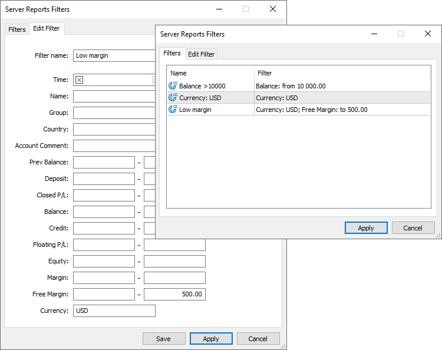
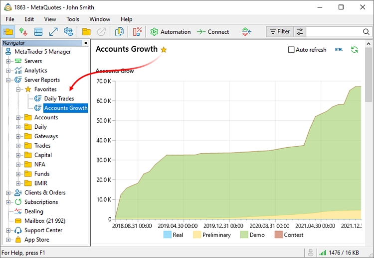
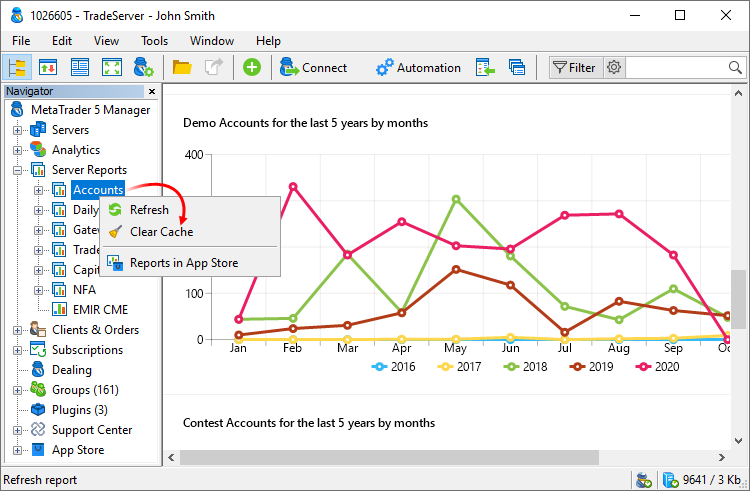
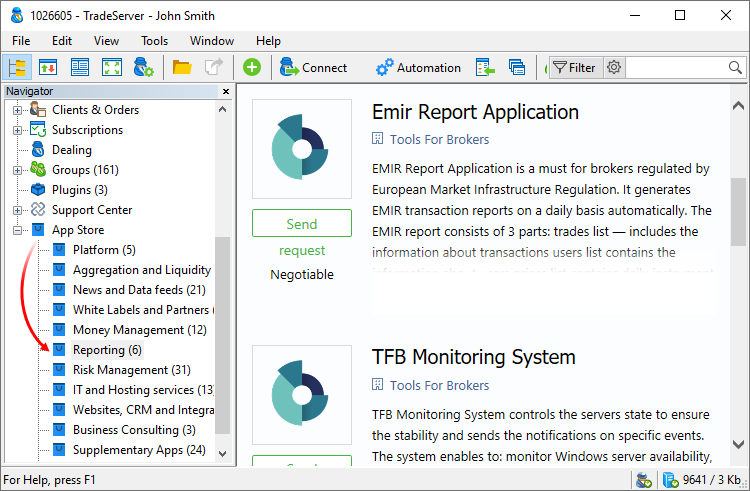

[🏠 Document Start](../README.md) / Server Reports

[Previous](../Managing-Trade-Server-Settings/Trade-Server-Journal.md) | [Next](Accounts-Groups.md)

# Server Reports (#server-reports)

The trading platform features multiple reports concerning clients' trading activity, agents' operation, account margin status, gateways and much more. The trading server settings affect what reports are available in the Manager terminal.

When a manager requests a report, the corresponding command is sent to the trading server. The trading server generates a report and sends it to the Manager terminal where it is displayed as a table, HTML page or dashboard.

> The trading platform features multiple [standard reports (#standard)](README.md#standard). [MetaTrader Report API](https://support.metaquotes.net/en/docs/mt5/api/reportapi) allows creating an unlimited number of custom reports.

Using the context menu commands, you can save the report in CSV, Open XML, MHT or HTML file. Diagram settings are available in the context menu for dashboard reports.

  * Title — show/hide the chart title.
  * Legend — show/hide the chart legend.
  * Details — show/hide the chart details.
  * Color — switch color. The option is used for charts displaying information about an entity.
  * Type — switch the chart view: Bar chart, Line chart, Area chart, Donut chart, value (shows the total variable value).
  * Stacking — switch chart stacking type. Used for charts, which compare several entities and their contribution to the overall value. For example, you may distribute positions by symbols and market sentiment. Available options:

  * None — data series are displayed separately
  * With negative values — data series are combined, values are not summed up
  * Regular — data series are combined, values are summed up
  * 100% — rows are combined, the general contribution of each series to the total value in percentage is shown

## Requesting a report (#request)

To request data, click button  in the upper right corner of a report.

Reports may have settings: filters by groups, dates and symbols. They can be changed in the upper right corner of the section.

The availability of the settings depends on the specific report.

  * Groups — group of users, on which the report is generated. Some reports do not support sorting by groups and accounts. When making a request, you may specify:

  * One of the trading groups or subgroups, for example, "demo\*.
  * User logins are comma-separated, for example "10011, 10012, 10015".
  * Create or use a previously saved [custom set of accounts (#list)](README.md#list).
  * Symbols — symbol, for which the report will be generated (for example, report on operation on a certain symbol). Possibility to filter by symbols depends on the report type.
  * Period — custom period for report generation (for example, report on trading operations for the last week). Dates can be specified both manually and using a calendar that is opened when you press . Using  you can select one of predefined time periods to generate a report for.
  *  /  — switch between report types: regular and dashboard. Depending on the implementation of the report by its developer, it can support both types or only one of them.

## Request for reports by client list (#list)

In order to request for reports conveniently, you can create and use previously saved account sets. Click  to the right of the Groups field and then click button .

Select the necessary account (or multiple accounts using Shift or Ctrl+Shift) and click Add. In order to add all accounts from a client group, select one account with a necessary group and click Group. Accounts can be added by country the same way.

Specify a name for an account group and click Save. The group will become available in the filter.

A group of accounts can be created based on any csv file (for example, obtained via export in the [Accounts](../Clients-and-Trading-Accounts/README.md) or [Online](../Clients-and-Trading-Accounts/Online-Accounts.md) sections). To do this, click Load and select a file. When importing, a login is taken from the file's first data column beginning from the first line, therefore it does not matter how many columns in total are in the file. The program takes the value up to the nearest separator: a space, a tab, a comma or a semicolon. Sample file:

Login;Name;Group;Country;Balance;Credit  
1811971;Mitchell Adam;demo\demoforex-5;Morocco;50056.50;0.00  
1811972;Richardson Lucas;demo\demoforex-5;Pakistan;49919.47;0.00  
1811973;Lewis Landon;demo\demoforex-5;United States;49623.39;0.00  
1811974;Cook John;demo\demoforex-5;Ukraine;49900.94;0.00  
---  
  
The first line with column names is not imported since a login may only contain numbers.

> Account sets are saved separately for each manager account and trading server.

## Report Filters (#filter)

Using filters, you can display the desired information that meets a specific criteria in your report. For example, you can select operations for a certain instrument or clients with a certain balance or margin, etc.

Filters operate throughout all tabular reports. You can configure them once and apply to any report. To apply a previously created filter, select it from the Filter menu in the list of accounts or clients. To return to the initial list of accounts, click "Not selected".

To create or edit filters, click Customize. The list of all previously created filters is shown in the Filters tab. Click twice on a filter to change its parameters.

Specify a filter name and then configure parameters for filtering reports:

  * Time — trading operation or account creation time.
  * Name — name of the account holder.
  * Group — group to which the account belongs.
  * Country — client's country.
  * Account comment — [comment added to the created account](../Clients-and-Trading-Accounts/Personal-Data.md). The parameter does not work with comments on trade operations.
  * Previous balance — the previous balance field in [daily reports](Daily.md).
  * Deposit — the amount of deposits into the account.
  * Closed P/L — profit/loss realized from deals.
  * Balance — account balance.
  * Credit — amount of credit on the account.
  * Floating P/L — floating profit/loss of open positions.
  * Equity — account [equity (#account-state)](../Clients-and-Trading-Accounts/Account-Overview.md#account-state).
  * Margin — the amount of funds [reserved as margin on the account (#margin)](../Clients-and-Trading-Accounts/Account-Overview.md#margin) for open positions and orders.
  * Free Margin — the amount of [available funds (#account-state)](../Clients-and-Trading-Accounts/Account-Overview.md#account-state) on the account.
  * Currency — trading operation currency or account deposit currency.

The filter can be immediately enabled from the editing window by clicking "Apply".

## Favorite reports (#favorites)

The platform provides more than 40 built-in reports. Furthermore, brokers can purchase additional reporting solutions from the [App Store](https://support.metaquotes.net/en/market/mt5/reporting) or develop their own reports using [Report API](https://support.metaquotes.net/en/docs/mt5/api/reportapi). For convenience, the administrator can arrange the reports into directories. However, navigation through so many solutions can be difficult.

To ensure that the reports you need are always at hand, add them to Favorites. Click on the star next to the report name, and it will be added to the corresponding directory. It will still be available in the source directory.

## Report cache (#cache)

Data cache stores data requested from the trading platform database, between report generation times. Use of data cache saves resources when creating reports: the server does not need to retrieve data from the databases again and perform the related calculations, since the data is already available in the cache. However, the data stored in the cache may become outdated. For example, if historical data on the server has significantly changed, it is recommended to reset the report cache to ensure data accuracy and completeness.

To reset the cache, select any report and execute the related command from the report menu. The cache will be cleared for all reports and not only for the selected one.

## Standard reports (#standard)

The standard delivery package of the trading platform includes multiple ready-made reports:

  * [Accounts Groups](Accounts-Groups.md) — statistical report on account groups on the server.
  * [Accounts Growth](Accounts-Growth.md) — report on the increase in the number of accounts in groups on the server.

  * [Accounts Lifetime by Countries](Accounts-Lifetime-by-Countries.md) — lifetime of accounts with a distribution by countries.

  * [Agents](Agents.md) — report on all transactions connected with agent commissions.
  * [Agents Detailed](Agents-Detailed.md) — detailed report on agent commissions.
  * [Credit Facility](Credit-Facility.md) — credit operations report for the selected period.
  * [Daily](Daily.md) — report on the financial state of the requested accounts as of the end of the day.
  * [Daily Detailed](Daily-Detailed.md) — detailed report on the financial state of the one selected account as of the end of the day.
  * [Daily Server](Daily-Server-Logs.md) — statistical report on the platform operation for the specified day.
  * [Daily Dealing](Daily-Dealing.md) — daily report on dealing activity.
  * [Daily Trades](Daily-Trades.md) — report on trade operations for the specified day.
  * [Daily Orders](Daily-Orders.md) — report on client orders open at the end of the selected day.
  * [Daily Positions](Daily-Positions.md) — report on client positions open at the end of the selected day.
  * [Daily Expert Advisors](Daily-Expert-Advisors.md) — report on trading operations performed by clients' Expert Advisors.
  * [Deals History](Deals-History.md) — summary report on the deals for the selected period.
  * [Deals Profit](Deals-Profit.md) — detailed report on deals for the selected period.
  * [Deals Initiators](Deals-Initiators.md) — deal initiators (reasons) report.
  * [Deals Geography](Deals-Geography.md) — trading activity distribution by country.
  * [Deals Weekly](Deals-Weekly.md) — trader activity report.
  * [Deposit and Withdrawal](Deposit-and-Withdrawal.md) — report on deposit and withdrawal operations for the selected period.
  * [Equity](Equity.md) — report on the financial state of the requested accounts as at the end of the day. The accounts are grouped according to their Comment field value. This report allows to generate reports on clients' accounts grouping them by custom criteria.
  * [Margin Calls](Margin-Calls.md) — report on the state of margin call or stop out accounts.
  * [Orders History](Orders-History.md) — summary report on the orders for the selected period.
  * [Positions History](Positions-History.md) — summary report on positions for the selected period.
  * [Segregated](Segregated.md) — summary report on the change of financial state of the requested accounts for the specified period.
  * [Summary](Summary.md) — summary motion of funds and funds cycles for the selected period.
  * [Gateways Turnover](Gateways-Turnover.md) — report on the volume of deals processed by gateways.
  * [Gateways Profit](Gateways-Profit.md) — report on the volume of deals processed by gateways, as well as the profit obtained by a broker while processing these trades.
  * [Gateways White Label](Gateways-White-Label.md) — report on volumes of deals performed on a trading server by external brokers via MetaTrader 5 Gateway (standard or White Label version).
  * [Execution Type](Execution-Type.md) — report on the number, volume and type of executed trades.
  * [Trade Accounts](Trade-Accounts.md) — report on the current trading statuses of client accounts.
  * [Trade Transactions](Trade-Transactions.md) — detailed data on trading operations at MetaTrader 5 servers.
  * [Trade Modifications](Trade-Modifications.md) — report on trade operations manually changed by an administrator, manager or API.

  * [Trade Performance Summary](Trade-Performance-Summary.md) — detailed trading statistics of trading accounts.
  * [Trade Group Statistics](Trade-Group-Statistics.md) — detailed statistics of groups: the number of accounts, commission amounts, share of trades by type, and more.

  * [StopOut Compensations](StopOut-Compensations.md) — report on operations associated with the compensation of a negative balance in the situation of Stop out. All trades with the "so compensation" type are included into this report.
  * [Money Flow Daily](Money-Flow-Daily.md) — a group of reports presenting the movement of funds on client accounts.
  * [Money Flow Weekly](Money-Flow-Weekly.md) — a group of reports representing the weekly movement of funds on client accounts.
  * [Lifetime Value](Lifetime-Value.md) — a group of reports concerning client LTVs.
  * [First Time Deposit](First-Time-Deposit.md) — a group of reports on first-time deposits on client accounts.
  * [Retention of Clients](Retention-of-Clients.md) — new client retention report.
  * [Retention of Trading Accounts](Retention-of-Trading-Accounts.md) — new client retention report by individual accounts.
  * [NFA](NFA.md) — a group of reports to be submitted to NFA regulator.
  * [EMIR](EMIR.md) — a report to be submitted to regulators according to EMIR.
  * [Fund Overview](Fund-Overview.md) — a report reflecting the key characteristics of a hedge fund.
  * [Risk Appetite](Risk-Appetite.md) — a report reflecting the risk level accepted by traders.

  * [Fast Profit Deals](Fast-Profit-Deals.md) — report on profitable deals with very short durations. It enables the detection of dishonest traders exploiting certain situations.

The availability of these reports is determined by an administrator when setting up the platform.

## Additional reports (#additional)

A wide variety of additional reports is available in the [App Store](https://support.metaquotes.net/en/market/mt5/reporting) on the technical support website. The App Store showcase is featured directly in Manager Terminals, allowing managers to view and order additional products without leaving their workspace:

Furthermore, you can develop your own reports using [MetaTrader Report API](https://support.metaquotes.net/en/docs/mt5/api/reportapi). The package contains all the necessary tools, alongside the source code examples of standard reports. You can modify the source codes to create your own reports.
