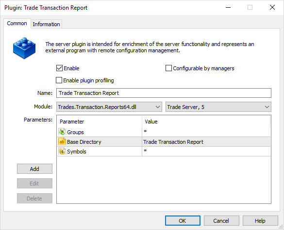
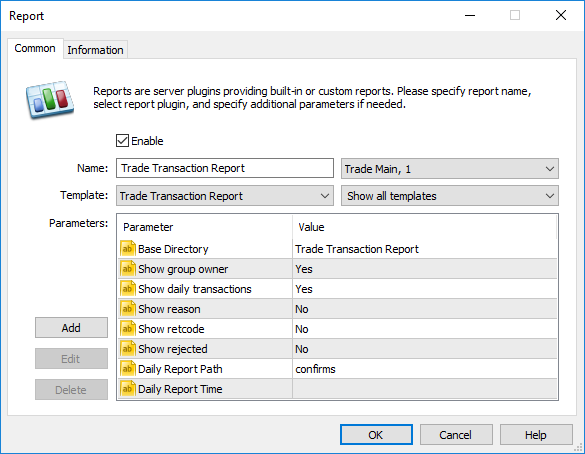
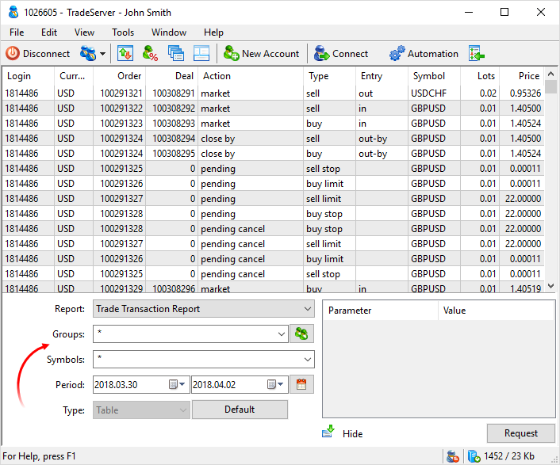

[🏠 Document Start](../README.md) / [Server Reports](README.md) / Trade Transactions

[Previous](Trade-Accounts.md) | [Next](Trade-Modifications.md)

# Trade Transactions Report

Trade Transaction Report provides detailed data on trading operations at MetaTrader 5 servers. This report is useful not only for a broker but also when providing data to regulatory bodies.

The report is implemented as TradesTransactionReports.dll file (TradesTransactionReports64.dll for 64-bit platform version) combining the report and the server plugin. The plugin collects data on report transactions and saves it in Reports\Trades.Transaction.Reports directory in trading server's folder, while the report provides collected data in the appropriate format. The plugin should be enabled in the settings of the appropriate trading server. If the plugin is not enabled, report data will not be updated and the report will provide data only for the plugin's operation period.

TradesTransactionReports.dll file is included into the standard delivery and located in Reports directory of MetaTrader 5 trading server.

## Plugin installation

The appropriate plugin should be installed to collect the data used in the report. To install the plugin, enter Plugins section in MetaTrader 5 Administrator. After the server with the installed plugin has been selected, click Add.

The following settings are available:

  * Groups — sort by groups. Groups are separated with a comma. To specify groups, you may also use the mask "*" and the negation sign "!". For example, the value "demoforex,democfd" means that the plugin will collect the transaction details for users in 'demoforex' and 'democfd' groups. The value "*" is for all groups. The default value is "*,!demo*,!contest*" which means all groups except those whose names start with 'demo' and 'contest'.
  * Base Directory — name of the directory where the database of transactions is saved for the report. The data is saved by days. This directory is automatically created in Reports\Trade.Transaction.Report. In most cases, this parameter should save a default value. 
  * Symbol — sort by symbols. Symbols are separated with a comma. To specify symbols, you may also use the mask "*" and the negation sign "!". For example, the value "EURUSD,GBPUSD" means that the plugin will collect the transaction details for EURUSD and GBPUSD symbols. The value "*" is for all symbols. *,!CFD\* value is for all symbols except those in the CFD group.

> It is not recommended to use the same Base Directory parameters for different plugins. In this case, correct operation of those plugins is not guaranteed.

## Report installation

To install the report, enter Reports section in MetaTrader 5 Administrator. After the server to install the report has been selected, click Add.

`

The following specific settings are available for the report:

  * Base Directory — directory where transaction databases are searched for. This parameter should be similar to the same-name parameter of the corresponding plugin. If the plugin with a similar Base Directory parameter does not exist, the report will be empty. Several reports may refer to similar transaction databases.
  * Show group owner — flag of Group Owner column display in the report. By default, the column is displayed (Yes). When set to No, Group Owner is not displayed in the report.
  * Show daily transactions — show the state of orders and positions as of the end of the trading day (the "daily order" and "daily deal" fields) in the report.
  * Show reason — show reasons for the execution of trading operations (the "reason" field) in the report.
  * Show retcode — show codes of operation execution results (the "retcode" field) in the report.
  * Show rejected — show rejected operations in the report.
  * Daily Report Path, Daily Report Time — once a day, the report plugin unloads data on all transactions for the past day to a CSV file.

  * In the "Daily Report Path" parameter, set the name of the folder in the trade server installation directory, in which files with transactions will be saved. The "confirms" folder is used by default. In this case, files are saved at the following path: [trade server directory]\confirms\\\YYYY.MM.DD.trans\\\"Base Directory".csv, where "Base Directory" is the value of plugin's "Base Directory" parameter.
  * Specify the time, when the file with transactions should be generated, in the "Daily Report Time" parameter. The time is not set by default, so the file is generated at the end of the trading day (после завершения всех процедур закрытия дня).

> The standard parameters are described in the Reports section of the MetaTrader 5 Administrator user guide.

## Using the report

MetaTrader 5 Manager is used for requesting the report. The requested data can be filtered by group, logins, period and symbol mask. The report is generated in real time and the data can be updated by new transactions at each new request.

The request is resulted in the table, which can be saved in HTML, CSV or Open XML (MS Office Excel 2007).

The report includes the following information:

  * Login — user account's number.

  * Group — group the account belongs to.
  * Country — client's country of residence.
  * Account comment — comment to the trading account.

  * Leverage — user account's leverage.
  * Dealer — login of the dealer that placed an order. It is specified only if a request is placed by a dealer.
  * IP — user's IP address.
  * Currency — account deposit currency.
  * Order — order ticket.
  * Order ID — order ID in an external trading system. The identifier is changed in case the order is updated in the external trading system by canceling or placing a new order.
  * Deal — deal ticket.
  * Deal ID — ID of a deal in an external trading system.
  * Position — position ticket.
  * Position ID — position ID in an external trading system.
  * Action — trading operation type (see below).
  * Type — trading operation type (see below).
  * Entry — direction of the operation: in (market entry), out (market exit), in/out (position reversal).
  * Symbol — trading instrument.
  * Position By — ticket of the opposite position. It is shown if the source position (Position) was closed by an opposite one.
  * Lots — volume in lots.
  * Amount — volume in units.
  * Time — transaction time.
  * Price — transaction price.
  * Bid — bid market price at the moment of transaction.
  * Ask — ask market price at the moment of transaction.
  * Position Price — position price for position closing transactions.
  * SL — Stop Loss price.
  * TL — Take Profit price.
  * Margin Rate — margin rate at the moment of transaction.
  * Margin Amount — margin volume at the moment of transaction without considering the leverage.
  * Commission — deal commission.
  * Swap — swap.
  * Profit — profit.
  * Profit Currency — profit currency.
  * Profit Rate — conversion rate of the profit currency to deposit currency.
  * Raw Profit — profit/loss gained during transaction. It is indicated in the profit currency of the operation symbol.
  * Amount Closed — closed volume in amounts.
  * Gateway Price — price in external trade system.
  * Reason — [reason (#reason)](https://support.metaquotes.net/en/docs/mt5/platform/administration/admin_orders#reason) of the operation execution.
  * Retcode — [code of an operation execution result](https://support.metaquotes.net/en/docs/mt5/api/retcodes_trade_request).
  * Group Owner — name of a company a client is serviced by. It corresponds to the Company field in client group configuration.

Action field reflects the transaction type. It may contain the following values:

  * market — market operation (entering, exiting, reversal).
  * position modify — position's stop loss and take profit modification.
  * pending — placing a pending order.
  * pending modify — modifying a pending order.
  * pending cancel — canceling a pending order.
  * pending expiration — pending order expiration.
  * pending activation — pending order activation.
  * stop loss — closing position by stop loss.
  * take profit — closing position by take profit.
  * deposit — balance operation.
  * order stopout — canceling order by stop out.
  * position stopout — closing position by stop out.
  * stoplimit — Stop Limit order activation.
  * daily order — state of an order as of the end of a trading day.
  * daily position — state of a position as of the end of a trading day.
  * close by — closing a position by an opposite one.
  * rollover — transferring of a position on the next trading day.
  * market by dealer — market operation performed by a dealer.
  * position modify by dealer — modification of the stop loss or take profit levels of a position performed by a dealer.
  * pending modify by dealer — modification of a pending order by a dealer.
  * pending cancel by dealer — canceling of a pending order by a dealer.
  * pending activation by dealer — activation of a pending order by a dealer.
  * dealer close by — operation of closing a position by an opposite one performed by a dealer.
  * variation margin — variation margin calculation.

Type field displays order or transaction type:

  * buy — order for buying at the current market price.
  * sell — order for selling at the current market price.
  * buy limit — buy limit order.
  * sell limit — sell limit order.
  * buy stop — buy stop order.
  * sell stop — sell stop order.
  * buy stop limit — buy stop limit order.
  * sell stop limit — sell stop limit order.
  * deposit — deposit or withdrawal operation.
  * credit — credit operation.
  * charge — charging commissions.
  * correction — correction operations.
  * bonus — accrual of bonuses.
  * commission — commission.
  * commission daily — commission per day.
  * commission monthly — commission per month.
  * agent daily — charging a daily agent's commission.
  * agent monthly — charging a monthly agent's commission.
  * interest rate — accrual of annual interest.
  * buy canceled — a canceled buy deal.
  * sell canceled — a canceled sell deal.
  * dividend — payment of taxable dividend.
  * dividend franked — payment of nontaxable dividend.
  * tax — charging a tax.
  * agent — accrual of instant agent commission.

