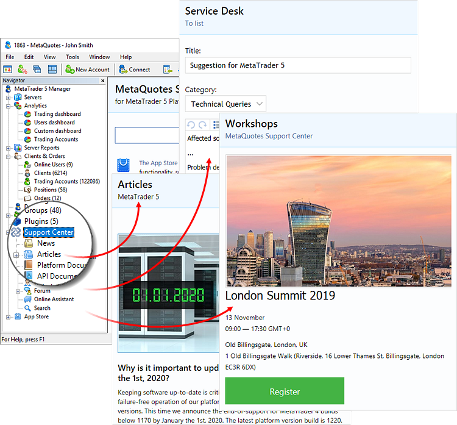
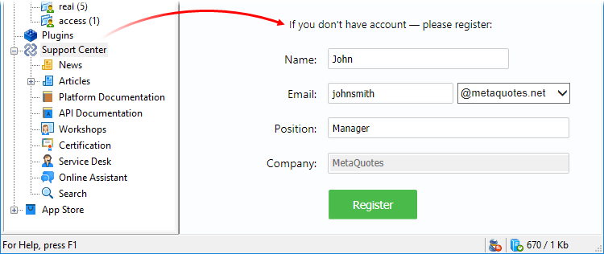

[🏠 Document Start](../README.md) / Technical Support

[Previous](../App-Store/README.md)

# Technical Support

The technical support is embedded directly in the Manager terminal. It provides the [complete documentation](https://support.metaquotes.net/en/docs) on all trading platform components, [useful articles](https://support.metaquotes.net/en/articles) and [forum](https://support.metaquotes.net/en/forum). You can also directly contact the platform developers: ask question to a support team member via the chat or create a [Service Desk](https://support.metaquotes.net/en/servicedesk) request.

To access this section, you need an account on the [MetaQuotes technical support website](https://support.metaquotes.net/). Specify it in the [Manager terminal settings (#support)](../MetaTrader-5-Manager/Terminal-Settings.md#support). If you do not have an account, register it straight from the terminal by filling out a simple form:

