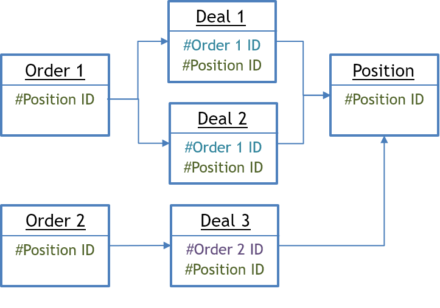
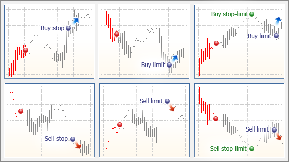
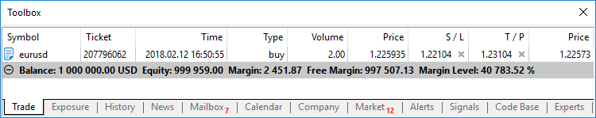
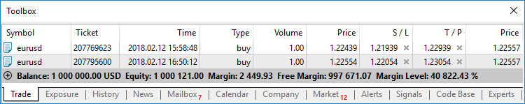

[🏠 Document Start](../README.md) / [Trading Operations](README.md) / Basic Principles

[Previous](README.md) | [Next](Market-Watch.md)

# Basic Principles (#basic-principles)

Before you proceed to study the trade functions of the platform, you should get a clear understanding of the basic terms: order, deal and position.

  * An order is an instruction given to a broker to buy or sell a financial instrument. There are two main [types of orders](Basic-Principles.md): Market and Pending. In addition, there are special [Take Profit (#take-profit)](Basic-Principles.md#take-profit) and [Stop Loss (#stop-loss)](Basic-Principles.md#stop-loss) levels.
  * A deal is a commercial exchange (buying or selling) of a financial security. Buying is executed at the demand price (Ask), and Sell is performed at the supply price (Bid). A deal can be opened as a result of a market order execution or a pending order triggering. Note that in some cases, execution of an order can result in several deals.
  * A position is a trade obligation, i.e. the number of bought or sold contracts of a financial instrument. A long position is financial security bought expecting the security price go higher. A short position is an obligation to supply a security expecting the price will fall in the future.

## Interrelation of orders, deals and positions (#interrelation-of-orders-deals-and-positions)

The platform allows you to easily track how a position was opened or how a deal was performed. Each trading operation has its unique ID called a "ticket". Each order and deal receive a ticket relating to their relevant position. Each deal receives a ticket of an order, by which it was concluded.

If a position was affected by multiple deals, for example in the case of a partial closing or increasing volumes, each of the deals feature the position's ticket. This makes it easy to track the entire history of the position as a whole.

If trading operations are sent to an exchange or a liquidity provider, they additionally feature an ID from an external system. This allows additional tracking of the interrelation of operations away from the platform.

# Types of orders (#types-of-orders)

The Manager terminal allows performing trade operations on any accounts. In addition, the terminal allows you to control and manage the state of open positions. For this purposes, several types of trade orders are used. They are divided into two main types: market and pending. Besides them there are ["Stop Loss" (#stop-loss)](Basic-Principles.md#stop-loss) and ["Take Profit" (#take-profit)](Basic-Principles.md#take-profit) orders.

## Market order (#market-order)

A market order is an instruction to buy or sell a financial instrument. Execution of this order results in committing a deal. A symbol is bought at the Ask price and sold at the Bid price. The price at which the deal is conducted is determined by the [type of execution (#execution-type)](Basic-Principles.md#execution-type) that depends on the symbol type. Generally, a security is bought at the Ask price and sold at the Bid price.

## Pending order (#pending-order)

A pending order is the client's instruction to a brokerage company to buy or sell a security under pre-defined conditions in the future. Types of pending orders:

  * Buy Limit — a trade request to buy at the Ask price that is equal to or less than that specified in the order. The current price level is higher than the value in the order. Usually this order is placed in anticipation of that the security price, having fallen to a certain level, will increase.
  * Buy Stop — a trade order to buy at the "Ask" price equal to or greater than the one specified in the order. The current price level is lower than the value in the order. Usually this order is placed in anticipation of that the security price, having reached a certain level, will keep on increasing.
  * Sell Limit — a trade order to sell at the "Bid" price equal to or greater than the one specified in the order. The current price level is lower than the value in the order. Usually this order is placed in anticipation of that the security price, having increased to a certain level, will fall.
  * Sell Stop — a trade order to sell at the "Bid" price equal to or less than the one specified in the order. The current price level is higher than the value in the order. Usually this order is placed in anticipation of that the security price, having reached a certain level, will keep on falling.
  * Buy Stop Limit — this type combines the two first types being a stop order for placing Buy Limit. As soon as the future Ask price reaches the stop-level indicated in the order (the Price field), a Buy Limit order will be placed at the level, specified in Stop Limit price field. A stop level is set above the current Ask price, while Stop Limit price is set below the stop level.
  * Sell Stop Limit — this type is a stop order for placing Sell Limit. As soon as the future Bid price reaches the stop-level indicated in the order (the Price field), a Sell Limit order will be placed at the level, specified in Stop Limit price field. A stop level is set below the current Bid price, while Stop Limit price is set above the stop level.

  * For symbols with Exchange Stocks, Exchange Futures and Futures Forts [calculation modes (#calculation)](Market-Watch.md#calculation), all types of pending orders trigger according to the Last price (price of a last executed deal). In other words, an order triggers when the Last price touches the price specified in the order. But note that buying or selling as a result of triggering of an order is always performed by the Bid and Ask prices.
  * In the Exchange execution mode, the price specified when placing limit orders is not verified. It can be specified above the current Ask price (for the Buy Limit orders) and below the current Bid price (for the Sell Limit orders). When placing an order with such a price, it triggers almost immediately and turns into a market one. However, unlike market orders where a trader agrees to perform a deal by a non-specified current market price, a pending order will be executed at a price no worse than the one specified.
  * If during pending order activation the corresponding market operation cannot be executed (for example, the free margin on the account is not enough), the pending order will be canceled and moved to history with the Rejected status.

  
---  
  

 |  — current market state |  |  — forecast  
---|---|---|---  
 |  — current price |  |  — order price  
 |  — price a pending order is placed at  
 |  — expected growth |  |  — expected fall  
  

## Take profit (#take-profit)

The take profit order is intended for gaining a profit when a security price has reached a certain level. Execution of this order leads to a complete closure of the position. It is always connected to an open position or a pending order. The order can be placed only together with a market or a pending order. This order condition for long positions is checked using the Bid price (the order is always set above the current Bid price), and the Ask price is used for short positions (the order is always set below the current Ask price).

## Stop loss (#stop-loss)

This order is used for minimizing losses if a security price has started to move in an unprofitable direction. If the price of the instrument reaches this level, the position is fully closed automatically. Such orders are always associated with an open position or a pending order. The order can be placed only together with a market or a pending order. This order condition for long positions is checked using the Bid price (the order is always set below the current Bid price), and the Ask price is used for short positions (the order is always set above the current Ask price).

> If during take profit or stop loss activation the corresponding market operation cannot be executed (for example, it is rejected by the exchange), the order will not be deleted. It will trigger again at the next tick corresponding to the order activation conditions.

### Stop loss and take profit inheritance rules ([netting (#netting)](Basic-Principles.md#netting)): (#stop-loss-and-take-profit-inheritance-rules-nettingbasic-principlesmdnetting)

  * When increasing position volume or reverting the position, Take Profit and Stop Loss levels are placed according to its latest order (market or triggered pending order). In other words, in every new order of the same position stop levels replace the previous ones. If zero values are specified in the order, stop loss and take profit of a position will be deleted.
  * If a position is partially closed, stop loss and take profit are not changed by the new order.
  * If a position is fully closed, stop loss and take profit levels are deleted, because they are associated with an open position and cannot exist without it.
  * If a trade operation is executed for a symbol, for which there is a position, the current stop loss and take profit of the open position are automatically inserted in the order placing window. This is aimed to prevent accidental deletion of current stop orders.
  * During one click trading operation in the client terminal (from a panel on the chart or from the Market Watch) for the symbol, for which there is a position, the current values of stop loss and take profit are not changed.
  * On the OTC markets (Forex, CFD, Futures), when a position is moved to the next trading day (the swap), including through re-opening, the levels of stop loss and take profit remain unchanged.
  * On the exchange market, when a position is moved to the next trading day (the swap), as well as when moved to another account or during delivery, the levels of stop loss and take profit are reset.

### Stop loss and take profit inheritance rule ([hedging (#hedging)](Basic-Principles.md#hedging)): (#stop-loss-and-take-profit-inheritance-rule-hedgingbasic-principlesmdhedging)

  * If a position is partially closed, stop loss and take profit are not changed by the new order.
  * If a position is fully closed, stop loss and take profit levels are deleted, because they are associated with an open position and cannot exist without it.
  * During one click trading operation in the client terminal (from a panel on the chart or Depth of Market), the stop loss and take profit levels are not set.

These rules apply both when trading manually or when placing orders from Expert Advisors (MQL5 programs) in the client terminal.

  * A trailing stop can be used in the client terminal to make a stop loss follow a price automatically.
  * Triggering of a take profit and stop loss leads to a complete closure of a position.
  * For symbols with Exchange Stocks, Exchange Futures and Futures Forts [calculation modes (#calculation)](Market-Watch.md#calculation), stop loss and take profit orders are triggered according to the rules of the exchange where trading is performed. Usually, Last price (price of the last performed transaction) is applied. In other words, a stop order triggers when the Last price touches a specified price. But note that buying or selling as a result of triggering of a stop order is always performed by Bid and Ask prices.

  
---  
  

## Order status (#state)

After an order is formed and sent to the trade server, it may pass the following stages:

  * Started — an order's correctness was checked, but it has not been accepted by the server yet;
  * Placed — a dealer has accepted an order;
  * Partially filled — an order is filled partially;
  * Filled — an entire order is filled;
  * Canceled — an order is canceled by a client;
  * Rejected — an order is rejected by a dealer;
  * Expired — an order is canceled due to its expiration.

You can view the state of orders on the [History](../Clients-and-Trading-Accounts/Account-History.md) tab in the State field. The state of pending orders that have not triggered yet can be viewed on the [Overview (#state)](../Clients-and-Trading-Accounts/Account-Overview.md#state) tab.

## Types of execution (#execution-type)

Three [order (#market-order)](Basic-Principles.md#market-order) execution modes are implemented in the trading platform:

  * Instant Execution  
In this mode, a market order is executed at the price offered by a client. When an execution request is sent, the client terminal automatically inserts current prices in the order. If a dealer/server accepts the prices, the order will be executed. If the requested price is not accepted, the so-called Requote is sent — prices, at which this order can be executed, are returned to the client.
  * Request Execution  
In this mode, a market order is executed at the price previously received from a dealer/server. Before submitting a market, prices of its execution are requested. Upon receiving them, a trader can confirm or reject the execution of the order.
  * Market Execution  
In this mode, a decision on execution is taken by the dealer/server without the additional consent of the trader. The fact that a trader sends a market order in this mode means that the trader agrees to the price, at which it will be executed.
  * Exchange Execution  
In this mode, trade operations conducted from the terminals are sent to an external trading system (exchange). Trade operations are executed at the prices of current market offers.

  * Execution mode for each financial instrument can be [changed (#properties)](../Dealing-and-Risk-Management/Quoting-and-Symbol-Management.md#properties) by a manager provided he or she has appropriate rights.
  * For market orders, placed in the Manager terminal, there is no division into execution modes.

  
---  
  

## Fill policy (#fill-policy)

Besides the general order execution rules that are set in symbol managers, a trader/manager can specify additional conditions in the [Fill Policy (#fill-policy)](Working-with-Trading-Positions.md#fill-policy) field of the order placing window:

  * Fill or Kill  
This fill policy means that an order can be filled only for the specified volume. If the necessary amount of a financial instrument is currently unavailable in the market, the order will not be executed. The required volume can be filled by several offers available in the market at the moment.
  * Immediate or Cancel  
In this case a trader/manager agrees to execute a deal with the volume maximally available in the market within that indicated in the order. If the request cannot be filled completely, an order with the available volume will be executed, and the remaining volume will be canceled. The possibility of using IOC orders should be enabled on the trade server.
  * Book or Cancel (BOC)  
The BOC policy indicates that the order can only be placed in the Depth of Market (order book). If the order can be filled immediately when placed, this order is canceled. This policy guarantees that the price of the placed order will be worse than the current market. BOC is used to implement passive trading: it is guaranteed that the order cannot be executed immediately when placed and thus it does not affect current liquidity. This fill policy is only supported for limit and stop limit orders.
  * Return  
This filling policy is used for market (Buy and Sell), [limit and stop limit orders (#pending-order)](Basic-Principles.md#pending-order). In case of partial filling, an order with remaining volume is not canceled but processed further. For market orders, the Return filling policy is used only in Exchange execution [mode (#execution-type)](Basic-Principles.md#execution-type), while for limit and stop limit orders, it is used in Market and Exchange execution modes.

Use of fill policies depending on the execution type can be shown as the following table:

Type of Execution\Fill Policy | Fill or Kill (FOK) | Immediate or Cancel (IOC) | Book or Cancel (BOC) | Return  
---|---|---|---|---  
Instant Execution | + | — | — | —  
Request Execution | + | — | — | —  
Market Execution | + | + | — | +  
Exchange Execution | + | + | + | +  
  

## Position accounting system (#position-system)

Two position accounting systems are supported in the trading platform: Netting and Hedging. The applied system depends on the [group settings](../Managing-Trade-Server-Settings/Spread-Commission-and-Swap.md):

Different accounting systems are supported only for the OTC market. In the exchange market, a netting system is always used.

### Netting system (#netting)

With this system, you can have only one common position for a symbol at the same time:

  * If there is an open position for a symbol, executing a deal in the same direction increases the volume of this position.
  * If a deal is executed in the opposite direction, the volume of the existing position can be decreased, the position can be closed (when the deal volume is equal to the position volume) or reversed (if the volume of the opposite deal is greater than the current position).

It does not matter, what has caused the opposite deal — an executed market order or a triggered pending order.

The below example shows execution of two EURUSD Buy deals 1 lot each:

### Hedging system (#hedging)

With this system, you can have multiple open positions of one and the same symbol, including opposite positions.

If you have an open position for a symbol, and execute a new deal (or a pending order triggers), a new position is additionally opened. Your current position does not change.

The below example shows execution of two EURUSD Buy deals 1 lot each:

### Impact of the system selected (#impact-of-the-system-selected)

Depending on the position accounting system, some of the platform functions may have different behavior:

  * Rules of [stop loss and take profit inheritance (#sltp-inherit)](Basic-Principles.md#sltp-inherit) also change.
  * To [close a position (#close)](Working-with-Trading-Positions.md#close) in the netting system, you should perform an opposite trading operation for the same symbol and the same volume. To close a position in the hedging system, explicitly select the Close Position command in the context menu of the position.
  * A position cannot be reversed in the hedging system. In this case, the current position is closed and a new one with the remaining volume is opened.
  * In the hedging system, a new condition for margin calculation is available — [Hedged margin (#hedged)](For-Advanced-Users/Margin-Calculation-Retail-Forex-CFD-Futures-—-Hedging.md#hedged).

