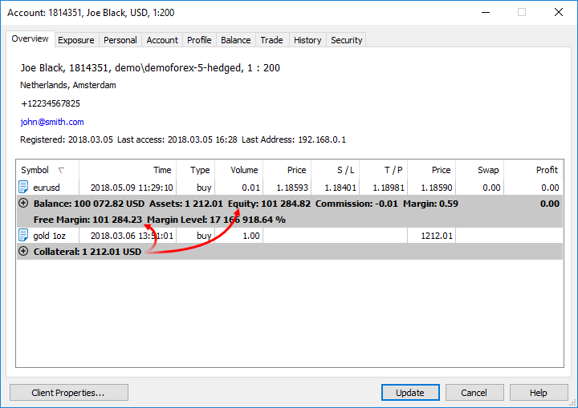

[🏠 Document Start](../../README.md) / [Trading Operations](../README.md) / [For Advanced Users](../For-Advanced-Users.md) / Collateral Symbols

[Previous](Spreads.md) | [Next](../../Corporate-Actions-and-Bulk-Operations/README.md)

# Collateral Symbols

The trading platform supports a special type of non-tradable assets, which can be used as client's assets to provide the required margin for open positions of other instruments. For example, a certain amount of gold in physical form can be available on a trader's account, which can be used as a margin (collateral) for open positions.

These instruments have [Collateral (#calculation)](../Market-Watch.md#calculation) calculation type. They have the following features:

  * Clients cannot perform any operations with them except closing. A position can be opened only by a manager.
  * No profit can be accrued for the positions of these symbols, they have no stop loss or take profit.

Such assets are displayed as open positions. Their value is calculated by the formula: Contract size * Lots * Market Price * Liquidity Rate.

  * Contract size — size of a contract
  * Lots — volume in lots
  * Market Price — current market price of the financial instrument
  * Liquidity Rate here means the share of the asset that a broker allows to use for the margin

The Assets are added to the client's Equity and increase Free Margin, thus increasing the volumes of allowable trade operations on the account.

In the example above, a trader has 1 ounce of gold having the current market value of 1 210.54 USD. This value is added to the equity and the free margin

Collateral symbol settings on the server may allow clients and managers close such positions (Trade = Close only). In this case, a trader is able to convert the asset into the deposit currency at the current market rate and use that money for trading. Closing can be performed only if an asset/deposit currency conversion rate is present.

  * To delete a collateral position without crediting any profit, a manager should close the position at the zero price.
  * To close a position with adding its value to a trader's balance, a manager should close it at the current market price.

  
---
