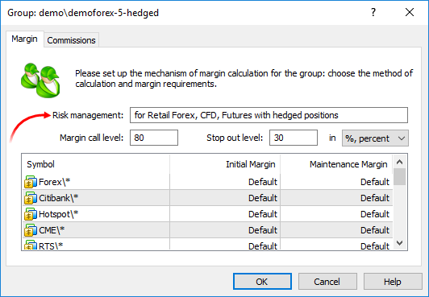
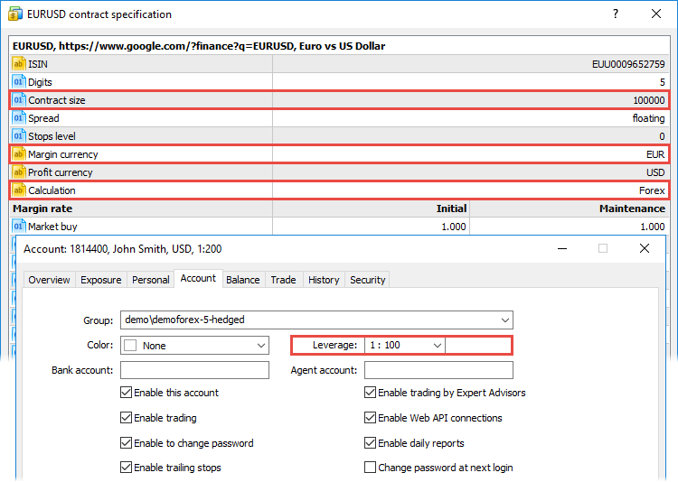
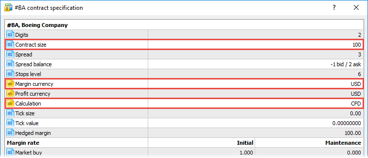
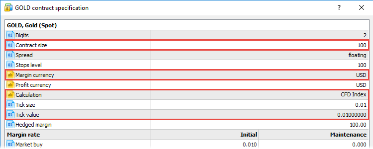
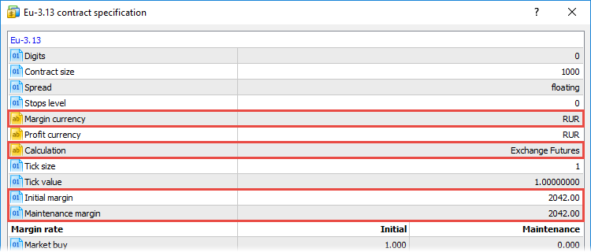
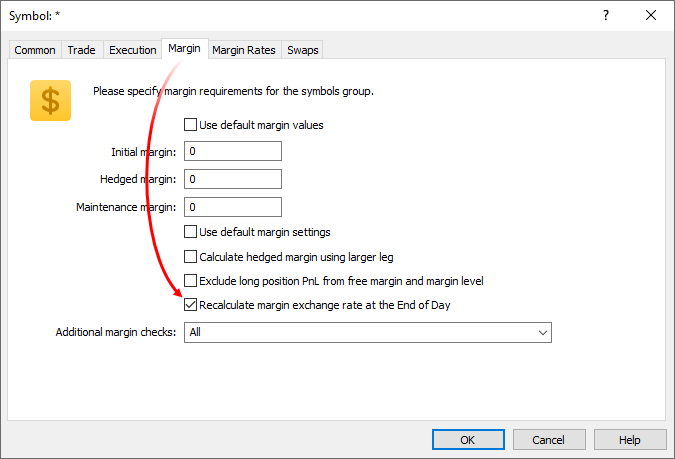

[🏠 Document Start](../../README.md) / [Trading Operations](../README.md) / [For Advanced Users](../For-Advanced-Users.md) / Margin Calculation: Basic

[Previous](../For-Advanced-Users.md) | [Next](Margin-Calculation-Retail-Forex-CFD-Futures-—-Netting.md)

# Basic Margin Calculation (#basic-margin-calculation)

The trading platform provides several margin requirement calculation types depending on the financial instrument. Calculation type is displayed in the "Calculation" field of the [symbol specification (#calculation)](../Market-Watch.md#calculation): Margin calculation formula for each instrument depends on the risk management formulaused for the client group:

  * [for Retail Forex, Futures](Margin-Calculation-Retail-Forex-CFD-Futures-—-Netting.md) — used for the OTC market. Margin calculation is based on the type of instrument.
  * [for Retail Forex, CFD, Futures with hedging](Margin-Calculation-Retail-Forex-CFD-Futures-—-Netting.md) — used for OTC market. Margin calculation is based on the type of instrument, as well as group settings. The [hedging position accounting (#hedging)](../Basic-Principles.md#hedging) is used.
  * [for Stock Exchange, based on margin discount rates](Margin-Calculation-Stock-Exchange.md) — used for the exchange market. Margin calculation is based on the discounts for instruments. Discounts are set by the broker, however they cannot be lower than the exchange set values.

The model is set for each client group on the trading server. To view the model you are using, open the [margin tab](../../Managing-Trade-Server-Settings/Spread-Commission-and-Swap.md) in the group dialog:

The basic calculation is only the first stage in the calculation of the final margin value. The value calculated by formulas is always converted to the deposit currency, after which the margin rate and other parameters are additionally applied. A detailed calculation scheme is provided in separate sections for each risk management system.

> If the [Initial Margin (#specification)](../Market-Watch.md#specification) parameter value is specified in symbol settings, this value will be used. The formulas described in this section will not be applied.

## Forex (#forex)

The margin for Forex market symbols is calculated using the following equation:

All modes: Volume in lots * Contract size / Leverage

For example, let's calculate the margin requirements for buying one lot of EURUSD, while [the size of one contract (#contract-size)](../Market-Watch.md#contract-size) is 100,000 and the leverage is 1:100.

By substituting the appropriate values to the formula, we obtain the following result:

1 * 100000 / 100 = EUR 1000

So, now we have the margin requirements value in base currency (or [margin currency (#margin-currency)](../Market-Watch.md#margin-currency)) of the symbol.

  * Generally, margin requirements currency matches the symbol's base currency. If the margin currency is different, calculation results are displayed in the margin currency rather than the symbol's base currency.

  * In this mode, a client leverage is taken into account even if a [fixed margin (#fixed)](Margin-Calculation-Basic.md#fixed) is set.

  
---  
  

## Forex No Leverage (#noleverage)

This type of calculation is also used for Forex symbols. However, it ignores the client's leverage, in contrast to the previous calculation type:

All modes: Volume in lots * Contract size

For example, let's calculate the margin requirements for buying one lot of EURUSD, while [the size of one contract (#contract-size)](../Market-Watch.md#contract-size) is 100,000 and the leverage is 1:100. After placing the appropriate values to the equation, we will obtain the following result:

1 * 100,000 = EUR 100,000

So, now we have the margin requirements value in base currency (or margin currency) of the symbol.

> Generally, margin requirements currency matches the symbol's base currency. If the margin currency is different, calculation results are displayed in the margin currency rather than the symbol's base currency.

## CFDs (#cfd)

Margin requirements for CFDs are calculated using the following formula:

All modes: Volume in lots * Contract size * Open market price

The current market Ask price is used for buy deals, while the current Bid price is used for sell deals.

For example, let's calculate the margin requirements for buying one lot of oil, with the contract size being 100 barrels, and the current Ask price being USD 80.

By substituting the appropriate values to the formula, we obtain the following result:

1 * 100 * 80 = USD 8,000

So, now we have the margin value in the base currency (or margin currency) of the symbol.

## CFD Leverage (#cfd-leverage)

The leverage is also considered in this type of margin requirement calculation for CFDs:

All modes: Volume in lots * Contract size * Open market price / Leverage

## CFD Index (#cfd-index)

For index CFDs, the margin requirements are calculated according to the following equation:

All modes: Volume in lots * Contract size * Open market price * Tick price / Tick size

In addition to the usual calculation for CFDs, the formula takes into account the tick [price (#tick-price)](../Market-Watch.md#tick-price) to tick [size (#tick-size)](../Market-Watch.md#tick-size) ratio.

## Futures, Exchange Futures (#futures)

There are two types of margin requirements for futures contracts:

  * Initial margin is the amount that must be available on the account at the moment of attempting to enter the market. Further maintenance of the same amount may not be obligatory.
  * Maintenance margin is the minimum amount that must be available on the account for holding a position open.

Both values are specified in the [symbol specification (#initial-margin)](../Market-Watch.md#initial-margin).

The final margin amount depends on the volume:

Volume in lots * Initial margin

Volume in lots * Maintenance margin

The same calculation method is applied for all risk management modes.

> If the amount of the maintenance margin is not specified, the initial margin value will be used instead.

## Exchange Options (#options)

There are two types of margin requirements for futures contracts:

  * Initial margin is the amount that must be available on the account at the moment of attempting to enter the market. Further maintenance of the same amount may not be obligatory.
  * Maintenance margin is the minimum amount that must be available on the account for holding a position open.

Both values are specified in the [symbol specification (#initial-margin)](../Market-Watch.md#initial-margin). The final size of the margin depends on the volume:

Volume in lots * Initial margin

Volume in lots * Maintenance margin

If the amount of the maintenance margin is not specified, the initial margin value will be used instead. If neither the initial nor the maintenance margin is specified, the appropriate value will be calculated according to the following formula:

Volume in lots * Contract size * Open market price

The current market Ask price is used for buy deals, while the current Bid price is used for sell deals.

The same calculation method is applied for all risk management modes.

## Exchange Stocks, Exchange MOEX Stocks (#stocks)

Margin requirements for stocks are calculated using the following formula:

Retail Forex, CFD, Futures: Volume in lots * Contract size * Open market price

Retail Forex, CFD, Futures with hedged position: Volume in lots * Contract size * Open market price

The current market Ask price is used for buy deals, while the current Bid price is used for sell deals.

For example, let's calculate the margin requirements for buying one lot of oil, with the contract size being 100 barrels, and the current Ask price being USD 80. By substituting the appropriate values to the formula, we obtain the following result:

1 * 100 * 80 = USD 8,000

So, now we have the margin value in the base currency (or margin currency) of the symbol.

In the "Stock Exchange, based on margin discount rates" mode, margin for stocks is calculated as an indicative value, for assessing the trading account state relative to available positions. In this case, the margin amount is not blocked on the account and therefore does not reduce available funds. For details, please see the [appropriate section](Margin-Calculation-Stock-Exchange.md).

> The only difference for the Exchange Stocks and Exchange MOEX Stocks modes is the [calculation of the adjusted initial margin (#corrected)](Margin-Calculation-Stock-Exchange.md#corrected) when using the exchange model for risk management.

## Exchange Bonds, Exchange MOEX Bonds (#bonds)

The bond margin is calculated as part of the position value. Bond prices are provided as a face value percentage, so the position value is calculated as follows:

Retail Forex, CFD, Futures: Volume in lots * Contract size * Face value * Open price / 100

Retail Forex, CFD, Futures with hedged position: Volume in lots * Contract size * Face value * Open price / 100

The part of the position value to be reserved for maintenance is determined by [margin ratios (#rate)](Margin-Calculation-Retail-Forex-CFD-Futures-—-Netting.md#rate).

In the "Stock Exchange, based on margin discount rates" mode, bond margin is calculated as an indicative value, for assessing the trading account state relative to available positions. In this case, the margin amount is not blocked on the account and therefore does not reduce available funds. For details, please see the [appropriate section](Margin-Calculation-Stock-Exchange.md).

  * The position value is calculated in the symbol's base currency (not in the profit currency).

  * The only difference for the Exchange Bonds and Exchange MOEX Bonds modes is the [calculation of the adjusted initial margin (#corrected)](Margin-Calculation-Stock-Exchange.md#corrected) when using the exchange model for risk management.

  
---  
  

## Exchange FORTS Futures (#forts)

The margin for the futures contracts of the Moscow Exchange derivative section is calculated separately for each symbol: First, the margin is calculated for the open position and all Buy orders. Then the margin for the same position and all Sell orders is calculated. The calculation is the same in all risk management modes.

MarginBuy = MarginPos + Sum(MarginBuyOrder)

MarginSell = MarginPos + Sum(MarginSellOrder))

The largest one of the calculated values is used as the final margin value for the symbol.

Thus, the same position is used in the calculation of both values. In the first formula (which includes Buy orders), the position margin is calculated as follows:

MarginPos = Volume * (InitialMarginBuy + (Open Price - SettlementPrice) * Tick Price / Tick Size * (1 + 0.01 * Margin Currency Rate))

The volume is used with a positive sign for long positions and with a negative sign for short positions.

In the second formula (which includes Sell orders), the position margin is calculated as follows:

MarginPos = Volume * (InitialMarginSell + (SettlementPrice - Open Price) * Tick Price / Tick Size * (1 + 0.01 * Margin Currency Rate))

The volume is used with a positive sign for short positions and with a negative sign for long positions.

This approach provides the trader a discount on margin, when there is an open position in the opposite direction with respect to the orders placed (the position acts as collateral for orders).

Margin on orders is calculated by the following formulas:

MarginBuyOrder = Volume * (InitialMarginBuy + (Price - SettlementPrice) * Tick price / Tick size * (1 + 0.01 * Margin currency rate))

MarginSellOrder = Volume * (InitialMarginSell + (SettlementPrice - Price) * Tick price / Tick size * (1 + 0.01 * Margin currency rate))

'Price' here depends on the order time and can be equal to:

  * The highest and the lowest contract price of the current session are used for the market or Stop Buy and Sell orders, which have not yet been executed. Since the price is not specified in market orders, the trader is charged the maximum possible margin. Once triggered, stop orders behave similar to market orders.
  * The order price is used for limit orders.
  * The Stop Limit price is used for stop limit orders.

Other parameters in the formulas:

  * InitialMarginBuy — the initial margin for the Buy operation.
  * InitialMarginSell — the initial margin for the Sell operation.
  * Currency margin rate is the rate change radius of the currency, a futures contract is denominated in, relative to the Russian ruble
  * SettlementPrice — the symbol's settlement price for the current session.

All these parameters for calculation are provided by the Moscow Exchange.

> InitialMarginBuy is displayed in the "Initial margin" field, InitialMarginSell is shown in the "Maintenance Margin" field in [contract specification (#specification)](../Market-Watch.md#specification).

Calculation example

The below example shows the calculation of margin requirements for the following trading account state:

  * Position Buy 3.00 Si-6.18 at 73640
  * Order Buy Limit 2.00 Si-6.18 at 73000
  * Order Sell Limit 10.00 Si-6.18 at 74500

Current session parameters

  * Clearing price = 73638
  * InitialMarginBuy = 7665.41
  * InitialMarginSell = 7739.59
  * Tick price = 1
  * Tick size = 1
  * Margin currency rate = 0

We substitute the values ​​in the formulas

MarginBuy = 3 * (7665.41 + (73640 - 73638) * 1/1) + 2 * (7665.41 + (73000-73638) * 1/1) = 37057.05

MarginSell = -3 * (7739.59 + (73638-73640) * 1/1) +10.0 * (7739.59 + (73638-74500) * 1/1) = 45563.13

Margin = Max(37057.05, 45563.13) = 45563.13

The resulting margin for the Si-6.18 symbol is 45563.13.

## Collateral (#collateral)

Non-tradable instruments of this type are used as trader's assets to provide the [required margin for open positions (#collateral)](../../Clients-and-Trading-Accounts/Account-Overview.md#collateral) on other instruments. For these instruments the margin is not calculated.

## Fixed Margin (#fixed)

If a non-zero value is specified in [symbol specification (#initial-margin)](../Market-Watch.md#initial-margin) in the "Initial margin" field, then no calculations by above formulas are performed (except for the calculation of [futures (#futures)](Margin-Calculation-Basic.md#futures), which is not affected). In this case, for all types of calculations (except for Forex and CFD Leverage), the margin is obtained as if "Futures" option is selected:

Volume in lots * Initial margin

Volume in lots * Maintenance margin

For Forex and CFD Leverage calculation types, the leverage is additionally considered:

Volume in lots * Initial margin / Leverage

Volume in lots * Maintenance margin / Leverage

The same calculation method is applied for all risk management modes.

> If the amount of the maintenance margin is not specified, the initial margin value will be used instead.

## End-of-day margin conversion rate recalculation (#recalculate-margin)

This option assists brokers in meeting regulatory requirements (in particular, NFA requirements), which limit the maximum allowed leverage for different symbol types.

In currency pair trading, the margin determined in the symbol's base currency is converted into the account deposit currency. For example, when trading EURUSD with a contract size of 100,000 and a leverage of 1:100, the margin will be EUR 1,000 per lot. If the trader's deposit currency is USD, the margin will be converted from EUR to USD at the current rate. The conversion rate is registered in the position's [Margin rate (#margin-rate)](../Viewing-and-Editing.md#margin-rate) field.

The EURUSD exchange rate will change over time, and the USD equivalent of EUR 1,000 will change accordingly. Thus, the trader's actual leverage may become greater or less than the original one.

To prevent this from happening, the trading platform provides a mechanism for updating margin conversions. It is activated by the new "Recalculate margin exchange rate at the end of day" option in [symbol settings (#recalculate-margin)](../../Managing-Trade-Server-Settings/Margin.md#recalculate-margin).

At the end of the trading day, the server will update the "Margin rate" field in all positions for the instruments with the recalculation enabled. The new value will be calculated using the current market prices for the relevant client groups (similar procedures performed during trade execution).

Please note the following features:

  * The margin rate is not recalculated on the days marked as non-working in the platform (according to the server settings)
  * The margin rate is recalculated after swaps calculations (if no swaps are charged, the rate is recalculated too)
  * If the required price is not available (zero) at the time of recalculation, no recalculation is performed

The recalculation process can be tracked in the trade server log. It will show the following records:

margin rates update started   
...   
margin rates update finished   
---
