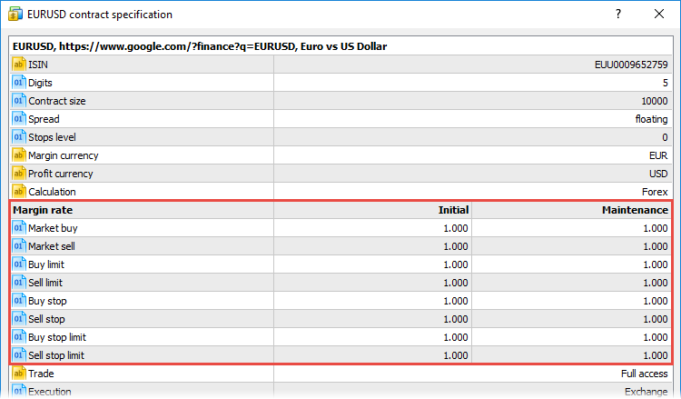

[🏠 Document Start](../../README.md) / [Trading Operations](../README.md) / [For Advanced Users](../For-Advanced-Users.md) / Margin Calculation: Retail Forex, CFD, Futures — Netting

[Previous](Margin-Calculation-Basic.md) | [Next](Margin-Calculation-Retail-Forex-CFD-Futures-—-Hedging.md)

# Retail Forex, CFD, Futures (#retail-forex-cfd-futures)

This margin calculation model is used for Retail Forex, CFD and Futures with the [netting position accounting system (#netting)](../Basic-Principles.md#netting). Unlike to the same model for hedging accounts, [spreads (#spread)](Margin-Calculation-Retail-Forex-CFD-Futures-—-Netting.md#spread) are additionally taken into account in this calculation method.

The first stage in margin calculation is defining if an account has positions or pending orders for the symbol the deal is performed for.

  * If that account has no positions and orders for the symbol, the margin is calculated using the [formulas](Margin-Calculation-Basic.md).
  * If the account has an open position, and a new order of any type with the volume being less or equal to the current position is placed in the opposite direction, the total margin is equal to the current position's one. Example: we have a 1 lot EURUSD Buy position and place an order to Sell 1 lot EURUSD (similarly for Sell Limit, Sell Stop and Sell Stop Limit).
  * If the account has an open position and an order of any type is placed in the same direction, the total margin is equal to the sum of the current position's and placed order's margins.
  * If the account has an open position, and an order of any type with the volume exceeding the current position is placed in the opposite direction, two margin values are calculated - for the current position and for the placed order. The final margin is taken according to the highest of the two calculated values.
  * If the account has two or more oppositely directed market and limit orders, the margin is calculated for each direction (Buy and Sell). The final margin is taken according to the highest of the two calculated values. For all other order types (Stop and Stop Limit), the margin is summed up (charged for each order).

The margin amount is calculated in several stages:

  * Basic calculation for a certain symbol
  * [Conversion of margin currency into deposit currency (#conversion)](Margin-Calculation-Retail-Forex-CFD-Futures-—-Netting.md#conversion)
  * [Multiplication by ratio (#rate)](Margin-Calculation-Retail-Forex-CFD-Futures-—-Netting.md#rate)
  * [Calculations for trading symbols in spread (#spread)](Margin-Calculation-Retail-Forex-CFD-Futures-—-Netting.md#spread)

## Basic Calculation for a Symbol (#main)

[The basic margin value](Margin-Calculation-Basic.md) in accordance with the symbol type is calculated first. The type is specified in the symbol specification as the ["Calculation" (#specification)](../Market-Watch.md#specification) field value.

## Converting into Deposit Currency (#conversion)

This stage is common for all calculation types. Conversion of the margin requirements calculated using one of the methods mentioned above is performed in case their currency is different from the account deposit one.

The current exchange rate of margin currency to deposit currency is used for conversion. The Ask price is used for buy deals, and the Bid price is used for sell deals.

Suppose that the basic size of the margin previously calculated for buying one lot of EURUSD is 1000 EUR. If the account deposit currency is USD, the current Ask price of EURUSD pair is used for conversion. For example, if the current rate is 1.2790, the total margin size is 1279 USD.

The margin to deposit currency conversion rate is shown in the "Margin rate" field in [orders (#order)](../Viewing-and-Editing.md#order) and [positions (#position)](../Viewing-and-Editing.md#position).

## Margin rate (#rate)

The symbol specification allows setting additional multipliers (rates) for the margin requirements depending on the position/order type. A manager having appropriate permissions can manage these rates in [group settings (#margin)](../../Managing-Trade-Server-Settings/Margin.md#margin).

The final size of the margin requirements previously calculated regarding conversion into the deposit currency is additionally multiplied by the appropriate rate. In addition, the rates allow complete disabling of margin for selected types of trading operations. To do this, set the zero margin ratio.

For example, the previously calculated margin for buying one lot of EURUSD is 1279 USD. This sum is additionally multiplied by long margin rate. For example, if it is equal to 1.15, the final margin is 1279 * 1.15 = 1470.85 USD.

## Calculations for Spread Trading (#spread)

The margin can be charged on preferential basis in case trading positions are in spread relative to each other. The spread is defined as the presence of the oppositely directed positions on related symbols. Reduced margin requirements provide traders with wider trading opportunities. Configuration of spreads is described in a [separate section](Spreads.md).

## Application of floating margin rules (#floating-margin)

Additional rates may be applied to the calculated margin value in accordance with the rules configured in the the [Leverages (#leverage)](../../Managing-Trade-Server-Settings/Margin.md#leverage) section.
