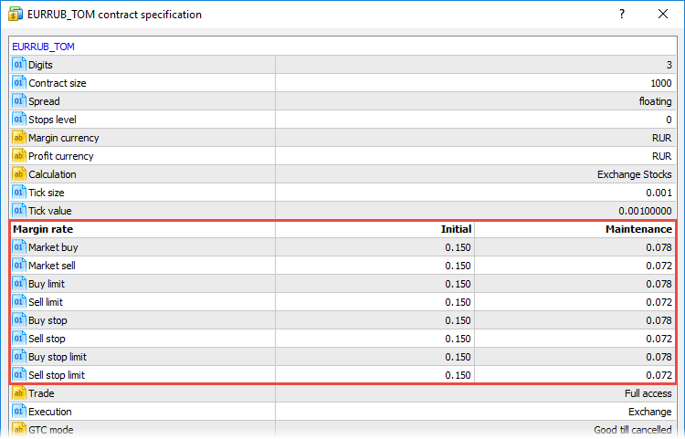

[🏠 Document Start](../../README.md) / [Trading Operations](../README.md) / [For Advanced Users](../For-Advanced-Users.md) / Margin Calculation: Stock Exchange

[Previous](Margin-Calculation-Retail-Forex-CFD-Futures-—-Hedging.md) | [Next](Spreads.md)

# Exchange Risk Management Model (#exchange-risk-management-model)

Exchange risk management model is the calculation of collateral on positions on the basis of symbol discounts which the broker defines based on data provided by the exchange.

## Basic Terminology (#basic-terminology)

### Assets (#assets)

Assets — the current value of purchased financial instruments (of long positions) defined in client's deposit currency. The value is determined dynamically based on the price of the latest deal of the financial instrument, taking into account the liquidity margin rate. In fact, the amount of assets is equivalent to the amount of money that the trader would receive in case of immediate closure of long positions.

Assets = Value1 * L1 + Value2 * L2 + ... + ValueN * LN  
---  
  
Here:

  * Value is the [market value of the position (#value)](Margin-Calculation-Stock-Exchange.md#value). It is determined depending on the financial instrument type.
  * L — the liquidity rate of the instrument.

> Only liquid instruments, i.e. those with the liquidity rate >0, can be used as collateral.

### Liabilities (#liabilities)

Liabilities — obligations on current short positions calculated as the value of these positions at the current market price. In fact, the amount of liabilities is equivalent to the amount of money that the client would pay in case of immediate closure of short positions.

Liabilities = Value1 + Value2 + ... + ValueN  
---  
  
Here Value is the [market value of the position (#value)](Margin-Calculation-Stock-Exchange.md#value). It is determined depending on the financial instrument type.

### Balance (own funds) (#balance-own-funds)

Balance — the client's own funds on the account.

### Equity (portfolio value) (#equity-portfolio-value)

Equity is calculated by the following formula:

Equity = Own Funds + Assets - Liabilities - Commission  
---  
  

### Margin (#margin)

  * Initial margin is the minimum value of trader's own funds with which the trader is allowed to enter the market.
  * Adjusted initial margin is the minimum value of own funds with which a trader is allowed to enter the market, including client's current market positions and limit orders .
  * Maintenance margin is the minimum amount of funds that must be available on the account for maintaining an open position. If the equity level falls below the maintenance margin, the broker starts closing trader's positions. The position closing procedure is determined by the broker's regulations.

### Determining the market value of a position (#value)

For instruments with the Exchange Stocks [calculation type (#specification)](../Market-Watch.md#specification), the market value is determined as follows: 

Volume in lots * Contract size * Open market price

For Exchange Bonds instruments, the position value is calculated using the following formula:

Volume in lots * Contract size * Face value * Market Open price / 100 + AI

Here AI is the accrued interest.

> The market value is calculated in symbol's base currency. If necessary, the resulting value can be converted to the account deposit currency.

## Calculation Features (#calculation-features)

On the spot market, as opposed to the futures and forward markets (where there is only the movement of collateral), payment and receipt of assets (or liabilities in the event of repurchase) occur immediately at the moment of deal conclusion. Accordingly, the transaction value is immediately reflected on the trader's balance.

Since the payment for the instrument purchase or sale is always made in full, the margin is only used as an indication of the trading account state, which determines the possibility of opening new positions or necessity to close out existing positions.

## Margin calculation for Exchange Stocks, Exchange Bonds, Exchange MOEX Stocks and Exchange MOEX Bonds (#margin-calculation-for-exchange-stocks-exchange-bonds-exchange-moex-stocks-and-exchange-moex-bonds)

The margin is the discounted assessment of client's positions:

Margin = Value1 * MarginRate1 + Value2 * MarginRate2 + ... + ValueN * MarginRateN  
---  
  
Here:

  * Value is the [market value of the position (#value)](Margin-Calculation-Stock-Exchange.md#value). It is determined depending on the financial instrument type.
  * MarginRate is the rate of margin or discount of the instrument, for which a position is opened. Individual margin rates can be used for the initial and maintenance margin, as well as for short and long positions.

> If margin rates of an instrument are equal to 0, such an instrument is considered to be non-marginable. For long positions, the charged margin is equal the value of such positions; short positions on non-margin instruments are not allowed.

### Example of Opening a Long Position (#example-of-opening-a-long-position)

Assume initially the trader's balance is 1,000,000 RUR. The initial and maintenance margin rates are equal to 0.1 and 0.05. For simplicity, we do not take into account the commission size.

Trade operations and price fluctuations | Trader's account state  
---|---  
Buying 1000 shares of LKOH 150 RUR each | 

  * Balance: 1,000,000 RUR - 1000 * 150 RUR = 850,000 RUR
  * Assets: 1000 * 150 = 150,000 RUR
  * Liabilities: 0 RUR
  * Equity: 850,000 RUR + 150,000 RUR = 1,000,000 RUR
  * Initial margin: 15,000 RUR
  * Maintenance margin: 7,500 RUR

  
Price drop to 50 RUR per share | 

  * Balance: 850,000 RUR
  * Assets: 1000 * 50 = 50,000 RUR

  * Liabilities: 0 RUR

  * Equity: 850,000 RUR + 50,000 RUR = 900,000 RUR
  * Initial margin: 5,000 RUR
  * Maintenance margin: 2,500 RUR

  
Buying 20,000 shares 50 RUR each | 

  * Balance: 850 000 RUR - 20 000 * 50 RUR = -150 000 RUR (uses borrowed money)
  * Assets: (1,000 + 20,000) * 50 RUR = 1,050,000 RUR

  * Liabilities: 0 RUR

  * Equity: 1,050,000 RUR - 150,000 RUR = 900,000 RUR
  * Initial margin: 105,000 RUR
  * Maintenance margin: 52,500 RUR

  
Price drop to 10 RUR per share | 

  * Balance: -150 000 RUR
  * Assets: 21,000 * 10 RUR = 210,000 RUR

  * Liabilities: 0 RUR

  * Equity: 210,000 RUR - 150,000 RUR = 60,000 RUR
  * Initial margin: 21,000 RUR
  * Maintenance margin: 10,500 RUR

  
Price drop to 7.8 RUR per share | 

  * Balance: -150 000 RUR
  * Assets: 21,000 * 7.8 RUR = 163,800 RUR

  * Liabilities: 0 RUR

  * Equity: 163,800 RUR - 150,000 RUR = 13,800 RUR
  * Initial margin: 16,380 RUR
  * Maintenance margin: 8,190 RUR

Note: equity below the initial margin. A trader cannot open new positions, only close existing ones.  
Price drop to 5 RUR per share | 

  * Balance: -150 000 RUR
  * Assets: 21,000 * 5 RUR = 110,000 RUR

  * Liabilities: 0 RUR

  * Equity: 110,000 RUR - 150,000 RUR = -40,000 RUR
  * Initial margin: 11,000 RUR
  * Maintenance margin: 5,500 RUR

Note: equity below the maintenance margin. Broker forcibly closes the trader's position.  
  

### Example of Opening a Short Position (#example-of-opening-a-short-position)

Assume initially the trader's balance is 1,000,000 RUR. The initial and maintenance margin rates are equal to 0.1 and 0.05. For simplicity, we do not take into account the commission size.

Trade operations and price fluctuations | Trader's account state  
---|---  
Selling 1000 shares of LKOH 150 RUR each | 

  * Balance: 1,000,000 RUR + 1,000 * 150 RUR = 1,150,000 RUR

  * Assets: 0 RUR

  * Liabilities: -1,000 * 150 RUR = -150,000 RUR

  * Equity: 1,150,000 RUR - 150,000 RUR = 1,000,000 RUR

  * Initial margin: 15,000 RUR
  * Maintenance margin: 7,500 RUR

  
Price grows to 300 RUR per share | 

  * Balance: 1,150,000 RUR
  * Assets: 0 RUR

  * Liabilities: -1000 * 300 RUR = -300,000 RUR

  * Equity: 1,150,000 RUR - 300,000 RUR = 850,000 RUR
  * Initial margin: 30,000 RUR
  * Maintenance margin: 15,000 RUR

  
Price grows to 1000 RUR per share | 

  * Balance: 1,150,000 RUR
  * Assets: 0 RUR

  * Liabilities: -1000 * 1000 RUR = -1,000,000 RUR

  * Equity: 1,150,000 RUR - 1,000,000 RUR = 150,000 RUR
  * Initial margin: 100,000 RUR
  * Maintenance margin: 50,000 RUR

  
Price grows to 1100 RUR per share | 

  * Balance: 1,150,000 RUR
  * Assets: 0 RUR

  * Liabilities: -1000 * 1100 RUR = -1,100,000 RUR

  * Equity: 1,150,000 RUR - 1,100,000 RUR = 50,000 RUR
  * Initial margin: 110,000 RUR
  * Maintenance margin: 55,000 RUR

Note: equity below the initial margin. A trader cannot open new positions, only close existing ones.  
Price grows to 1200 RUR per share | 

  * Balance: 1,150,000 RUR
  * Assets: 0 RUR

  * Liabilities: -1000 * 1200 RUR = -1,200,000 RUR

  * Equity: 1,150,000 RUR - 1,200,000 RUR = -50,000 RUR
  * Initial margin: 120,000 RUR
  * Maintenance margin: 60,000 RUR

Note: equity below the maintenance margin. Broker forcibly closes the trader's position.  
  

### Adjusted Initial Margin Calculation for Exchange Stocks and Exchange Bonds (#corrected)

If a trader has limit orders, then the following formula is used for calculating the initial margin when opening a position.

The adjusted margin is always calculated on the larger side — the aggregate amount of Buy or Sell positions and orders.

Corrected Margin = Max(Margin Buy;Margin Sell)  
---  
  
Long side calculation:

Margin Buy = PositionSize * (PriceMarket - PriceMin) + (PositionSize + OrdersBuySize) * PriceMin * MarginRate + (OrdersBuyValue - OrdersBuySize * PriceMin)  
---  
  
Here:

  * PositionSize — position size calculated as the product of the volume in lots and the contract size.
  * PriceMarket — the current market price of the financial instrument (last deal price).
  * PriceMin — the minimum price among all current buy limit orders of the trader.
  * OrdersBuySize — the size of the trader's buy limit orders calculated as the product of the total volume of orders in lots and the contract size.
  * OrdersBuyValue — the value of the buy limit orders if they were executed at the prices specified in them. It is calculated as the sum of the products of order sizes and their limit price.
  * MarginRate — the amount of the symbol discount.

> If the trader's current position is short, and its size is greater than or equal to OrdersBuySize, Margin Buy is not calculated and is considered to be 0.

Short side calculation:

Margin Sell = -PositionSize * (PriceMax - PriceMarket) - (PositionSize - OrdersSellSize) * PriceMax * MarginRate + (OrdersSellSize * PriceMax - OrdersSellValue)  
---  
  
Here:

  * PositionSize — position size calculated as the product of the volume in lots and the contract size.
  * PriceMarket — the current market price of the financial instrument (last deal price).
  * PriceMax — the maximum price among all current sell limit orders of the trader.
  * OrdersSellSize — the size of the trader's sell limit orders calculated as the product of the total volume of orders in lots and the contract size.
  * OrdersSellValue — the value of the sell limit orders if they were executed at the prices specified in them. It is calculated as the sum of the products of order sizes and their limit price.
  * MarginRate — the amount of the symbol discount.

> If the trader's current position is long, and its size is greater than or equal to OrdersSellSize, Margin Buy is not calculated and is considered to be 0.

Consider the following example. The trader has:

  * Position Buy 1 lot LKOH, contract size is 1000 shares, the current price is 100 RUR, initial margin rate is 0.1
  * Order Buy Limit 0.5 lot LKOH (500 shares), order price is 80 RUR
  * Order Buy Limit 0.3 lot LKOH (300 shares), order price is 60 RUR
  * Order Buy Limit 0.1 lot LKOH (100 shares), order price is 40 RUR

Calculations:

PriceMin = 40   
Price Market = 100   
OrdersBuySize = 500 + 300 + 100 = 900   
OrdersBuyValue = 500 * 80 + 300 * 60 + 100 * 40 = 62 000   
Margin Buy = 1000 * (100 - 40) + (1000 + 900) * 40 * 0.1 + (62 000 - 900 * 40) = 87 900  
---  
  
The total amount of the adjusted initial margin is equal to 87,900.

### Adjusted initial margin calculation for Exchange MOEX Stocks and Exchange MOEX Bonds (#corrected-moex)

> The Exchange MOEX Stocks and Exchange MOEX Bonds calculation modes are only used for the financial instruments which are traded on Moscow Exchange. The adjusted margin calculation rules applied in these modes are valid on Moscow Exchange since 01.07.2019.

If a client has limit orders, then the below formulas are used for calculating the initial margin when opening a position.

The adjusted margin is always calculated on the larger side, i.e. the aggregate amount of Buy or Sell positions and orders.

Corrected Margin = Max(Margin Buy;Margin Sell)  
---  
  
Long side calculation:

Margin Buy = (PositionSize + OrdersBuySize) * PriceMarket * MarginRate  
---  
  
Here:

  * PositionSize — position size calculated as the product of the volume in lots and the contract size.
  * PriceMarket — the current market price of the financial instrument (last deal price).
  * OrdersBuySize — the size of the client's buy limit orders calculated as the product of the total volume of orders in lots and the contract size.
  * MarginRate — the amount of the symbol discount.

> If the current position of a client is short and its size is greater than or equal to OrdersBuySize, then Margin Buy is not calculated and is considered 0.

Short side calculation:

Margin Sell = (-PositionSize + OrdersSellSize) * PriceMarket * MarginRate  
---  
  
Here:

  * PositionSize — position size calculated as the product of the volume in lots and the contract size.
  * PriceMarket — the current market price of the financial instrument (last deal price).
  * OrdersSellSize — the size of the client's sell limit orders calculated as the product of the total volume of orders in lots and the contract size.
  * MarginRate — the amount of the symbol discount.

> If the current position of a client is long and its size is greater than or equal to OrdersSellSize, then Margin Sell is not calculated and is considered 0.

Consider the following example. The client has:

  * Position Buy 1 lot LKOH, contract size is 1000 shares, the current price is 100 RUR, initial margin rate is 0.1
  * Order Buy Limit 0.5 lot LKOH (500 shares), order price is 80 RUR
  * Order Buy Limit 0.3 lot LKOH (300 shares), order price is 60 RUR
  * Order Buy Limit 0.1 lot LKOH (100 shares), order price is 40 RUR

Calculations:

Price Market = 100   
OrdersBuySize = 500 + 300 + 100 = 900   
Margin Buy = (1000 + 900) * 100 * 0.1 = 19,000  
---  
  
The total amount of the adjusted initial margin is equal to 19,000.

### Adjusted margin calculation for non-marginal instruments (#unmargined)

A financial instrument is considered non-marginal if [zero margins (#margin-rate)](../../Managing-Trade-Server-Settings/Margin.md#margin-rate) are specified for this instrument. Thus, no margin is charged for the positions of such instruments, while the trader pays full collateral when opening such positions. Accordingly, the calculation of initial margin when a position for a non-marginal instrument is opened is actually involves the check of whether the trader has enough money to buy the asset (short positions for non-marginal instruments are usually prohibited).

Margin Buy = OrderBuySize * PriceAsk   
Margin Sell = (- PositionSize + OrderSellSize) * PriceMarket  
---  
  
Here:

  * PositionSize — position size calculated as the product of the volume in lots and the contract size.
  * OrdersBuySize — the size of the client's buy limit orders calculated as the product of the total volume of orders in lots and the contract size.
  * OrdersSellSize — the size of the client's sell limit orders calculated as the product of the total volume of orders in lots and the contract size.
  * PriceMarket — the current market price of the financial instrument (last deal price).
  * PriceAsk — the current Ask price of the instrument.

Note that the current Ask (not Last) price is used in the long position margin calculation formula. Non-marginal instruments are usually low-liquid. Accordingly, deals with such instruments are rare and thus the last deal price may differ significantly from the current market price. Therefore, the current Ask price is used for the correct estimation of the asset value.

> This calculation is used for non-marginal instruments with type Exchange Stocks, Exchange Bonds, Exchange MOEX Stocks and Exchange MOEX Bonds.

## Margin calculation for other types of instruments (#margin-calculation-for-other-types-of-instruments)

For all financial instruments except Exchange Stocks and Exchange Bonds, margin is calculated similar to [Retail Forex, CFD, Futures for netting](Margin-Calculation-Retail-Forex-CFD-Futures-—-Netting.md). However, this calculated margin value is not recorded in a separate field of the account state, but increases the client's liabilities. The margin amount is actually blocked in the trader's account as collateral. Floating profit from positions is included in the account equity (and thus it affects the free margin amount).

Unlike the Retail mode, the exchange system does not take into account whether positions are [in spread (#spread)](Margin-Calculation-Retail-Forex-CFD-Futures-—-Netting.md#spread). 

For example, there is an open position: Buy EURUSD 1.00 lot at 1.16135. Forex calculation type is used for the instrument, and its contract size is 100,000. The account deposit is USD, the leverage is 1:200.

  * Calculate the margin using the [Forex formula](Margin-Calculation-Basic.md): 1 * 100 000 / 200 = 500 EUR
  * Convert the margin from EUR to USD at the price as of the deal time: 500 * 1.16135 = 580.68 USD

The resulting value is not recorded to the Margin field, but is written to the Trading Account Liabilities field instead.
