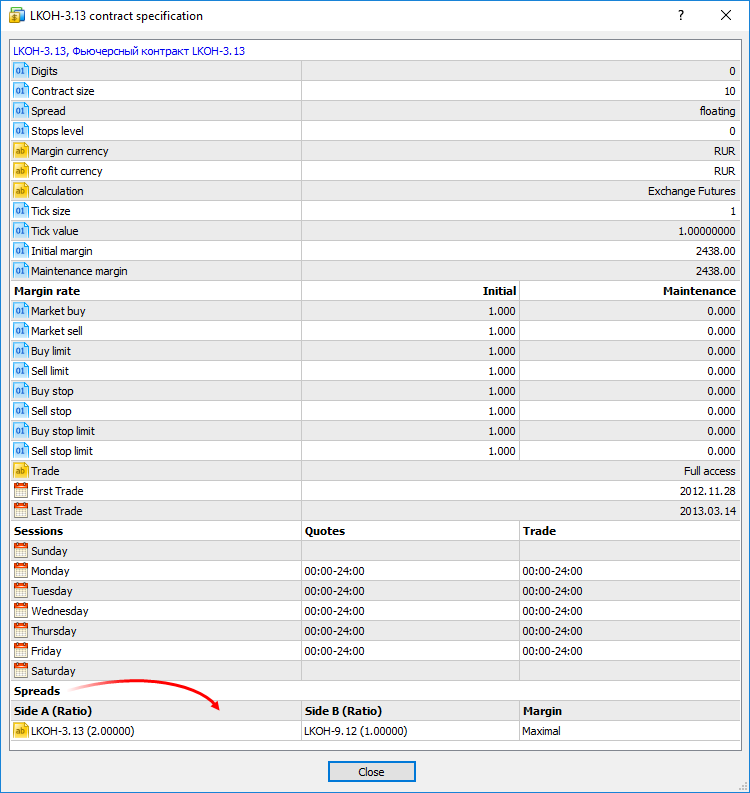
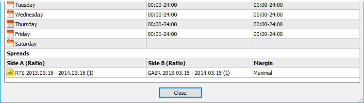
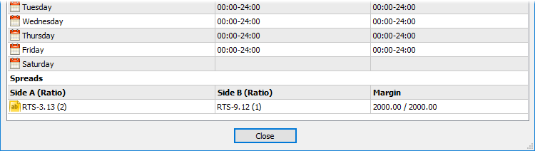
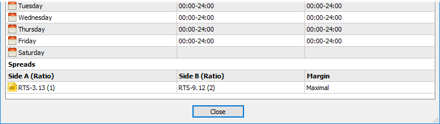
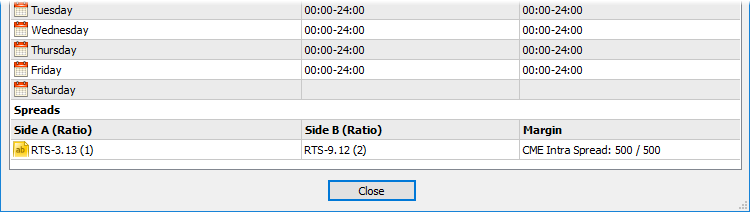

[🏠 Document Start](../../README.md) / [Trading Operations](../README.md) / [For Advanced Users](../For-Advanced-Users.md) / Spreads

[Previous](Margin-Calculation-Stock-Exchange.md) | [Next](Collateral-Symbols.md)

# Spreads

The margin can be charged on preferential basis in case trading positions are in spread relative to each other. The spread trading is defined as the presence of the oppositely directed positions of correlated symbols. Reduced margin requirements provide more trading opportunities for traders.

All possible options of entering the spread are specified at the bottom of the [symbol specification window (#spreads)](../Market-Watch.md#spreads):

## Spread legs

The spread has two legs - A and B. The legs are the oppositely directed positions in a spread - buy or sell. The leg type is not connected with some definite position direction (buy or sell). It is important that trader's positions at all leg's symbols are either long or short.

Several symbols with their own volume rates can be set for each spread leg. These rates are shown in parentheses, for example, LKOH-3.13 (1). For example:

  * leg A consists of GAZR-9.12 and GAZR-3.13 symbols having the ratios of 1 and 2 respectively;
  * leg B consists of GAZR-6.13 having the ratio of 1.

To keep positions in the spread, a trader should open positions of 1 and 2 lots for GAZR-9.12 and GAZR-3.13 respectively in one direction and a position of 1 lot for GAZR-6.13 in another.

Trading instruments for the leg can be specified both as a certain symbol, and an underlying asset, for example, if there are quite a lot of symbols in spread.

If an underlying asset is specified for the spread leg, all symbols with that asset are considered in the spread. Besides, the symbols are additionally filtered by their lifetime (specified next to an underlying asset's name).

## Margin calculation type

Margin charge type by spread is specified in Margin column.

### Value

Specific values ​​mean charging a fixed margin for a spread in a specified volume. The first value specifies the volume of the initial margin, while the second one specifies the volume of the maintenance one.

Example:

  * initial and maintenance margins are set to 2000;
  * the spread contains two symbols — RTS-3.13 with the ratio of 2 and RTS-9.12 with the ratio of 1;

If the client has oppositely directed positions at RTS-9.12 and RTS-3.13 with the volume of 1 and 2 lot respectively, the margin of 2000 units is charged. In case the volumes are equal to 2 and 4 lots, the margin of 4000 units is charged.

### Maximal

In this mode, the values of initial and maintenance margins will be calculated for each spread leg. The calculation is performed by summing up the margin requirements for all leg symbols. The margin requirements of the leg having a greater value will be used for the spread.

> In this mode, the total volume of positions on each side is considered, not only covered volume. Ratio for symbols in the spread legs is not considered in this mode.

Example:

  * the spread contains the symbol RTS-9.12 and RTS-3.13;
  * for RTS-9.12, the initial and maintenance margins are equal to 2000;
  * for RTS-3.13, the initial and maintenance margins are equal to 2100.

If the client has oppositely directed positions at RTS-9.12 and RTS-3.13 with the volume of 2 and 1 lot respectively, the margin of 4000 units is charged.

### CME Inter Spread

In this mode, rates (in percentage value) for the margin are specified: the first one is for the initial margin, while the second is for the maintenance one. The total margin value will be defined by summing up the margin requirements for all symbols of the spread and multiplying the total value by the specified rate.

Example:

  * the spread contains the symbol RTS-3.13 (leg A with the ratio of 1) and RTS-9.12 (leg B with the ratio of 2);
  * for RTS-9.12, the initial and maintenance margins are equal to 2000;
  * for RTS-3.13, the initial and maintenance margins are equal to 2100;
  * rates of 50% are set in Margin field for the initial and maintenance margins.

The final value of the initial and maintenance margins is calculated the following way: (2000 * 2 + 2100) * 0.5 = 3050.

### CME Intra Spread

In this mode, two values for margin increase are specified: the first value is for the initial margin, while the second is for the maintenance one. During the calculation, the difference between the total margin of A leg symbols and the total margin of B leg symbols is calculated (the difference in absolute magnitude is used, so that it does not matter what leg is a deductible one). According to the type of the calculated margin, the first (for the initial margin) or the second (for the maintenance one) value is added to the obtained difference.

Example:

  * the spread contains the symbol RTS-3.13 (leg A with the ratio of 1) and RTS-9.12 (leg B with the ratio of 2);
  * for RTS-9.12, the initial and maintenance margins are equal to 2000;
  * for RTS-3.13, the initial and maintenance margins are equal to 2100;
  * the values of 500 are set in Margin field for the initial and maintenance margins.

The maintenance and initial margins are calculated the following way: (2000 * 2 - 2100) + 500 = 2400.

  * The specified margin is charged per spread unit - for the specified combination of positions. If any part of the position does not fit into the spread, it will be charged an additional margin according to the [symbol settings](Margin-Calculation-Retail-Forex-CFD-Futures-—-Netting.md). If the client's current positions have the volume the specified combination fits in several times, the charged margin is increased appropriately. For example, suppose that A and B symbols with the ratios of 1 and 2 are in spread. If a client has positions for these symbols with the volumes of 3 and 4 respectively, the total margin size is equal to the doubled value from the spread settings (two spreads: 1 lot of A and 2 lots of B, 1 lot of A and 2 lots of B) plus the margin for the single remaining A symbol lot.
  * The values are specified in the margin currency (except for CME Inter Spread where rates are set). It is assumed that the margin currency of all symbols is the same.

  
---
