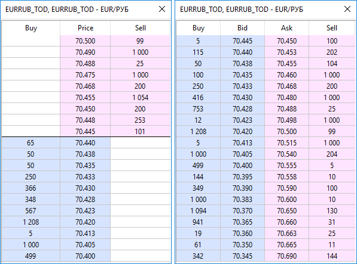

[🏠 Document Start](../README.md) / [Trading Operations](README.md) / Market Depth

[Previous](Market-Watch.md) | [Next](Economic-Calendar.md)

# Market Depth

The Depth of Market displays buy and sell offers for a particular instrument at the best prices (closest to the market) at the moment. To open the depth of market of a financial instruments, select " Depth of Market" in the context menu of the [Market Watch](Market-Watch.md) window.

Depth of Market (DOM) is only available for the symbols traded in the [exchange execution (#execution-type)](Basic-Principles.md#execution-type) mode.

> The number of bids and offers displayed in the DOM is determined by the symbol parameters on the trading server.

The context menu allows you to switch between the request display modes:

  * Standard mode — volumes of buy and sell requests are displayed in separate columns (sell orders — at the top, buy orders — at the bottom).
  * One column mode — volumes of buy and sell requests are displayed in a single column (sell orders — at the top, buy orders — at the bottom).
  * Horizontal mode — buy and sell requests are displayed in the parallel columns.

Also, the context menu allows you to switch volume display modes: lots and units.
