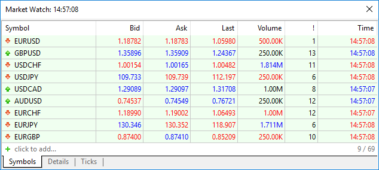
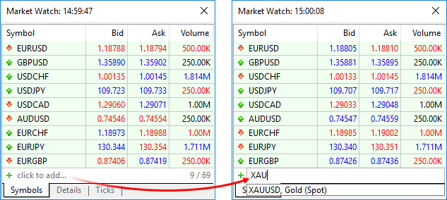
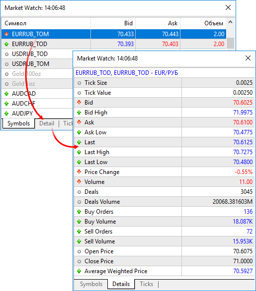
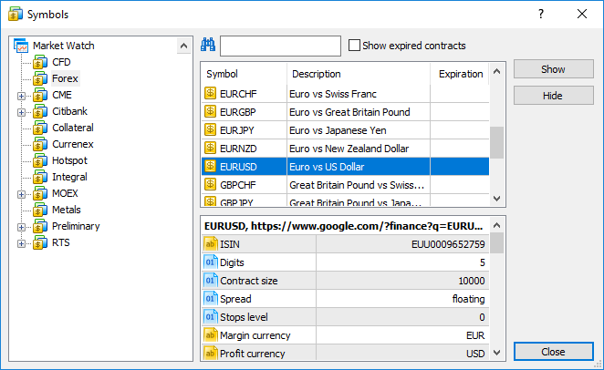
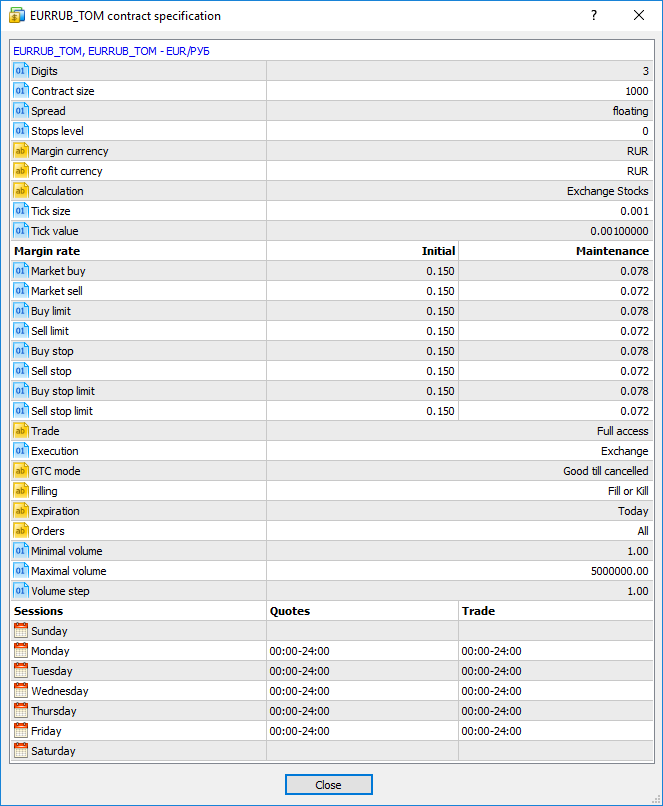
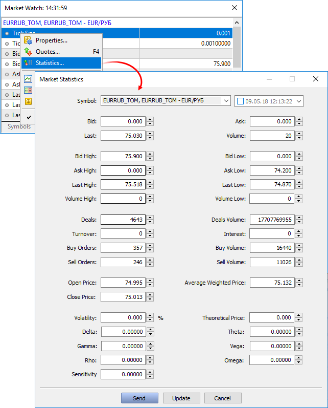
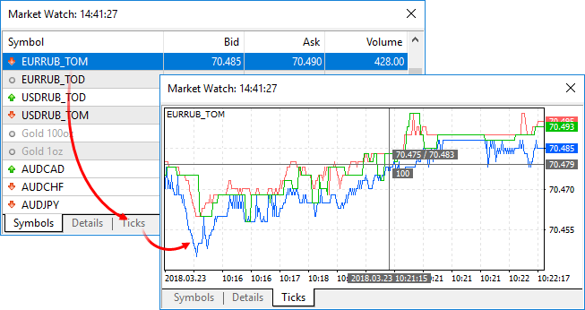

[🏠 Document Start](../README.md) / [Trading Operations](README.md) / Market Watch

[Previous](Basic-Principles.md) | [Next](Market-Depth.md)

# Market Watch (#market-watch)

The Market Watch window provides an overview of price data of financial instruments: quotes, price statistics and tick chart. Here you can also view contract specifications, change symbol settings and throw in quotes if you have the appropriate rights. To open this window, click  Market Watch in the [View (#view)](../User-Interface/Main-Menu.md#view) menu.

## Viewing quotes of financial instruments (#symbols)

The Market Watch features real-time quotes of financial instruments and other price data: spread, volume, etc.

Financial symbol name

Bid price

Ask price

Last price

Volume of the last executed deal

Spread — the difference between the Bid and Ask prices

Time of the last quote

The displayed data can be configured in the context menu. For example, you can show the Source field — provider of the financial instrument liquidity. Also, managers can enable the display of "raw" quotes. These quotes do not consider price spreading settings of the group the manager's account belongs to. To do this, select " Show Raw Quotes". This option appears only if the "Show row quotes without spread difference" permission is given to the manager account (granted by the platform administrator).

[When receiving trade requests](../Dealing-and-Risk-Management/Dealing.md), if you enable "Track requests" option in the context menu, the Market Watch window is automatically switched to a tick chart of a symbol the request has arrived for.

A double click on one of symbols will open a window for [throwing in quotes (#quotes)](../Dealing-and-Risk-Management/Quoting-and-Symbol-Management.md#quotes). A symbol chart can be opened by dragging it to the chart viewing area using a mouse (Drag'n'Drop); in this case, windows of currently open charts will be closed. If you hold down Ctrl while dragging, the chart is opened in a separate [tab](../User-Interface/README.md), and other charts remain open.

  * You cannot hide financial symbols having [open positions](Working-with-Trading-Positions.md) or [pending orders](Working-with-Trading-Orders.md), as well as symbols used for profit re-calculation, from the Market Watch window.
  * In the High and Low columns of symbols whose charts are built at Bid prices, the Bid High and Bid Low prices are displayed. If a symbol chart is constructed using Last prices, Last High and Last Low prices are shown for this symbol. If Market Watch contains at least one symbol whose chart is drawn based on Last prices, the Last column is automatically enabled in addition to High/Low.

  
---  
  
Prices in the Market Watch window have different colors:

  * Blue — the current price is higher than the previous one;
  * Red — the current price is lower than the previous one;
  * Gray — the price has not changed for the last 15 seconds.

If the [depth of market](Market-Depth.md) and the Last trade price are available for a symbol, the color is determined by the Last price. Otherwise, the color is determined by the Bid price.

The individual background coloring for symbols can also be configured on the server. This enables their visual distinguishing by types, exchange and other properties. If you do not want to use the specified coloring, enable the "Use system colors" option in the context menu.

### Fast adding of symbols (#fast-adding-of-symbols)

To quickly add a symbol in the Market Watch, click + below the list and enter the name of the symbol. While you type in the name, the list of suitable symbols is shown.

Information about the current number of symbols in the Market Watch and the total number of available symbols is available at the bottom of the list.

## Viewing trade statistics of financial instruments (#details)

To view statistics, select a financial instrument in the Symbols tab and click Details.

The statistical information includes:

  * Bid — bid price.
  * B. High — Bid High, the highest bid price for the current day.
  * B. Low — Bid Low, the lowest bid price for the current day.
  * Ask — ask price.
  * A. High — Ask High, the highest ask price for the current day.
  * A. Low — Ask Low, the lowest ask price for the current day.
  * Last — last price, at which a deal was executed.
  * L. High — Last High, the highest price, at which a deal was executed for during the current day.
  * L. Low — Last Low, the lowest price, at which a deal was executed for during the current day.
  * Volume — volume of the last executed deal.
  * V. High — Volume High, the highest deal volume for the current day.
  * V. Low — Volume Low, the lowest deal volume for the current day.
  * Deals — total number of deals executed during the current session;
  * Deals Volume — total volume of deals executed during the current session;
  * Turnover — money turnover for a symbol for the current session;
  * Open Interest — total volume of effective contracts (futures, options) which have been settled yet;
  * Buy Orders — total number of buy requests;
  * Buy volume — total volume of buy orders;
  * Sell Orders — total number of sell requests;
  * Sell Volume — total volume of sell orders;
  * Open Price — open price of the last (recent) session;
  * Close Price — close price of the last (recent) session;
  * Average Weighted Price — weighted average price for a session;
  * Settlement Price — settlement (clearing) price of the previous session;
  * Price Change — indicates the difference between the last price of the instrument and the close price of the last session in percentage terms. The calculation formula depends on the symbol charting mode:  
  
By Last prices: ((Last - Last price at session close)/Last price at session close)*100  
By Bid prices: ((Bid - Bid price at session close)/Bid price at session close)*100.  
  
For futures symbols, the clearing price is used instead of the the session close price, if the clearing price is provided by the broker (non-zero):  
  
By Last prices: ((Last - Clearing price)/Clearing price)*100  
By Bid prices: ((Bid - Clearing price)/Clearing price)*100.  

  * Delta — option delta. [The Greeks (#greeks)](https://www.metatrader5.com/en/terminal/help/trading/options_board#greeks), which include Delta, Theta, Gamma, Vega, Po and Omega, are quantities representing the sensitivity of the option price to changes in various parameters: strike prices, volatility, etc.
  * Theta — option theta.
  * Gamma — option gamma.
  * Vega — option vega.
  * Rho — option rho.
  * Omega — option omega.
  * Sensitivity — option sensitivity. It shows by how many points the price of the option's underlying asset should change so that the price of the option changes by one point.

## Managing symbols (#manage)

You can show and hide symbols in the Market Watch window, as well as view their properties. To do this, click  Symbols in the Market Watch window context menu.

All symbols available in the terminal are displayed here. A double click on a symbol name is used for hiding or showing it in the Market Watch window. The same actions can be performed by selecting it and clicking Show or Hide.

> You cannot hide financial symbols having [open positions](Working-with-Trading-Positions.md) or [pending orders](Working-with-Trading-Orders.md), as well as symbols used for profit re-calculation, from the Market Watch window.

Specification of a selected symbol is displayed at the bottom of the window.

To quickly find a symbol, use the filter in the upper part of the window. Type the first letters of the symbol name or description in it. A list of symbols corresponding to the search string appears below.

All expired symbols are hidden to preserve a more compact display. This is particularly convenient when working on the futures market. A non-relevant symbol is the expired one, which is defined by the "Last trade" parameter. This date is specified in the Expiration column of the list of symbols. To view all symbols, click "Show expired contracts".

## Viewing symbol specification (#specification)

The symbol contract specification window contains the terms of a symbol trading. To see the symbol specification, click " Specification" in the context menu of the Market Watch window.

The following set of parameters is specified here:

  * Symbol name and description — name of a symbol and its short description. This parameter can be a link to a website containing symbol information. A pop-up tip with the link address appears when you hover the mouse over it.
  * Spread — spread in points. If the spread is floating, then the appropriate record is specified in this point (floating). 
  * Digits — number of decimal places in the price of the symbol.
  * Stops level — channel of prices (in points) from the current price, inside which one cannot place [stop loss (#stop-loss)](Basic-Principles.md#stop-loss), [take profit (#take-profit)](Basic-Principles.md#take-profit) and pending orders. If you try to place an order inside the channel, the server will return Invalid Stops and will not accept the order.
  * Contract size — number of units of the commodity, currency or financial asset in one lot.
  * Margin currency — currency, in which the margin requirements are calculated.
  * Profit currency — currency, in which the profit of the symbol trading is calculated.
  * Calculation — method of profit and [margin](For-Advanced-Users/Margin-Calculation-Basic.md) calculation: Forex, Forex No Leverage, CFD, CFD Leverage, CFD Index, Futures, Exchange Futures, Exchange Stocks, Exchange MOEX Stocks, Exchange Bonds, Exchange MOEX Bonds, FORTS Futures, Collateral.
  * Chart mode — symbol chart (bar) construction mode: by last deal prices (Last) or by Bid prices. The first option is usually used for exchange instruments.
  * Tick size — minimum price change step.
  * Tick value — cost of a single price change point.
  * Initial margin — security deposit (margin) provided for a fixed-term contract to perform a one-lot deal. If the initial margin value is specified for the symbol, this is the value that is used. [Margin (#fixed)](For-Advanced-Users/Margin-Calculation-Basic.md#fixed) calculation equations are not applied to the appropriate calculation type.
  * Maintenance margin — minimum security deposit (margin) a trader should have on his or her account to maintain a one-lot position.
  * Hedged margin — margin charged per one lot of [hedged (#hedged)](For-Advanced-Users/Margin-Calculation-Retail-Forex-CFD-Futures-—-Hedging.md#hedged) positions. Margin calculation mode using the larger leg for hedged positions can also be specified here.
  * Margin rate — margin rates for various order types are specified in this table. The rates are set for the initial and maintenance margin individually. If no ratio is set for the maintenance margin (set to zero), the initial margin ratio will be used for it.
    * Market Buy Order — multiplier for calculating margin requirements for long positions relative to the [basic margin amount](For-Advanced-Users/Margin-Calculation-Basic.md).
    * Market Sell Order — multiplier for calculating margin requirements for short positions relative to the main amount of margin.
    * Buy limit — multiplier for calculating margin requirements for Buy Limit orders relative to the main amount of margin.
    * Sell limit — multiplier for calculating margin requirements for Sell Limit orders relative to the main amount of margin.
    * Buy stop — multiplier for calculating margin requirements for Buy Stop orders relative to the main amount of margin.
    * Sell stop — multiplier for calculating margin requirements for Sell Stop orders relative to the basic margin amount.
    * Buy stop limit — multiplier for calculating margin requirements for Buy Stop Limit orders relative to the main amount of margin.
    * Sell stop limit — multiplier for calculating margin requirements for Sell Stop Limit orders relative to the main amount of margin.
  * Trade — symbol trading mode (full access, long only, short only, close only). Also, trading can be completely prohibited.
  * Execution — [execution mode (#execution-type)](Basic-Principles.md#execution-type): Instant, Request, Market, Exchange.
  * Type of orders — types of orders placed: 
    * Good till today including SL/TP — orders that are valid only during one trading day. With the end of the day, all of the stop loss and take profit levels, as well as pending orders are deleted.
    * Good till canceled — pending orders are preserved as a trade day changes.
    * Good till today excluding SL/TP — only pending orders are deleted at the end of a trading day, while [stop loss (#stop-loss)](Basic-Principles.md#stop-loss) and [take profit (#take-profit)](Basic-Principles.md#take-profit) levels are preserved.
  * Filling — available order [fill policies (#fill-policy)](Basic-Principles.md#fill-policy): Fill or Kill, Immediate or Cancel, Book or Cancel, Return.
  * Expiration — available [types of expiration (#expiration)](Working-with-Trading-Orders.md#expiration) of pending orders:
    * Good till Canceled — order lifetime is unlimited.
    * Intraday — orders are canceled at the end of the current trading.
    * Specified time — order is canceled in a user-specified time.
    * Date — order is canceled at the end of a day specified by a user.
  * Orders— allowed [order types](Basic-Principles.md): market, limit, stop, stop-limit, stop loss and take profit.
  * Minimal volume — minimal volume of a deal for a symbol.
  * Maximal volume — maximal volume of a deal for a symbol.
  * Volume step — step of volume changes.
  * Swap type — type of swap calculation:
    * In points — specified number of points of a security price.
    * In the base currency — specified amount in a base currency of a symbol.
    * In the margin currency — specified amount in a symbol margin currency;
    * In the deposit currency — specified amount in a deposit currency.
    * As a percentage of current price — specified percentage of a symbol price at the time of calculation of the swap.
    * As a percentage of the open price — specified percentage of a position open price;
    * In points, re-open at Close price — at the end of the trading day, a position is closed. The next day, the position is re-opened at the Close price +/- the specified number of points.
    * In points, re-open at the Bid price — at the end of the trading day, a position is closed. The next day, the position is re-opened at the Bid price +/- the specified number of points.
  * Swap long — swap for Buy positions.
  * Swap short — swap for Sell positions.
  * 3-days swap — day of the week when a triple swap is charged.
  * Category — the property is used for additional marking of financial instruments. For example, this can be the market sector to which the symbol belongs: Agriculture, Oil & Gas and others.
  * Exchange — the name of the exchange in which the security is traded.
  * CFI — instrument classification in accordance with the [ISO 10962](https://www.iso.org/standard/44799.html) standard.
  * Sector — economic sector the instrument belongs to, such as energy, finance, healthcare and others.
  * Industry — industry branch the instrument belongs to, such as sportswear and accessories, car manufacturing, restaurant business and others.
  * Country — country of the company whose shares are traded on the stock exchange.
  * Option type — call or put.
  * Underlying — the underlying symbol of the option.
  * Strike price — option strike price.

### Commission (#commission)

Information on [commissions (#commission)](../Managing-Trade-Server-Settings/Spread-Commission-and-Swap.md#commission) charged by a broker for the symbol deals. Calculation details are displayed here:

  * Commission may be single-level and multilevel, i.e. be equal regardless of the deal volume/turnover or can depend on their size. Appropriate data is displayed in the terminal.
  * Commission can be charged immediately upon deal execution or at the end of a trading day/month.
  * Commission can be charged depending on deal direction: entry, exit or both operation types.
  * Commission can be charged per lot or deal.
  * Commission can be calculated in money, percentage or points.

For example, the following entry means that a commission is charged immediately upon deal entry and exit. If the deal volume is from 0 to 10 lots, a commission of 1.2 USD is charged per operation. If the deal volume is 11 to 20 lots, a commission of 1.1 USD is charged per each lot of the deal.

Commission | Instant, volume, entry/exit deals   
0 - 10 | 1.2 USD per deal   
11 - 20 | 1.1 USD per loat  
---  
  

### Sessions (#sessions)

The lower part shows information about quoting and trading sessions of the symbol. Sessions are specified for every day of a week.

### Spreads (#spreads)

The margin can be charged on preferential basis in case trading positions are in spread relative to each other. The spread trading is defined as the presence of the oppositely directed positions of correlated symbols. Reduced margin requirements provide more trading opportunities for traders.

More detailed information on spread can be found in the [appropriate section](For-Advanced-Users/Spreads.md).

## Editing statistical data (#edit)

The manager terminal allows editing statistical data on a symbol. Open its context menu and click  Statistics.

In this window, you can edit all statistical data shown in the Details tab. If you click Update, the current values from the server will be inserted to the fields. Click Send to save the changed values.

> If you hold one of the below buttons when clicking arrows, the value will change by a certain amount:

# Viewing tick data (#ticks)

Tick chart— the most detailed chart of symbol prices, where all received symbol quotes are shown. To view a tick chart of a symbol, select it in the [Market Watch](Market-Watch.md) window and go to the Ticks tab.

To change the horizontal chart scale, left-click on the timeline and move the cursor right or left holding the mouse button.

The context menu of the Ticks tab features the following commands:

  * Current — show data only for the last time period that can fit in the current window.
  * Request — open the window for requesting deeper tick data from the server. Specify the time interval in the new window and click OK. Data are downloaded from the server and displayed on the tab.
  * Save — save tick data in a *.CSV file. If the Current option is enabled, the current day tick data is saved. When you select a different period, tick data for the relevant time period will be saved. 
  * Auto Scroll — enable/disable automatic chart scrolling to its beginning when new ticks are received.
  * Crosshair — enable/disable the Crosshair mode of the cursor. This mode allows viewing exact prices at any point of the chart.
  * Bid Line — show/hide the bid line (red) in the chart.
  * Ask Line — show hide the ask line (blue) in the chart.
  * Last Line — show/hide the line of the last price of an executed deal (green line) for a stock exchange symbol.
  * Grid — show/hide grid in the chart.

