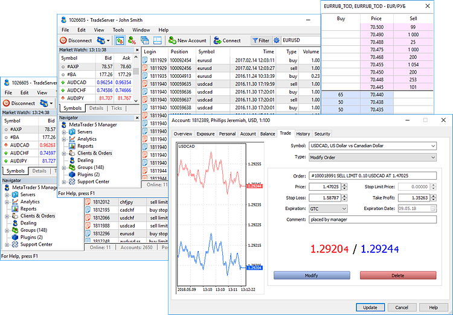

[🏠 Document Start](../README.md) / Trading Operations

[Previous](../Clients-and-Trading-Accounts/Security-and-Certificates.md) | [Next](Basic-Principles.md)

# Trading Operations

The Manager terminal allows you to conduct any trade operations on clients' accounts: [place (#place)](Working-with-Trading-Orders.md#place) and [activate pending orders (#activate)](Working-with-Trading-Orders.md#activate), [open (#open)](Working-with-Trading-Positions.md#open) and [close positions (#close)](Working-with-Trading-Positions.md#close), etc. In case of appropriate permissions, it is possible to [edit orders, trades and positions parameters](Viewing-and-Editing.md) in the trade server databases. Managers always have the list of all open positions and pending orders of their clients.

The terminal features multiple additional tools to perform trade operations:

  * [Market Watch](Market-Watch.md) with real-time quotes
  * [Depth of Market](Market-Depth.md) (level 2) with requests that are the closest ones to the market
  * [Economic calendar](Economic-Calendar.md) providing data on releases of important indices affecting quotes
  * [Trading notifications](Trading-Notifications.md) to avoid missing important price levels

> Before trading, please read the [general information on the platform's trading system](Basic-Principles.md) and basic concepts.
