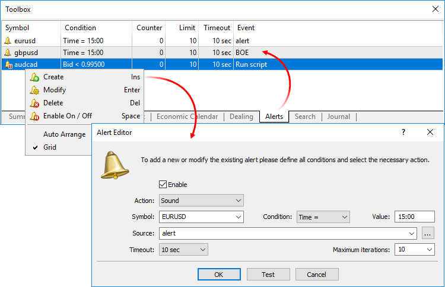

[🏠 Document Start](../README.md) / [Trading Operations](README.md) / Trading Notifications

[Previous](Economic-Calendar.md) | [Next](Working-with-Trading-Positions.md)

# Trading Notifications (Alerts)

Alerts notify a manager of various market events. Having created alerts, one may leave the monitor as the terminal will automatically inform about the server event.

Alerts are configured on the Alerts tab of the Toolbox window. An alert can be created via the context menu or by pressing Insert.

The data of this financial instrument are used to check the alert conditions. If the Time parameter is selected as a condition, the symbol has no value.

Alert trigger condition.

Action performed when the event occurs:

  * Sound — play an audio file.
  * File — launch an executable file.

Price, volume or time an alert is triggered at.

Depending on a type of an action executed when an event occurs, this may be:

  * An audio file of *.wav, *.mp3 or *.wma format.
  * An executable file of *.exe, *.vbs or *.bat format.

Time between alert repetitions.

Maximum allowed number of alert repetitions.

Enable/disable a selected alert. If disabled, the alert is not removed but stops working.

Number of current signal triggers.

Notifications can be configured for the following event types (specified in the Condition field):

  * Bid < — Bid price is less than the specified value.
  * Bid > — Bid price is greater than the specified value.
  * Ask < — Ask price is less than the specified value.
  * Ask > — Ask price is greater than the specified value.
  * Last < — Last price is less than the specified value.
  * Last > — Last price is greater than the specified value.
  * Volume < — Last deal volume for the symbol is less than the specified value.
  * Volume > — Last deal volume for the symbol is greater than the specified value.
  * Time = — certain time arrival. Specify here the local time of the computer in the HH:MM format, for example: 15:00.
  * Positions > — number of client positions exceeds the set value.
  * Positions < — number of client positions is less than the set value.
  * Net Volume > — net volume is more than the set value. Net volume — difference between the volumes of clients' buy and sell positions, at that the corresponding volume on the coverage account is subtracted from the buy or sell position.
  * Net Volume < — net volume is less than the set value. Net volume — difference between the volumes of clients' buy and sell positions, at that the corresponding volume on the coverage account is subtracted from the buy or sell position.
  * Profit > — total profit (loss) at clients' positions is more than the set value.
  * Profit < — total profit (loss) at clients' positions is less than the set value.
  * Uncovered > — difference between the total profit (loss) from the clients' positions and the corresponding position on the coverage account is more than the set value.
  * Uncovered < — difference between the total profit (loss) from the clients' positions and the corresponding position on the coverage account is less than the set value.

The Test button allows to test the selected alert. To apply the changes, click OK.
