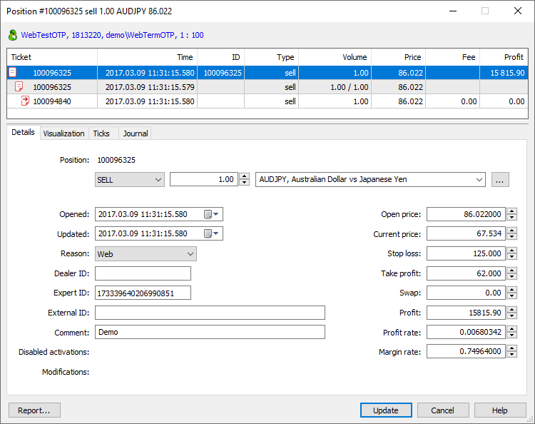
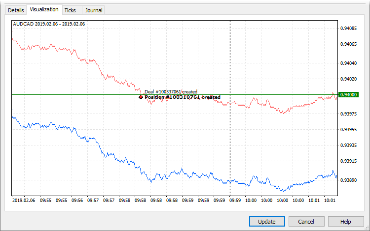
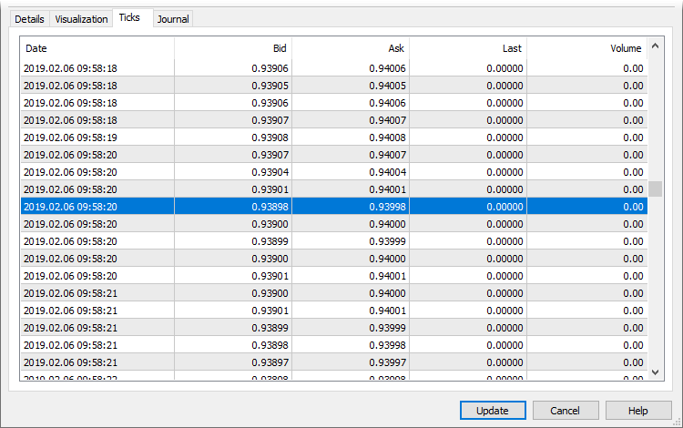
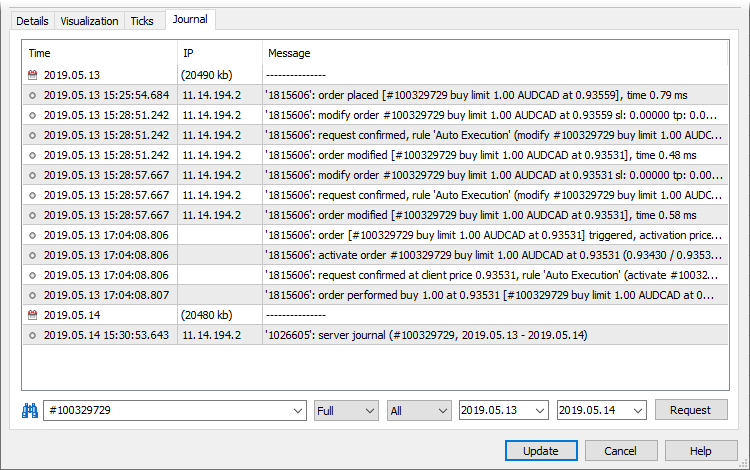
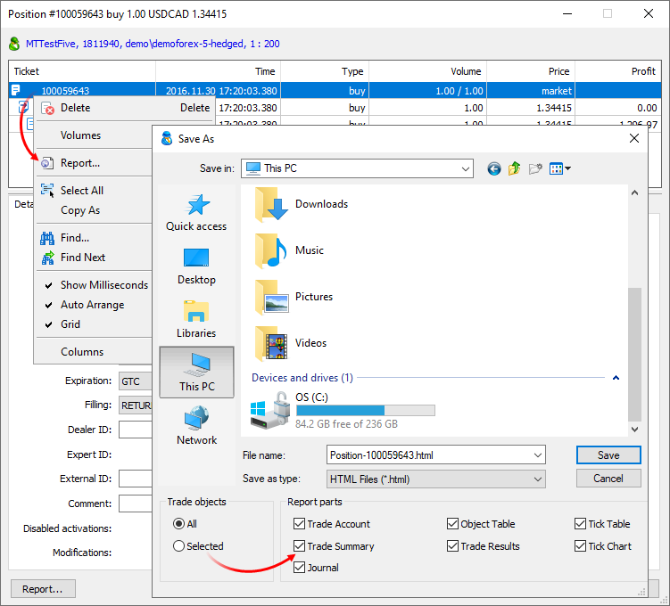
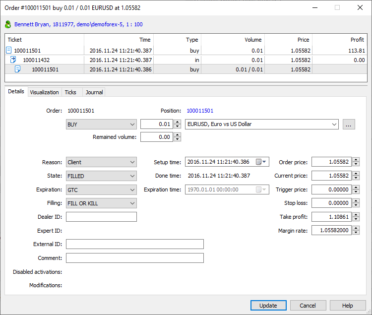
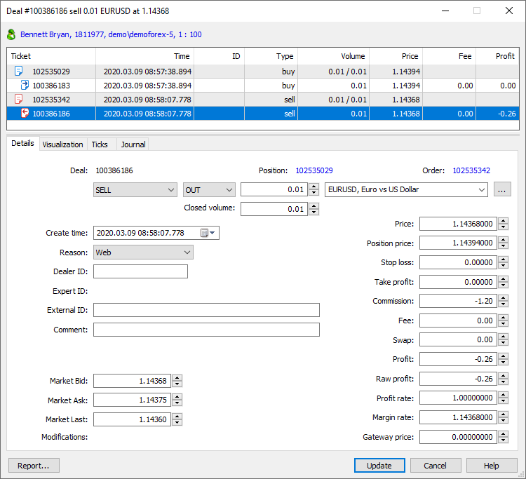

[🏠 Document Start](../README.md) / [Trading Operations](README.md) / Viewing and Editing

[Previous](Working-with-Trading-Orders.md) | [Next](For-Advanced-Users.md)

# Viewing and Editing Trading Operations (#viewing-and-editing-trading-operations)

The trading operation dialog is a fully-featured tool with a plethora of advanced features:

  * Detailed information about [orders (#order)](Viewing-and-Editing.md#order), [deals (#deal)](Viewing-and-Editing.md#deal) and [positions (#position)](Viewing-and-Editing.md#position)
  * Displaying of all [related operations (#connected-transactions)](Viewing-and-Editing.md#connected-transactions), for example the orders and deals by which the position was opened
  * [Execution visualization (#visualization)](Viewing-and-Editing.md#visualization) on the tick chart
  * Access to the [history of nearby ticks (#ticks)](Viewing-and-Editing.md#ticks)
  * Ability to view [trading server logs (#journal)](Viewing-and-Editing.md#journal) associated with the operation

An operation can be opened for viewing or editing from different parts of the Manager terminal: from the [list of orders](Working-with-Trading-Orders.md) or[positions](Working-with-Trading-Positions.md), as well as from the account [Overview](../Clients-and-Trading-Accounts/Account-Overview.md) or [History](../Clients-and-Trading-Accounts/Account-History.md) sections.

> If you have appropriate permissions, you can edit orders, trades and positions parameters via the Manager terminal. Do not edit trading operations unless you have a specific reason.

## Account details (#account-details)

The upper part of the dialog features brief information about the account, on which the operation was performed: name, login, groups and leverage. Click on this line to view [account details](../Clients-and-Trading-Accounts/Account-Overview.md).

## Overview and related operations (#connected-transactions)

This block features all operations associated with the current one. If you are viewing an order, the deal and the position opened as a result of the orders execution will be additionally shown here. For positions, the block will contain all orders and deals that affected it. Thus you can easily access the entire chain of related actions. Select an operation from the tree and all relevant parameters will be instantly displayed in the bottom part.

## Visualization (#visualization)

In this section, execution of a trading operation is visualized on the tick chart of the appropriate symbol.

## Nearest ticks before and after the operation (#ticks)

When examining disputable situations with traders, it is often necessary to analyze quotes which were broadcasted at the trading operation execution time. The relevant quote data can be obtained in a couple of clicks. Open operation details and navigate to the "Ticks" section. The terminal will automatically request the quote history from the server for the entire day on which the operation was performed. The nearest quote to operation execution time will be automatically selected in the list of received quotes.

## Operation journal (#journal)

This is another tool to assist during the follow-up operation examination. There is no need to manually request [logs from the server](../Managing-Trade-Server-Settings/Trade-Server-Journal.md) and to filter its records. Open operation details, navigate to the "Journal" section and the terminal will automatically request the necessary logs from the server, using ticket and time interval filters (from the operation date to the current day).

## Trading operation report (#report)

The trading operation details available in the editing dialogs can be saved as a report. The report contains the entire chain of operations from an order to a position, visualization on a tick chart, extract from the server log and the trading account overall status.

To generate a file, click "Report" in the context menu in the "[Overview and related operations (#connected-transactions)](Viewing-and-Editing.md#connected-transactions)" section. Next, select data to be saved: account state, trading totals, logs, tick chart, etc.

Select the path on the disk and click "Save".

## Order Details (#order)

Orders have the following parameters:

  * Login — number of an account, on which an order was placed.
  * Order — number (ticket) of an order.
  * Setup time — time of order placing by a client. If the order is passed to an external trading system, this field displays the time of order placing in an external system (not in the MetaTrader 5 platform).
  * Position — ticket of a position opened, modified or closed due to this order. For "close by" orders, two tickets are displayed: closed position ticket and opposite position ticket.
  * Type — order type: "Buy", "Sell", "Buy Limit", "Sell Limit", "Buy Stop", "Sell Stop", "Buy Stop Limit", "Sell Stop Limit" or "Close By".
  * Initial volume — volume requested in an order.
  * Symbol — financial instrument of an order.
  * Filling — additional parameters of [order execution (#fill-policy)](Basic-Principles.md#fill-policy): "Fill or kill", "Cancel remainder", "Book or Cancel" or "Return remainder".
  * Order price — price specified by trader for execution of an order.
  * Trigger price — this field is intended for the "Buy Stop Limit" and "Sell Stop Limit" orders. It contains the price level when they trigger and the corresponding limit orders are placed.
  * Stop loss — stop loss level.
  * Take profit — take profit level.
  * Comment — text comment to the order. This field can contain trader's comments if they were specified.
  * Margin rate — rate of converting a symbol margin currency to a deposit currency.
  * Expiration — expiration type of an order: "GTC" (Good Till Canceled), "Day" or "Specified".
  * Expiration time — if lifetime of an order has expired, then this field contains the date and time of expiration.
  * Disable activation — additional conditions (flags), with which order activation is prohibited. The flags can be set by Gateway API when orders are sent to an external system. For example, if activation of stop loss and take profit should be controlled by an external system, a flag disabling activation on the MetaTrader 5 side can be set for the order. Order flags are inherited by positions created upon order execution. Available flags:
    * Limit — no processing a limit level hitting.
    * Stop — no processing a stop level hitting.
    * Stop Limit — no processing a stop limit level hitting.
    * SL — no processing a stop loss activation.
    * TP — no processing a take profit activation.
    * Stop Out — no processing a stop out activation.
    * Expiration — no processing an expired order cancellation.
  * Modifications — if an order is changed manually, this field displays who implemented the changes:
    * Administrator — order changed by an administrator.
    * Manager — open price changed by a manager.
    * Restore — order restored.
    * Admin API — order changed via Manager API administrator interface.
    * Manager API — order changed via Manager API manager interface.
    * Server API — order changed via Server API.
    * Gateway API — order changed via Gateway API.

> Use [Trade Modification Report](../Server-Reports/Trade-Modifications.md) to obtain information about all modified trade operations.

  * Reason — reason of placing an order:
    * Client — order is placed manually by a client via the client terminal.
    * Expert — order is placed by a client using an Expert Advisor.
    * Dealer — order is placed by a dealer via the Manager terminal.
    * SL — order is placed as a result of stop loss triggering.
    * TP — order is placed as a result of take profit triggering.
    * SO — order is placed because a client reached a stop out level.
    * Rollover — order is placed when reopening a position for charging swaps.
    * External Client — order is placed by a client from an external trading system.
    * Variation margin — order is placed for accruing variation margin.
    * Gateway — order is placed by a MetaTrader 5 gateway that had connected to the trading platform.
    * Signal — order is placed as a result of copying a [trade signal](https://www.mql5.com/en/signals) according to a subscription in the client terminal.
    * Settlement — order is placed as a result of performing operations connected with the settlement of a futures contract/option. It is currently not used.
    * Transfer — order is placed due to transferring a position at the settlement price to a new symbol with the same underlying asset. It is currently not used.
    * Synchronization — order is placed as a result of synchronization of an account's trade state with an external system.
    * External Service — order is placed from an external trading system for technical reasons (for example, to correct a trade status of a client).
    * Mobile — order generated via the MetaTrader 5 mobile terminal for Android or iPhone.
    * Web — order generated via the web terminal.
    * Split — order generated as a result of a symbol split.
    * Corporate action — the order was created as a result of a corporate action, such as consolidating or renaming securities, transferring a client to a different account, etc. API applications set this flag for service operations so that the platform does not account for such corporate actions in commission calculations.
    * Migration — order was created while importing clients' trading operations from the MetaTrader 4 server.
  * Expert — identifier (magic number) of an Expert Advisor that has sent this order from the client terminal.
  * Execution time — order execution time. If the order is passed to an external trading system, this field displays the time of the order execution in the external system (not in the MetaTrader 5 platform).
  * State — current state of the order (filled, rejected, partially filled, expired, etc.). Editing allowed for emergency situations only. It is strongly not recommended to change this setting manually without a special need;
  * Current price — current price of a symbol a pending order was placed for. For market orders, a value from the "Order price" field is displayed here.
  * Remained volume — if an order is not filled in the volume requested by a trader, this field will display the remainder volume.
  * ID — unique identifier of an order in external systems.
  * Dealer — number of an account of a dealer, who processed this order. If "0" is specified in this field, it means that the order was processed without a dealer.

After making changes, click Update. If you have the appropriate permissions, you can completely delete an order by clicking the appropriate button.

## Deal Details (#deal)

Deals have the following parameters:

  * Login — number of an account, on which an order was placed.
  * Create time — time of a deal execution.
  * Deal — unique deal number.
  * Order — ticket (number) of an order a deal was executed on.
  * Position — ticket of a position that was opened or closed by this deal.
  * Action — type of a deal and direction of the trade relative to the current position of the account: "in", "out", "in/out" or "out by". There are the following types of deals:
    * Sell — selling a financial instrument.
    * Buy — buying a financial instrument.
    * Balance — replenishing balance via the Manager terminal.
    * Credit — crediting via a manager terminal.
    * Charge — other financial operations on the account, which are not included into other categories.
    * Correction — manual correction of a client's balance.
    * Bonus — accrual of bonuses. Operations of this type affect the credit assets of a client ([Credit (#account-state)](../Clients-and-Trading-Accounts/Account-Overview.md#account-state) field).
    * Commission — accrual of commission.
    * Daily commission — deal of charging [commission (#commission)](../Managing-Trade-Server-Settings/Spread-Commission-and-Swap.md#commission) at the end of a trading day.
    * Monthly commission — deal of charging commission at the end of a month.
    * Agent commission — deal of accruing agent commission, used at an [instant execution (#charge)](../Managing-Trade-Server-Settings/Spread-Commission-and-Swap.md#charge).
    * Daily agent commission — deal of accruing agent commission at the end of a trading day.
    * Monthly agent commission — deal of accruing agent commission at the end of a month.
    * Interest rate — deal of accruing annual interest at the end of a month.
    * Canceled buy and Canceled sell — canceled deal. Such deal types are possible, for example, when working with an external trading system via a gateway. A deal can be canceled in an external trading system. In this case, the type of a previously performed deal in the platform (Buy or Sell) is changed to Canceled buy or Canceled sell respectively. At the same time, profit/loss of such deal is reset. A client's position is then recalculated and an appropriate profit/loss is deposited/withdrawn in a separate balance deal. Deal cancellation does not entail changes in client's orders history. Canceled buy and Canceled sell type deals do not participate in an account financial status calculation and are not considered in positions recalculation.
    * Dividend — paying taxable dividends.
    * Franked Dividend — paying non-taxable dividends (tax is paid by a company, not a client).
    * Tax — charging a tax.
    * SO Compensation — negative balance [compensation (#compensate)](../Managing-Trade-Server-Settings/Margin.md#compensate) after a Stop Out.
    * SO Credit Compensation — [resetting (#so-credit)](../Managing-Trade-Server-Settings/Margin.md#so-credit) credit funds to zero after the negative balance compensation.
  * Volume — deal volume.
  * Closed volume — position volume closed by this deal. This field enables convenient working with reversal deals. In addition to the total volume of the executed deal, which is opposite to the current position, you can view the closed volume. This ability is especially useful if the initial reversed position is composed of several deals, and its total volume is not explicitly visible.
  * Symbol — financial instrument of a deal.
  * Price — deal price.
  * Value — deal value in client deposit currency. The rate of conversion to deposit currency is shown in the "Margin rate" field. The field is used only for [Exchange* calculation type (#calculation)](Market-Watch.md#calculation) symbols and groups with the ["for Stock Exchange, based on margin discount rates" risk management type (#risk)](../Managing-Trade-Server-Settings/Margin.md#risk).  
In case of exchange risk accounting, each deal affects the account balance: the deal value is charged or deducted from the balance. In other words, the system uses the Value field here (not the Profit one, as is the case with OTC accounting). The same applies to [verifying the balance using the trading history (#fix)](../Clients-and-Trading-Accounts/Balance-Operations.md#fix): the values of deals (rather than their results) are verified. Thus, if you change the deal price for some reason, make sure to update the Value field as well, since it is not recalculated automatically. Otherwise, the value change result is not displayed on the account balance after its verification and correction using the trading history.
  * Stop loss — the Stop Loss level. Stop Loss values for entry and reversal deals are set in accordance with the Stop Loss of orders, which initiated these deals. The Stop Loss values ​​of appropriate positions as of the time of position closing are used for exit deals.
  * Take profit — the Take Profit level. Take Profit values for entry and reversal deals are set in accordance with the Take Profit of orders, which initiated these deals. The Take Profit values ​​of appropriate positions as of the time of position closing are used for exit deals. 
  * Reason — reasons for deal execution:
    * Client — deal performed by a client manually through the client terminal.
    * Expert — deal performed by a client using an Expert Advisor.
    * Dealer — deal performed by a dealer through the Manager terminal.
    * Stop loss — deal performed as a result of stop loss activation.
    * Take profit — deal performed as a result of take profit activation.
    * Stop out — deal performed when a client reached a stop out level.
    * Rollover — deal performed when reopening a position for charging swaps.
    * External Client — deal performed by a client from an external trading system.
    * Variation margin — deal performed for accruing a variation margin.
    * Gateway — deal performed by a MetaTrader 5 gateway that had connected to the trading platform.
    * Signal — deal performed as a result of copying a [trading signal](https://www.mql5.com/en/signals) according to a subscription in the client terminal.
    * Settlement — deal performed as a result of performing operations connected with the settlement of a futures contract/option. It is currently not used.
    * Transfer — deal was performed as a result of relocating a position at a calculated price to a new symbol with the same underlying asset. It is currently not used.
    * Synchronization — deal performed as a result of synchronization of an account's trade state with an external system.
    * External Service — deal performed from an external trading system for technical reasons (for example, to correct the trade state of a client).
    * Mobile — deal is conducted via the MetaTrader 5 mobile terminal for Android or iPhone.
    * Web — deal is conducted via the web terminal.
    * Split — deal is conducted as a result of a symbol split.
    * Corporate action — deal created as a result of a corporate action, such as consolidating or renaming securities, transferring a client to a different account, etc. API applications set this flag for service operations so that the platform does not account for such corporate actions in commission calculations.
    * Migration — deal is created while importing clients' trading operations from the MetaTrader 4 server.
  * Expert — identifier (magic number) of an Expert Advisor that has executed this deal in the client terminal.
  * Commission — commission charged for deal execution. The field is only used for the standard commission charged immediately. [Commission (#commission)](../Managing-Trade-Server-Settings/Spread-Commission-and-Swap.md#commission) settings are specified for each group separately.
  * Fee — fee charged for deal execution. The field is used for the [Fee (#commission-type)](../Managing-Trade-Server-Settings/Spread-Commission-and-Swap.md#commission-type) commission type.
  * Agent commission — agent commission fees for the deal. Parameters of agent commissions are specified for each group separately.
  * Swap — charged swap.
  * Profit — profit/loss gained as a result of performing a deal.
  * Position price — open price of a position, which has been closed by this deal. This field is filled for deals that have the "out" or "in/out" type.
  * Gateway price — the field is only used for operations which are forwarded to external trading systems via gateways. It features the actual deal price on the external system side, not taking into account [gateway price transformation settings (#translation)](https://support.metaquotes.net/en/docs/mt5/platform/administration/admin_gateways/gateways_config#translation). The field is only visible if the manager account has ["Dealer" and "Risk Manager" permissions (#permissions)](https://support.metaquotes.net/en/docs/mt5/platform/administration/admin_managers#permissions).
  * Raw profit — profit/loss of the committed deal. The profit/loss is represented in the profit currency of the symbol the deal is performed by.
  * Comment — comment to a deal. Additional information can be written in the Comment field. For example, a comment indicating an account for whose trades an agent receives the commission is automatically added to the agent commission deals.
  * ID — unique identifier of a deal in external systems.
  * Dealer — number of the dealer's account who processed this deal. "0" specified in this field means that the deal was processed without a dealer.
  * Modifications — if the deal is changed manually, this field displays who implemented the changes:
    * Administrator — deal changed by an administrator.
    * Manager — open price changed by a manager.
    * Position — deal modification data was inherited from the position closed by that deal.
    * Restore — deal restored.
    * Admin API — deal changed via Manager API administrator interface.
    * Manager API — deal changed via Manager API manager interface.
    * Server API — deal changed via Server API.
    * Gateway API — deal changed via Gateway API.

  * Deals that close positions fully or partially inherit their modification flags. After closing, no separate entry about the position remains in the database. In order not to lose data on modifications, the flags are copied to the deal closing the position. In this case, the additional Position modification flag is added to the deal. This means the flags were inherited from the position. When inheriting, the deal modification flags are not lost. Instead, they are added to the position flags.

  * Use [Trade Modification Report](../Server-Reports/Trade-Modifications.md) to obtain information about all modified trade operations.

  
---  
  
  * Profit rate — exchange rate of a deal profit currency to a trader's group deposit currency.
  * Margin rate — exchange rate of a margin currency to a trader's deposit currency.
  * Market Bid — the market Bid price as at the time of deal execution by the server. The field is only filled for the deals which were created after the platform was updated to build 2890 or higher. For earlier deals, the value will be zero.
  * Market Ask — the market Ask price as at the time of deal execution by the server. The field is only filled for the deals which were created after the platform was updated to build 2890 or higher. For earlier deals, the value will be zero.
  * Market Last — the market Last price as at the time of deal execution by the server. The field is only filled for the deals which were created after the platform was updated to build 2890 or higher. For earlier deals, the value will be zero.

After making changes, click Update. If you have the appropriate permissions, you can completely delete a deal by clicking the appropriate button.

## Position Details (#position)

The following information is available here:

  * Login — account number a position was opened on.
  * Position — ticket (unique number) of a position. Usually, a position ticket matches the [ticket of the order (#order)](Viewing-and-Editing.md#order) used to open the position. The exceptions are positions re-opened as a result of service operations or opened without placing an order. The tickets may be different for positions having the following [opening reasons (#position-reason)](Viewing-and-Editing.md#position-reason):
    * Rollover — charging swaps with a position re-opening
    * Split — re-opening a position after a split
    * Variation margin — re-opening a position after charging a variation margin
    * Synchronization — opening a position when synchronizing with an external system (without a previous order)
    * Transfer — relocating a position with a calculated price to a new symbol with the same underlying asset

> Tickets of positions having other opening reasons match initial orders.

  * Open time — position open time.
  * Update time — last position modification time (when its volume was changed). This is actually the time of the last deal for the financial instrument which corresponds to this position. This time does not change when Stop Loss or Take Profit is modified or when the position is edited via the Administrator terminal or API.
  * Type — type of the position - buy or sell.
  * Symbol — symbol the position was opened for.
  * Volume — current position volume in lots.
  * Reason — reasons for a position opening:
    * Client — opened by a client manually through the client terminal.
    * Expert — opened by a client using an Expert Advisor.
    * Dealer — opened by a dealer through the Manager terminal.
    * Stop loss — not used for positions.
    * Take profit — not used for positions.
    * Stop out — not used for positions.
    * Rollover — opened when reopening a position for charging swaps.
    * External Client — opened by a client from an external trading system.
    * Variation margin — not used for positions.
    * Gateway — opened by a MetaTrader 5 gateway that had connected to the trading platform.
    * Signal — opened as a result of copying a [trade signal](https://www.mql5.com/en/signals) according to a subscription in the client terminal.
    * Settlement — opened as a result of performing operations connected with the settlement of a futures contract/option. It is currently not used.
    * Transfer — opened due to transferring a position at the settlement price to a new symbol with the same underlying asset. It is currently not used.
    * Synchronization — opened as a result of synchronization of an account's trade state with an external system.
    * External Service — opened from an external trading system for technical reasons (for example, to correct the trade state of a client).
    * Mobile — position opened via the MetaTrader 5 mobile terminal for Android or iPhone.
    * Web — position opened via the web terminal.
    * Split — position opened as a result of a symbol split.
    * Corporate action — position created as a result of a corporate action, such as consolidating or renaming securities, transferring a client to a different account, etc. API applications set this flag for service operations so that the platform does not account for such corporate actions in commission calculations.
    * Migration — position opened as a result of import of clients' trading operations from the MetaTrader 4 server.
  * Price — weight-average price of the position opening: (price of deal 1 * volume of deal 1 + ... + price of deal N * volume of deal N) / (volume of deal 1 + ... + volume of deal N). The accuracy of rounding of the average weighted price is equal to the number of decimal places in the symbol price plus three additional digits.
  * Stop loss — stop loss level of a position.
  * Take profit — take profit level of a position.
  * Profit — current profit on this position. The profit does not include swap and commission.
  * Current price — current price of a position symbol.
  * Swap — charged swap.
  * Margin rate — exchange rate of a margin currency to a trader's deposit currency. It is usually calculated and registered at the moment when a position is opened or its volume is modified. The rate can be recalculated at the end of the trading day if the relevant option is enabled in [symbol settings (#recalculate-margin)](For-Advanced-Users/Margin-Calculation-Basic.md#recalculate-margin).

  * Profit rate — exchange rate of the position profit currency to the trader's group deposit currency.

  * Comment — comment to a position. A comment to a position is inherited from the last deal by the symbol of the position.
  * Expert — identifier (magic number) of an Expert Advisor that has opened this position in the client terminal.
  * ID — unique identifier of a position in external systems.
  * Dealer — login of a dealer (gateway) that processed an order, which opened a position. If "0" is specified in this field, it means that the order was processed without a dealer.
  * Disable activation — additional conditions (flags), with which order activation is prohibited. The flags can be set by Gateway API when orders are sent to an external system. For example, if activation of a stop loss and take profit should be controlled by an external system, a flag disabling activation on the MetaTrader 5 side can be set for the order. Order flags are inherited by positions created upon order execution. Available flags:
    * Limit — no processing of a limit level hitting.
    * Stop — no processing of a stop level hitting.
    * Stop Limit — no processing of a stop limit level hitting.
    * SL — no processing of a stop loss activation.
    * TP — no processing of a take profit activation.
    * Stop Out — no processing of a stop out activation.
  * Expiration — no processing of an expired order cancellation.
    * Modifications — if a position is changed manually, this field displays who implemented the changes:
    * Administrator — position changed by an administrator.
    * Manager — open price changed by a manager.
    * Restore — position restored.
    * Admin API — position changed via Manager API administrator interface.
    * Manager API — position changed via Manager API manager interface.
    * Server API — position changed via Server API.
    * Gateway API — position changed via Gateway API.

  * Deals that close positions fully or partially inherit their modification flags. After closing, no separate entry about the position remains in the database. In order not to lose data on modifications, the flags are copied to the deal closing the position. In this case, the additional Position modification flag is added to the deal. This means the flags were inherited from the position. When inheriting, the deal modification flags are not lost. Instead, they are added to the position flags.

  * Use [Trade Modification Report](../Server-Reports/Trade-Modifications.md) to obtain information about all modified trade operations.

  
---  
  
After making changes, click Update. If you have the appropriate permissions, you can completely delete a position by clicking the appropriate button.
