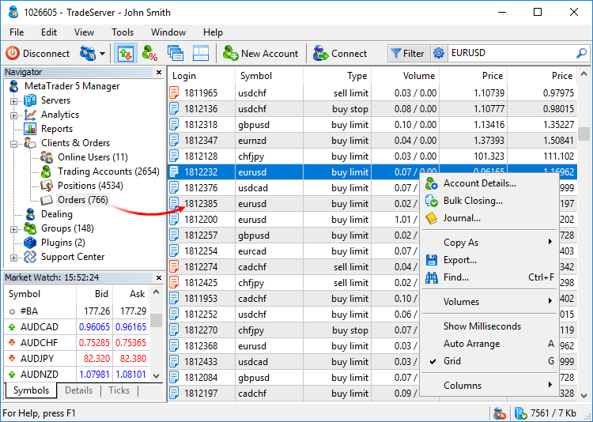
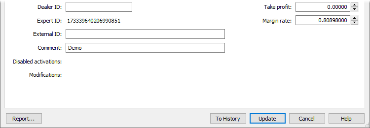
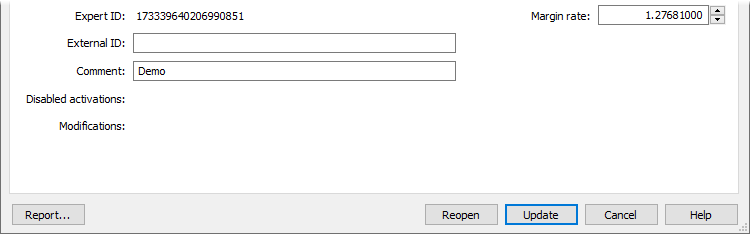
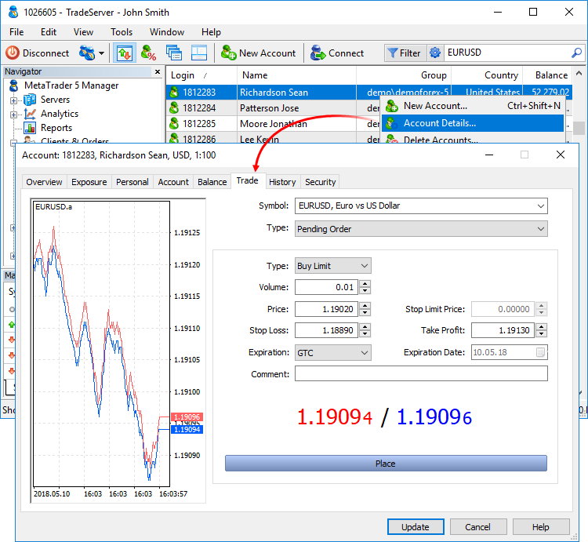
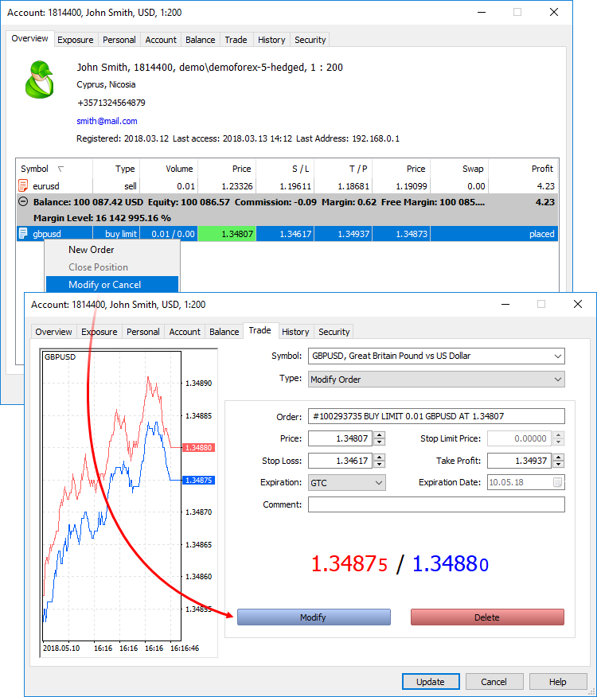
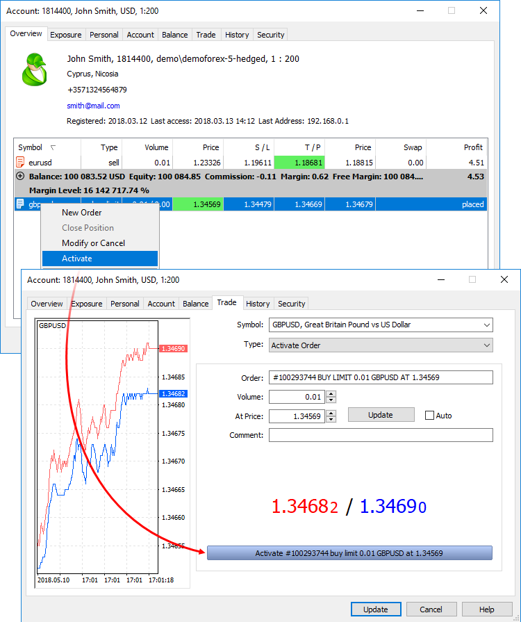
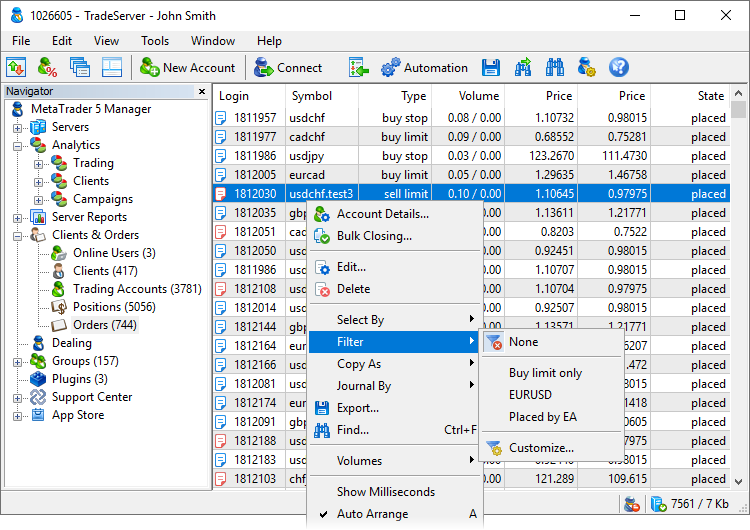
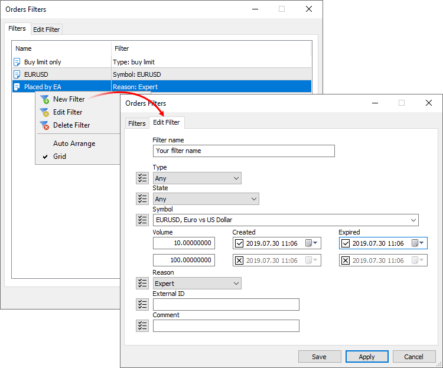

[🏠 Document Start](../README.md) / [Trading Operations](README.md) / Working with Trading Orders

[Previous](Working-with-Trading-Positions.md) | [Next](Viewing-and-Editing.md)

# Working with Trading Orders (#working-with-trading-orders)

Managers always have the list of all active [pending orders (#pending-order)](Basic-Principles.md#pending-order) of their clients. They are displayed in a separate section of the terminal.

The following data is displayed for each order:

  * Login — number of an account, on which an order was placed.
  * Order — number (ticket) of an order.
  * ID — unique identifier of an order in external systems.
  * Symbol — financial instrument of an order.
  * Time — time when the order was placed by the client. If the order is passed to an external trading system, this field displays the time of order placing in the external system (not in the MetaTrader 5 platform).
  * Type — order type: "Buy", "Sell", "Buy Limit", "Sell Limit", "Buy Stop", "Sell Stop", "Buy Stop Limit", "Sell Stop Limit" or "Close By".
  * Volume — volume requested by a trader in an order, as well as remaining (not executed) volume if the order has been executed partially.
  * Order price — price specified by a trader for execution of an order.
  * Trigger price — this field is intended for the "Buy Stop Limit" and "Sell Stop Limit" orders. It contains the price level when they trigger and the corresponding limit orders are placed.
  * S / L — stop loss level.
  * T / P — take profit level.
  * Current price — current price of the symbol the pending order was placed for. For market orders, a value from the "Order price" field is displayed here.
  * Reason — reason of placing the order:
    * Client — order is placed manually by a client via the client terminal.
    * Expert — order is placed by a client using an Expert Advisor.
    * Dealer — order is placed by a dealer via the Manager terminal.
    * SL — order is placed as a result of stop loss triggering.
    * TP — order is placed as a result of take profit triggering.
    * SO — order is placed because a client reached the stop out level.
    * Rollover — order is placed when reopening position for charging swaps.
    * External Client — order is placed by a client from an external trading system.
    * Variation margin — order is placed for accruing variation margin.
    * Gateway — order is placed by a MetaTrader 5 gateway that had connected to the trading platform.
    * Signal — order is placed as a result of copying a [trade signal](https://www.mql5.com/en/signals) according to a subscription in the client terminal.
    * Settlement — order is placed as a result of performing operations connected with the settlement of a futures contract/option. It is currently not used.
    * Transfer — order is placed due to transferring a position at the settlement price to a new symbol with the same underlying asset. It is currently not used.
    * Synchronization — order is placed as a result of synchronization of an account's trade state with an external system.
    * External Service — order is placed from an external trading system for technical reasons (for example, to correct the trade state of a client).
    * Mobile — order generated via the MetaTrader 5 mobile terminal for Android or iPhone.
    * Web — order generated via the web terminal.
    * Split — order generated as a result of a symbol split.
    * Corporate action — the order was created as a result of a corporate action, such as consolidating or renaming securities, transferring a client to a different account, etc. API applications set this flag for service operations so that the platform does not account for such corporate actions in commission calculations.
    * Migration — the order was generated as a result of client trading operations imported from the MetaTrader 4 server.
  * State — current state of an order (filled, rejected, partially filled, expired, etc.). Editing allowed for emergency situations only. It is strongly not recommended to change this setting manually without a special need;
  * Expiration — expiration type of an order: "GTC" (Good Till Canceled), "Day" or "Specified".
  * Comment — text comment to an order. This field can contain trader's comments if they were specified.

Double-click on the order to go to a dialog of a client it belongs to. You can [modify or remove (#modify-delete)](Working-with-Trading-Orders.md#modify-delete) the order from there. The context menu allows you to [remove orders in bulk](../Corporate-Actions-and-Bulk-Operations/Bulk-Closing.md), [export](../MetaTrader-5-Manager/For-Advanced-Users/Data-Export.md) order data to a file, as well as set [filtering (#filter)](Working-with-Trading-Orders.md#filter) and configure the order list: select columns, display milliseconds etc. The Journal... command allows you to quickly request the journal for a selected order from the trade server.

> Up to 128 trade requests can be sent to the server simultaneously. If this number is exceeded, the server returns the error.

## Order details and editing (#details)

The trading operation dialog is a fully-featured tool with a plethora of advanced features, such as the display of the structure of operations, visualization, tick history and logs. To open the dialog, select an order from the list and click "View" in its context menu. If your account has trading operation editing permission, the "Edit" command will be shown in the menu instead of "View". For more details, please view the [separate section](Viewing-and-Editing.md).

## Moving orders to history (#to-history)

Any open order can be canceled and moved to history. At that, its state will be changed to Canceled. Click "To history":

Orders moved to history are not executed and do not trigger, no margin is charged for them.

## Reopening orders (#reopen)

Pending orders can be reopened from the client's trading history. Before reopening the order, client's trading positions and account should be properly corrected:

  * Delete the trade opened according to the order.
  * Correct the client's positions. To do this, open the account's dialog window in MetaTrader 5 Administrator and execute Fix Positions context menu command in the Overview tab.
  * Correct the client's balance. Select the appropriate account in the list in MetaTrader 5 Administrator and execute Balance->Fix Balance context menu command.

After that, the triggered order can be reopened. To do this, move to [History](../Clients-and-Trading-Accounts/Account-History.md), open the necessary order for editing and click Reopen:

## Placing pending orders (#place)

To place a [pending order (#pending-order)](Basic-Principles.md#pending-order), open the client dialog and go to the Trade tab.

The left part of the window contains a [tick chart (#ticks)](Market-Watch.md#ticks) of a selected symbol, while the right part contains the form for placing orders. Select a traded symbol and set Pending Order in the Type field. Then, fill in the order parameters:

  * Type — [pending order type (#pending-order)](Basic-Principles.md#pending-order);
  * Volume — volume of an order in lots.
  * Fill Policy — additional [rules of filling (#fill-policy)](Basic-Principles.md#fill-policy) (only for [limit and stop limit (#pending-order)](Basic-Principles.md#pending-order) orders): "Fill or Kill", "Immediate or Cancel", "Book or Cancel" or "Return". If this box is unavailable, then the option is locked on the server.
  * Price — pending order trigger price. For stop and limit orders, it is the price, at which they will be placed. For stop limit orders, this is the price of a stop order triggering. Upon reaching it, a limit order is set at the price from the Stop Limit Price field.
  * Stop Limit Price — this field is active only for Stop Limit orders. When the Stop Limit order triggers, a limit order will be placed at the price specified in it.
  * Stop Loss — [stop loss (#stop-loss)](Basic-Principles.md#stop-loss) level. If you leave the zero value in this field, this type of order will not be attached.
  * Take Profit — [take profit (#take-profit)](Basic-Principles.md#take-profit) level. If you leave the zero value in this field, this type of order will not be attached.
  * Expiration — order expiration term:
    * Good Till Canceled (GTC) — order will stay in the queue until it is manually canceled.
    * Today — order will be valid only during the current trading day.
    * Specified — order will be valid until the date specified in Expiration Date.
    * Specified day — order will be valid until 00:00 of a specified day. If this time is not within a trading session, expiration will occur in the nearest trading time.
  * Expiration date — order expiration date if the "Specified" or "Specified day" is selected for the order expiration condition. Available expiration types are determined by symbol settings.
  * Comment — text comment to the order. Maximum length of a comment is 31 characters.

After filling in all the necessary parameters, click Place.

> To quickly change prices, volumes or stop loss and take profit levels by a certain amount, hold Ctrl or Shift:

## Modifying/deleting pending orders (#modify-delete)

To change or remove a pending order, open the client dialog and go to the Overview tab. Select an order and click "Modify or Delete" in its context menu.

In the Order field, information about an order that is being changed/deleted is specified. Below, you can change any order parameters set when [placing (#place)](Working-with-Trading-Orders.md#place) it. To save new parameters, click Modify.

To remove a pending order, click Delete. The order will be moved to the client's trading history with Canceled status.

> To quickly change prices, volumes or stop loss and take profit levels by a certain amount, hold Ctrl or Shift:

# Activation of pending orders (#activate)

Activation of a pending order is equivalent to its triggering upon the occurrence of the conditions specified therein, but it is carried out manually by a manager. A manager is able to activate a pending order at any time.

To activate an order, open the client dialog and go to the Overview tab. Select an order and click Activate in its context menu.

Data on an activated order is specified in the Order field. The activation settings are set below:

  * Volume — volume of an order that will be activated. If it is activated partially, the remainder will be processed in accordance with the [fill policy](Basic-Principles.md) specified in the order (an order with a sufficient volume can be left or removed).
  * At Price — price, at which an order will be activated. To set the current price here (Ask for OTC and Last for exchange symbols), click update. The current price is also placed in this field when switching to the order activation.
  * Auto — if enabled, current Bid and Ask prices will be automatically used in an order activation when clicking Activate.
  * Comment — text comment to an order.

Below, the current prices Bid and Ask are shown. After setting all necessary parameters, click Activate.

> To quickly change prices, volumes or stop loss and take profit levels by a certain amount, hold Ctrl or Shift:

## Order Filtering (#filter)

Use filters for convenient work with orders. All orders available to a manager a shown by default. You may use filters to view orders, which correspond to selected criteria. For example, you can view operations on a specific instrument or operations of a certain volume and direction.

To apply a previously created filter, select it from the Filter menu in the list of accounts or clients. To return to the initial list of accounts, click "Not selected".

To create or edit filters, click "Customize". The list of all previously created filters is shown in the Filters tab. Click twice on a filter to change its parameters.

Set the name of the filter and then configure parameters for filtering accounts:

  * Type — show orders of a specific [type](Basic-Principles.md): Buy, Sell, Buy Limit, Sell Limit, Buy Stop, Sell Stop, Buy Stop Limit, Sell Stop Limit, Close by. 
  * State — show orders which are in a certain [state (#state)](Basic-Principles.md#state): started, placed, partial, request adding, request, modifying, request canceling. Using this filter, you can easily find orders with the frozen processing.
  * Symbol— show orders placed for the selected trading instrument. A symbol mask can be specified here. For example, EUR* — all rates to the euro.
  * Volume — show orders having a volume within the specified range. Use this filter to keep track of big players.
  * Creation date — show orders which were placed in the specified time interval. The filter will help you find outdated and most recent orders.
  * Expiry — show orders having the expiration date within the specified time interval. Use this filter to determine orders to be canceled soon.
  * Reason — show orders with a specific [order creation reason (#reason)](Working-with-Trading-Orders.md#reason): placed manually by a client or automatically by a trading robot, created by dealer or API, etc.
  * External ID — display orders with the specified identifier in the external system (in the exchange). This filter will allow you to work with operations forwarded to the specified external trading system.
  * Comment — show orders with the specific comment.

The filter can be immediately enabled from the editing window by clicking "Apply".

Filters enable selection of entries not only based on fields matching the specified value, but also by the "Except" and "Not empty field" parameters. Enter the desired value in the filter field and click , it will change to . The filter will select orders, the parameters of which do not match the specified value. For example, you can use the filter to create a list of operations on all symbols which do not belong to the specified group, as well as of orders except those opened by trading robots or orders without an external ID. In the latter case, switch the filter mode and leave the field blank.
