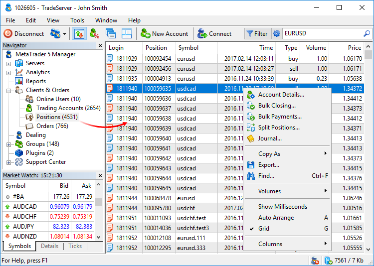
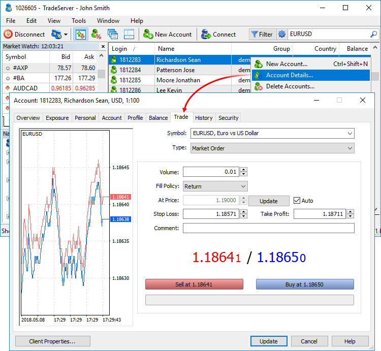
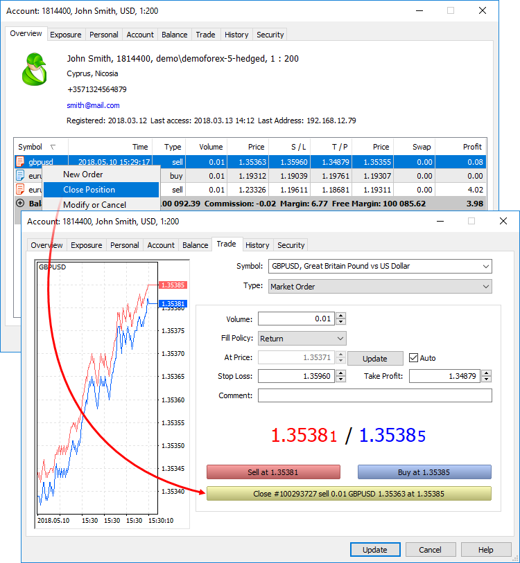
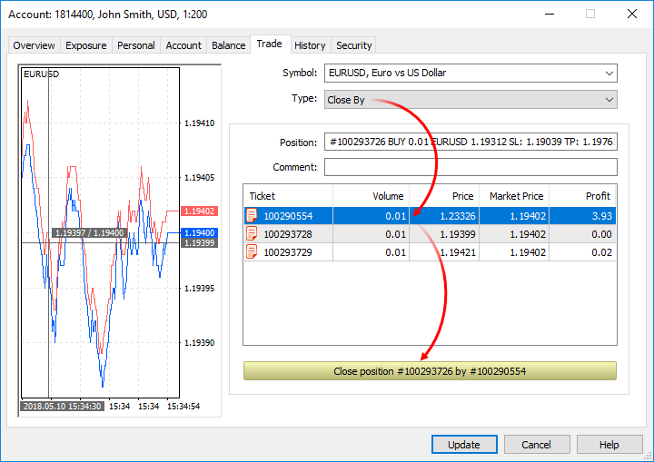
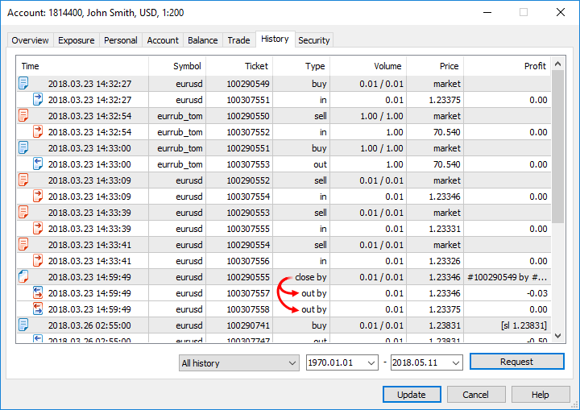
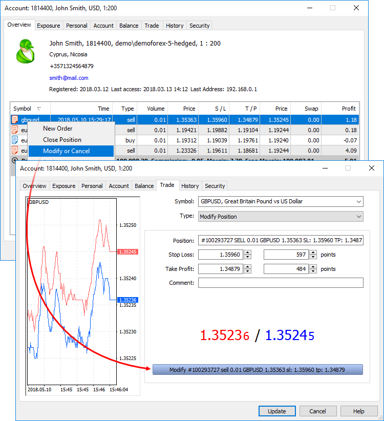
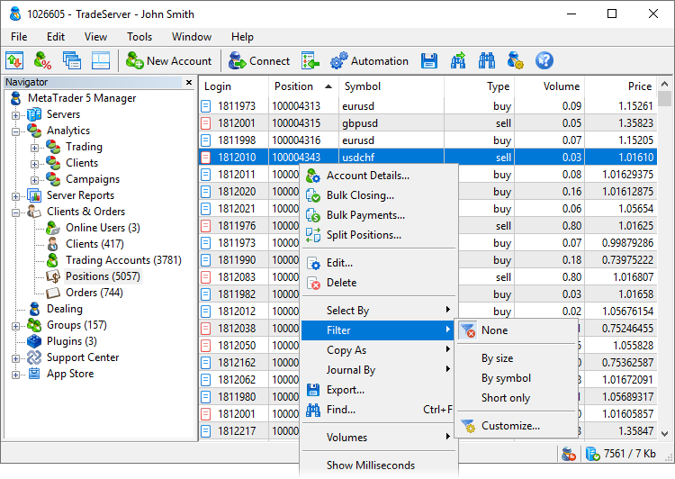
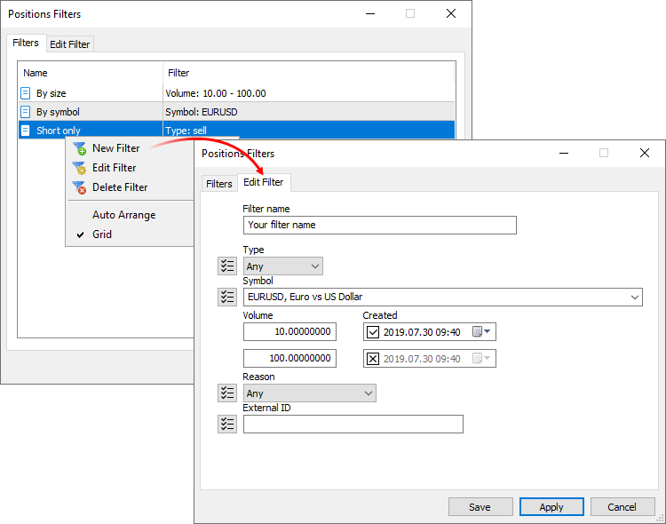

[🏠 Document Start](../README.md) / [Trading Operations](README.md) / Working with Trading Positions

[Previous](Trading-Notifications.md) | [Next](Working-with-Trading-Orders.md)

# Working with Trading Positions (#working-with-trading-positions)

Managers always have the list of all [open positions (#position)](Basic-Principles.md#position) of their clients. They are displayed in a separate section of the terminal.

The following data is displayed for each position:

  * Login — account number a position was opened on.
  * Position — ticket (unique number) of a position. Usually, a position ticket matches the [ticket of the order (#ticket)](Working-with-Trading-Orders.md#ticket) used to open the position. The exceptions are positions re-opened as a result of service operations or opened without placing an order. The tickets may be different for positions having the following [opening reasons (#position-reason)](Working-with-Trading-Positions.md#position-reason):
    * Rollover — charging swaps with position re-opening
    * Split — re-opening a position after a split
    * Variation margin — re-opening a position after charging a variation margin
    * Synchronization — opening a position when synchronizing with an external system (without a previous order)
    * Transfer — relocating a position with a calculated price to a new symbol with the same underlying asset

> Tickets of positions having other opening reasons match initial orders.

  * ID — unique identifier of the position in external systems.
  * Symbol — symbol a position was opened for.
  * Time — position open time.
  * Type — position type: buy or sell.
  * Volume — current position volume in lots.
  * Price — weight-average price of a position opening: (price of deal 1 * volume of deal 1 + ... + price of deal N * volume of deal N) / (volume of deal 1 + ... + volume of deal N). The accuracy of rounding of the average weighted price is equal to the number of decimal places in the symbol price plus three additional digits.
  * S / L — stop loss level of a position.
  * T / P — take profit level of a position.
  * Current price — current price of a position symbol.
  * Reason — reasons for position opening:
    * Client — opened by a client manually through the client terminal.
    * Expert — opened by a client using an Expert Advisor.
    * Dealer — opened by a dealer through the Manager terminal.
    * Stop loss — not used for positions.
    * Take profit — not used for positions.
    * Stop out — not used for positions.
    * Rollover — opened when reopening a position for charging swaps.
    * External Client — opened by a client from an external trading system.
    * Variation margin — not used for positions.
    * Gateway — opened by a MetaTrader 5 gateway that had connected to the trading platform.
    * Signal — opened as a result of copying a [trade signal](https://www.mql5.com/en/signals) according to a subscription in the client terminal.
    * Settlement — opened as a result of performing operations connected with the settlement of a futures contract/option. It is currently not used.
    * Transfer — opened due to transferring a position at the settlement price to a new symbol with the same underlying asset. It is currently not used.
    * Synchronization — opened as a result of synchronization of an account's trade state with an external system.
    * External Service — opened from an external trading system for technical reasons (for example, to correct the trade state of a client).
    * Mobile — position opened via the MetaTrader 5 mobile terminal for Android or iPhone.
    * Web — position opened via the web terminal.
    * Split — position opened as a result of a symbol split.
    * Corporate action — position created as a result of a corporate action, such as consolidating or renaming securities, transferring a client to a different account, etc. API applications set this flag for service operations so that the platform does not account for such corporate actions in commission calculations.
    * Migration — position opened as a result of import of clients' trading operations from the MetaTrader 4 server.
  * Swap — charged swap.
  * Profit — current profit on this position. The profit does not include swap and commission.

Double-click on a position to go to a dialog of a client it belongs to. You can [modify (#modify)](Working-with-Trading-Positions.md#modify) or [close (#close)](Working-with-Trading-Positions.md#close) the position from there. The context menu allows you to go to [corporate actions](../Corporate-Actions-and-Bulk-Operations/README.md), [export](../MetaTrader-5-Manager/For-Advanced-Users/Data-Export.md) position data to a file, as well as set [filtering (#filter)](Working-with-Trading-Positions.md#filter) and configure the position list: select columns, display milliseconds etc. The Journal... command allows you to quickly request the journal for a selected trading position from the trade server.

> Up to 128 trade requests can be sent to the server simultaneously. If this number is exceeded, the server returns the error.

## Position details and editing (#details)

The trading operation dialog is a fully-featured tool with a plethora of advanced features, such as the display of the structure of operations, visualization, tick history and logs. To open the dialog, select a position from the list and click "View" in its context menu. If your account has trading operation editing permission, the "Edit" command will be shown in the menu instead of "View". For more details, please view the [separate section](Viewing-and-Editing.md).

## Opening a position (#open)

Opening a [position (#position)](Basic-Principles.md#position) or entering the market is the primary purchase or sale of a certain amount of a financial instrument. Managers are able to open positions on client accounts by placing [market orders (#market-order)](Basic-Principles.md#market-order). Execution of this order results in a [deal (#deal)](Basic-Principles.md#deal) and position opening.

To open a position, open the client dialog and go to the Trade tab.

The left part of the window contains a [tick chart (#ticks)](Market-Watch.md#ticks) of a selected symbol, while the right part contains the form for placing orders. Select a traded symbol and set Market Order in the Type field. Then, fill in the order parameters:

  * Volume — volume of an order in lots. The greater the deal volume, the greater its potential profit or loss, depending on where the symbol price goes. The deal volume also affects the [margin](For-Advanced-Users/Margin-Calculation-Retail-Forex-CFD-Futures-—-Netting.md) reserved for the position on the trading account. 
  * Fill Policy — additional [rules of order filling (#fill-policy)](Basic-Principles.md#fill-policy). Available fill types are determined by the symbol settings.
  * At Price — price, at which the order will be placed. When you open the window, the current value of the buy price is set in this field. If the Auto option is enabled, then during execution of trade operations, current Bid and Ask prices will be automatically used (current Bid or Ask price when Sell or Buy button is clicked). If the option is disabled, the price can be set manually. When you click Update, the current Ask price is set in the price field.
  * Stop Loss — level of [stop loss (#stop-loss)](Basic-Principles.md#stop-loss). The level is set to limit the position loss. If you leave the zero value in this field, this type of order will not be attached.
  * Take Profit — level of [take profit (#take-profit)](Basic-Principles.md#take-profit). The level is set to lock in profits of the position. If you leave the zero value in this field, this type of order will not be attached.
  * Comment — text comment to an order. Maximum length of a comment is 31 characters.

After setting all necessary parameters, click Sell or Buy. In this case, an order to open a short or long positions, respectively, is sent to the server.

> Unlike the client terminal, different [filling modes (#execution-type)](Basic-Principles.md#execution-type) are not applied to orders here. The trade server executes deals at a specified price.

## Closing a position (#close)

When you close a trade position, an operation opposite to the first one is performed. For example, if the first trade operation was buying one lot of GOLD, one lot of the same security should be sold to close the position.

Open the client dialog and select a position to be closed on the Overview tab. Then, click Close Position in its context menu. The window of position closing is similar to its opening, but in its lower part, an additional button Close ... appears:

After clicking it, the position will be closed at a specified price, partially or completely, depending on the specified volume.

  * A position can be closed fully or partially, depending on the volume of a trade executed in the contrary direction.
  * To close a position in the [netting system (#netting)](Basic-Principles.md#netting), you should perform an opposite trading operation for the same symbol and the same volume. To close a position in the [hedging (#hedging)](Basic-Principles.md#hedging) system, explicitly select the Close Position command.

  
---  
  

## Closing a position by an opposite one (#closeby)

The Close By operation allows traders to simultaneously close two opposite positions of the same financial instrument. If opposite positions have different lot values, only one of them will be left open. Its volume will be equal to the difference between the lot values of the two positions, while the direction and open price of the remaining position will be the same as the direction and open price of a larger position.

Compared to a individual closure, the Close By operation allows the trader to save one spread:

  * In case of a single closing, traders have to pay a spread twice: when closing a buy position at a lower price (Bid) and closing a sell position at a higher one (Ask).
  * During the Close By operation, the open price of the second position is used to close the first one, and the second position is closed at the open price of the first position.

> This type of operations can only be used with the [hedging (#hedging)](Basic-Principles.md#hedging) mode of position accounting system.

Open the client dialog and select a position to be closed on the Overview tab. Then, click Close Position in its context menu. Select Close By in the Type field:

Choose a position and tap Close.

In the latter case, a "close by" order is placed. The tickets of the positions to close are specified in the order comment. A pair of opposite positions is closed by two "out by" deals. The amount of final profit/loss resulting from the closure of the two positions is only indicated in one deal.

# Modifying a position (#modify)

With appropriate rights, managers are able to modify parameters of clients' open positions.

Open the client dialog and select a position to be modified on the Overview tab. Then click "Modify or Cancel" in its context menu.

Position field displays main data: ticket, direction, volume, symbol and open price. Open price is a weighted average price: (price of deal 1 * volume of deal 1 + ... + price of deal N * volume of deal N) / (volume of deal 1 + ... + volume of deal N). The accuracy of rounding of the average weighted price is equal to the number of decimal places in the symbol price plus three additional digits.

The following position parameters can be changed:

  * Stop Loss — level of [stop loss (#stop-loss)](Basic-Principles.md#stop-loss). In the first box, you can specify the absolute value of the level and in the second - the difference between the level and the average price of a position in points.
  * Take Profit — level of [take profit (#take-profit)](Basic-Principles.md#take-profit). In the first box, you can specify the absolute value of the level and in the second - the difference between the level and the average price of a position in points.
  * Comment — comment to a position. The field is read-only and cannot be changed.

Below, the current prices Bid and Ask are shown. After setting new parameters, click Modify...

> To quickly change prices, volumes or stop loss and take profit levels by a certain amount, hold Ctrl or Shift:

## Position Filtering (#filter)

Use filters for convenient work with positions. All positions available to a manager a shown by default. You may use filters to view orders, which correspond to selected criteria. For example, you can view operations on a specific instrument or operations of a certain volume and direction.

To apply a previously created filter, select it from the Filter menu in the list of accounts or clients. To return to the initial list of accounts, click "Not selected".

To create or edit filters, click "Customize". The list of all previously created filters is shown in the Filters tab. Click twice on a filter to change its parameters.

Set the name of the filter and then configure parameters for filtering accounts:

  * Type — show positions of a certain direction: Buy or Sell. 
  * Symbol — show positions opened for the selected trading instrument. A symbol mask can be specified here. For example, EUR* — all rates to the euro.
  * Volume — show positions having a volume within the specified range. Use this filter to keep track of big players.
  * Created — show positions which were created within the specified time interval. If an abnormal situation occurs, the filter will help you find all related trading operations.
  * Reason — show orders with a specific [position opening reason (#position-reason)](Working-with-Trading-Positions.md#position-reason): opened manually by a client or automatically by a trading robot, opened by dealer or API, etc.
  * External ID — display positions with the specified identifier in the external system (in the exchange). This filter will allow you to work with positions forwarded to the specified external trading system.

The filter can be immediately enabled from the editing window by clicking "Apply".

Filters enable selection of entries not only based on fields matching the specified value, but also by the "Except" and "Not empty field" parameters. Enter the desired value in the filter field and click , it will change to . The filter will select positions, the parameters of which do not match the specified value. For example, you can use the filter to create a list of operations on all symbols which do not belong to the specified group, as well as of positions except those opened by trading robots or positions without an external ID. In the latter case, switch the filter mode and leave the field blank.
