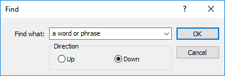

[🏠 Document Start](../README.md) / [User Interface](README.md) / Main Menu

[Previous](README.md) | [Next](Toolbar.md)

# Main Menu (#main-menu)

The main menu contains various commands to control the manager terminal and work in it, user's guide, info about the program, as well as links to useful resources.

## File (#file)

| Command | Description  
 | Connect | [Connect](../MetaTrader-5-Manager/Connecting-to-the-Server.md) to the server.  
 | Disconnect | Disconnect from the server.  
 | Start Dealing | Start accepting and processing trade requests coming from clients. You are automatically moved to the [Dealer](../Dealing-and-Risk-Management/Dealing.md) tab.  
 | Stop Dealing | Switch to "offline" mode and no longer accept clients' trade requests.  
 | New Account | [New account](../Clients-and-Trading-Accounts/Creation-of-Accounts.md).  
 | Export... | [Export](../MetaTrader-5-Manager/For-Advanced-Users/Data-Export.md) data from a selected section: [Online Users](../Clients-and-Trading-Accounts/Online-Accounts.md), [Accounts](../Clients-and-Trading-Accounts/README.md), [Positions](../Trading-Operations/Working-with-Trading-Positions.md) or [Orders](../Trading-Operations/Working-with-Trading-Orders.md).  
 | Open Data Folder | Open the folder [the Manager terminal data](../MetaTrader-5-Manager/For-Advanced-Users/Files-and-Folders.md) is stored in.  
 | Print... | Go to printing the information displayed on the selected tab, for example — accounts or orders.  
 | Print Preview | View information before printing. Settings of a selected printer are used for it. Using this command you can check if all the data will be printed correctly before you print them.  
| Print Setup... | Configure print settings — a printer, paper size, page orientation etc.  
| Exit | Close the Manager terminal.  
  

## Edit (#edit)

| Command | Description  
 | Copy | Copy the selected item to clipboard.  
 | Find | Open the search window. Search in the current section allows you to find items in the selected section (Online Users, Accounts, Orders or Positions). After executing the command, the following window appears:  It contains the following parameters:

  * Find what — field to enter a search word or phrase.

  * Direction — search direction from the current cursor position: upwards or downwards. The search is performed from the currently selected element on the tab in a set direction.

  
 | Find Next | Find the next item for the current search query.  
  

## View (#view)

| Command | Description  
| Languages | Select the Manager terminal interface language. For the changes to take effect, restart the program.  
| Color Themes | Select a color theme for the terminal interface: light or dark.  
| Toolbar | Show/hide the [toolbar](Toolbar.md).  
| Market Depth | Open the submenu that allows showing windows of the [Depth of Market](../Trading-Operations/Market-Depth.md) for symbols, for which this function is available.  
 | Market Watch | Show/hide the [Market Watch](../Trading-Operations/Market-Watch.md) window.  
 | Navigator | Show/hide the [Navigator](Navigator.md) window.  
 | Margin Call | Show/hide the [Margin Call](../Dealing-and-Risk-Management/Accounts-with-Margin-CallStop-Out.md) window.  
 | Queue | Show/hide the [Queue](../Dealing-and-Risk-Management/Queue-of-Trade-Requests.md) window.  
 | Toolbox | Show/hide the [Toolbox](Toolbox.md) window.  
 | Fullscreen | Enable/disable the full screen mode. As soon as this option is enabled, toolbars and status bar are disabled and all signal windows are closed. Only accounts and trades management area remains on the screen. The repeated execution of the command returns the terminal to the initial appearance.  
  

## Tools (#tools)

| Command | Description  
 | Options | Open the window of the Manager terminal [configuration](../MetaTrader-5-Manager/Terminal-Settings.md).  
  

## Window (#window)

| Command | Description  
 | Reports | Go to the [Reports](../Server-Reports/README.md) tab.  
 | Online Users | Go to the [Online Users](../Clients-and-Trading-Accounts/Online-Accounts.md) tab.  
 | Accounts | Go to the tab [Accounts](../Clients-and-Trading-Accounts/README.md).  
 | Positions | Go to the tab [Positions](../Trading-Operations/Working-with-Trading-Positions.md).  
 | Orders | Go to the tab [Orders](../Trading-Operations/Working-with-Trading-Orders.md).  
 | Dealer | Go to the tab [Dealer](../Dealing-and-Risk-Management/Dealing.md).  
 | Reports | Go to the [Reports](../Server-Reports/README.md) tab.  
 | Groups | Show/hide the [Groups](../Managing-Trade-Server-Settings/Spread-Commission-and-Swap.md) window.  
 | Plugins | Show/hide the [Plugins](../Managing-Trade-Server-Settings/Managing-Plugins.md) window.  
 | Log | Go to the [Journal](../Managing-Trade-Server-Settings/Trade-Server-Journal.md) tab.  
  

## Help (#help)

| Command | Description  
| Help Topics | Open the Manager terminal Help.  
| MetaQuotes Ltd. | Go to [MetaQuotes Ltd.](https://www.metaquotes.net/) website.  
| MetaQuotes Support | Go to [technical support website](https://support.metaquotes.net "Technical support") of MetaQuotes Software Corp.  
| MQL5.community | Go to the [MQL5.Community](https://www.mql5.com) website of the community of trading application developers.  
 | About MetaEditor... | Open the Manager terminal info window. It displays the Manager terminal version and its release date.
