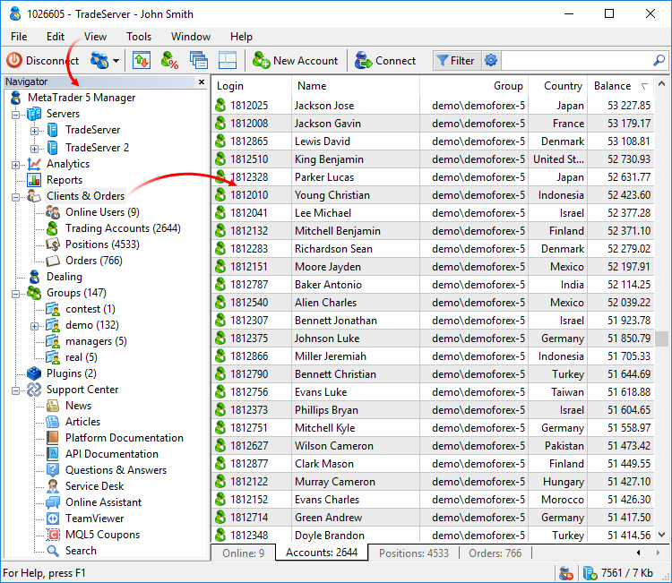

[🏠 Document Start](../README.md) / [User Interface](README.md) / Navigator

[Previous](Toolbox.md) | [Next](Status-Bar.md)

# Navigator

The Navigator window allows you to conveniently switch between various sections of the Manager terminal. You can quickly go to [reports](../Server-Reports/README.md), [client list](../Clients-and-Trading-Accounts/README.md), [group](../Managing-Trade-Server-Settings/Spread-Commission-and-Swap.md) settings, [plugins](../Managing-Trade-Server-Settings/Managing-Plugins.md), etc. If you have several manager accounts on different servers, Navigator allows you to conveniently switch between them. 

Press Ctrl+D or select the " Navigator" command in the [View (#view)](Main-Menu.md#view) menu.

The Navigator also provides access to the [technical support](../Technical-Support/README.md) section. There you can find complete documentation on the platform and useful articles, as well as contact developers via the online chat or Service Desk in case of an issue.
