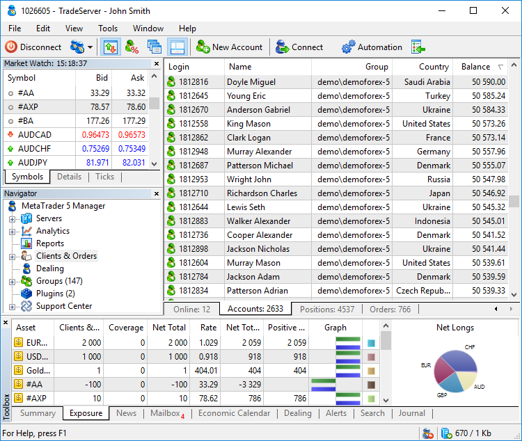
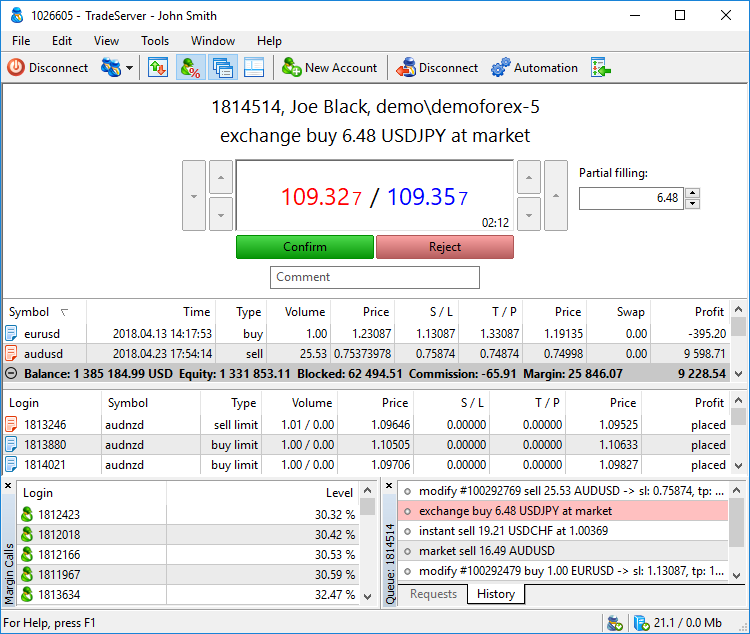

[🏠 Document Start](../README.md) / User Interface

[Previous](../MetaTrader-5-Manager/For-Advanced-Users/Terminal-Deinstallation.md) | [Next](Main-Menu.md)

# User Interface

The MetaTrader 5 Manager interface provides access to all the necessary tools for managers and dealers. It includes various menus, toolbars, and service windows. Almost all Manager terminal commands have [hot keys](Hot-Keys.md) to accelerate the work.

### Main menu

The [main menu](Main-Menu.md) provides commands for managing the terminal and working in it: enabling/disabling a dealer, configuring the terminal view, switching between windows and various interface languages, etc.

### Toolbox

[Toolbox](Toolbar.md) allows you to conveniently arrange the work in the terminal. Add here the most frequently used commands to execute them in a single click. Also, the toolbox features the [search (#search)](Toolbar.md#search) along the entire Manager terminal.

### Market Watch

The [Market Watch](../Trading-Operations/Market-Watch.md) window allows viewing price data by trading symbols: quotes, price statistics and tick chart.

### Navigator

From the ["Navigator"](Navigator.md), you can easily switch between the Manager terminal sections: reports, accounts, dealing, as well as groups and plugins settings. Also, from the Navigator, you can go to the [technical support](../Technical-Support/README.md) section.

### Online Users

The list of [accounts currently connected to the trade server](../Clients-and-Trading-Accounts/Online-Accounts.md).

### Accounts

The total list of [accounts](../Clients-and-Trading-Accounts/README.md) available to the current manager.

### Positions

The list of all [open positions](../Trading-Operations/Working-with-Trading-Positions.md) of clients available to the current manager.

### Orders

The list of all [existing pending orders](../Trading-Operations/Working-with-Trading-Orders.md) of clients available to the current manager.

### Toolbox

This multi-purpose window allows viewing [summary positions](../Dealing-and-Risk-Management/Summary-Positions-and-Coverage.md) and [client assets](../Dealing-and-Risk-Management/Exposure.md) and provides access to [news (#news)](Toolbox.md#news), [emails (#mail)](Toolbox.md#mail) and [economic calendar](../Trading-Operations/Economic-Calendar.md).

It also allows you to configure [notifications on market events](../Trading-Operations/Trading-Notifications.md), view the [search (#search)](Toolbar.md#search) results and [terminal journal (#journal)](Toolbox.md#journal).

### Status bar

The [status bar](../Trading-Operations/Working-with-Trading-Orders.md) displays auxiliary data: command prompts, server connection status and dealer mode connections.

The manager terminal interface is highly customizable. You can choose to display only the tools that are currently needed. For example, you may hide [Market Watch](../Trading-Operations/Market-Watch.md) and [Depth of Market](../Trading-Operations/Market-Depth.md), and show [Margin Call](../Dealing-and-Risk-Management/Accounts-with-Margin-CallStop-Out.md) and [Queue](../Dealing-and-Risk-Management/Queue-of-Trade-Requests.md) windows.

### Program header

Active account, server and manager names are specified here.

### Processing client requests

A dealer may reject a trade request or execute it partially or fully. A request can be requoted or executed at the changed price within the deviation the client agrees to.

### Client's trading status

When receiving a request, the dealer immediately sees the client account status: all open positions and pending orders, as well as the overall financial status.

### Orders and positions closest to the market

The dealer always has data on positions and orders that are close to the market price. Stop loss and take profit levels of positions are tracked, as is the order price of pending orders.

### Margin Call

A separate window displays a list of accounts located close to Margin Call and Stop Out states.

### Request queue

The list of trade requests waiting to be processed by the dealer is displayed in a separate window. Here you can also view the history of trade requests of clients whose request is currently being processed.
