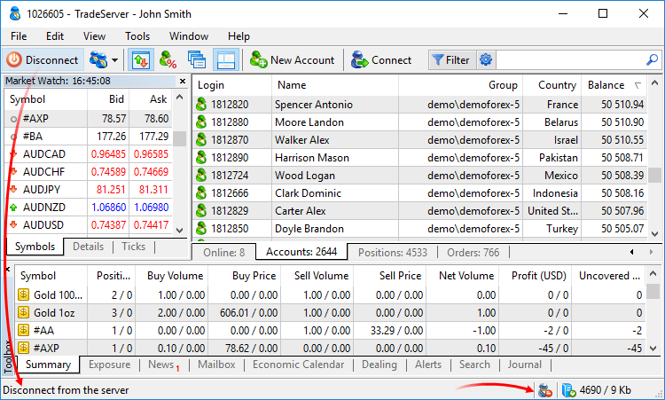
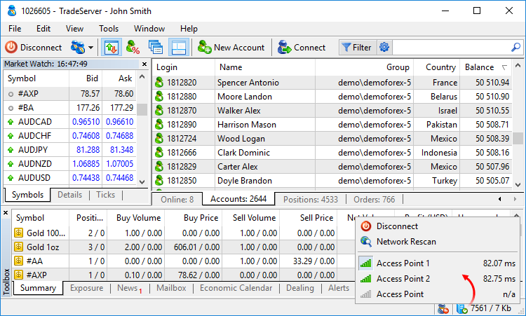

[🏠 Document Start](../README.md) / [User Interface](README.md) / Status Bar

[Previous](Navigator.md) | [Next](Hot-Keys.md)

# Status Bar (#status-bar)

A status bar is located at the bottom of the manager terminal window. It contains hints of the program commands, status of connection to the server and the amount of sent and received data:

From left to right the following information is shown in the bar:

  * Command tips.
  * Connection status of the [dealer](../Dealing-and-Risk-Management/Dealing.md). Icon  means that the dealer is currently connected and can process trade requests. If a dealer is disabled, icon  is displayed.
  * Status of connection to a trade server. Icon  means that the terminal is currently connected to the server. If connection to the terminal is not established, icon  is displayed. Hover over the icon to view additional connection details: ping to the trade server and packet loss. These variables measure connection quality between the terminal and the server.
  * Amount of incoming and outgoing traffic for the current session.

The status bar can be disabled by removing the check mark at the corresponding item of the [View (#view)](Main-Menu.md#view) menu.

## Menu of switching between access points (#access-servers)

The Manager terminal is connected to the trade server through special access servers that are part of the trading platform. When connecting, the best access point is chosen (the least server load and the best quality of connection). The automatic checking of best access point is performed every three hours of working.

You can also switch between access servers using the menu that is opened by clicking on the connection status or traffic data in the status bar:

The menu contains the following commands

  *  Connect/ Disconnect — [connect](../MetaTrader-5-Manager/Connecting-to-the-Server.md) or disconnect from the server.
  *  Network Rescan — manually start scanning of access points. If a server with connection quality better than the current one by 30% is found, it is automatically switched to it.
  * List of access servers — all available access servers are displayed below. The indicator of the server quality is shown before the name of each access server. To switch to one of the access points, click its name. During the next scanning of the network, the best server is automatically chosen.

