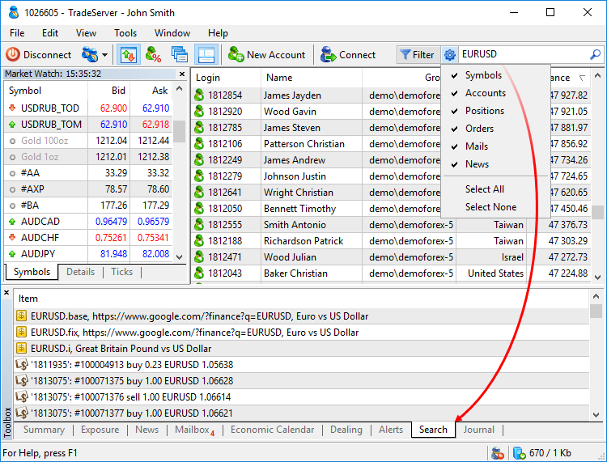
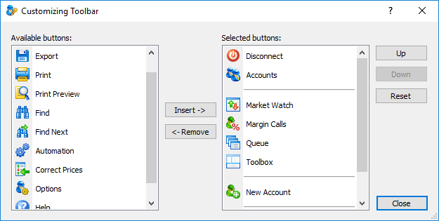

[🏠 Document Start](../README.md) / [User Interface](README.md) / Toolbar

[Previous](Main-Menu.md) | [Next](Toolbox.md)

# Toolbar (#toolbar)

The toolbar is a part of the interface of the Manager terminal. It allows organizing the work in a convenient way and find data in the terminal. A set of toolbar commands is customizable.

| Command | Description  
 | Connect | [Connect](../MetaTrader-5-Manager/Connecting-to-the-Server.md) to the server.  
 | Disconnect | Disconnect from the server.  
 | Accounts | Open the sub-menu of switching between manager accounts. It displays all the accounts that were used for connecting to the server from this terminal.  
 | Export... | [Export](../MetaTrader-5-Manager/For-Advanced-Users/Data-Export.md) data from a selected section: [Online Users](../Clients-and-Trading-Accounts/Online-Accounts.md), [Accounts](../Clients-and-Trading-Accounts/README.md), [Positions](../Trading-Operations/Working-with-Trading-Positions.md) or [Orders](../Trading-Operations/Working-with-Trading-Orders.md).  
 | Print... | Go to printing the information displayed on the selected tab, for example — accounts or orders.  
 | Print Preview | View information before printing. Settings of a selected printer are used for it. Using this command, you can check if all the data will be printed correctly before you print them.  
 | Find | Open the search window.  
 | Find Next | Find the next item for the current search query.  
 | Market Watch | Show/hide the [Market Watch](../Trading-Operations/Market-Watch.md) window.  
 | Margin Call | Show/hide the [Margin Call](../Dealing-and-Risk-Management/Accounts-with-Margin-CallStop-Out.md) window.  
 | Queue | Show/hide the [Queue](../Dealing-and-Risk-Management/Queue-of-Trade-Requests.md) window.  
 | Toolbox | Show/hide the [Toolbox](Toolbox.md) window.  
 | New Account | [New account](../Clients-and-Trading-Accounts/Creation-of-Accounts.md).  
 | Start Dealing | Start accepting and processing trade requests coming from clients. You are automatically moved to the [Dealer](../Dealing-and-Risk-Management/Dealing.md) tab.  
 | Stop Dealing | Switch to "offline" mode and no longer accept clients' trade requests.  
 | Automation | Enable/disable [automatic processing of trade requests (#automation)](../Dealing-and-Risk-Management/Dealing.md#automation) in accordance with [settings (#automation)](../MetaTrader-5-Manager/Terminal-Settings.md#automation) of the Manager terminal.  
 | Correct Prices | [Automatically throw quotes (#prices)](../MetaTrader-5-Manager/Terminal-Settings.md#prices) in the price flow when replying to a trade request. The prices, at which a request is executed, are thrown to the flow.  
 | Options | Open the window of the Manager terminal [configuration](../MetaTrader-5-Manager/Terminal-Settings.md).  
 | Help | Switch the cursor to the context help mode. When executing the command, a question mark appears at the end of the mouse cursor. After that, click on any element of the terminal interface to view the help on it.  
  

## Find (#search)

This part of the toolbar allows having a global search in the Manager terminal.

Enter the search word or phrase and press Enter or .

In order to sort out the terminal sections to search in, click . Then select the desired items in the list. Click Select All or Select None to select or deselect all points, accordingly.

  * Results of the global search are displayed on the [Search (#search)](Toolbox.md#search) tab of the Toolbox window.
  * If the terminal detects that a specific account number is requested in search, it automatically opens the account viewing window.

  
---  
  

## Setup (#settings)

To change a set of commands on the toolbar, click Customize... in its context menu.

To add a command to the toolbar, move it from the left part of the window to the right one: double click and drag it (Drag'n'Drop) or select it and click Insert. To remove a command, perform the same action on the right part of the window.

To change the order of commands, drag them or use Up and Down buttons. To return to the default settings, click Reset.

A separating line is also available among the commands. Adding it, one can divide toolbar buttons into groups.

> If you remove all the buttons from the list of selected ones and close the toolbar setup window, the default set of commands is restored.
