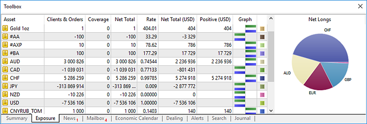
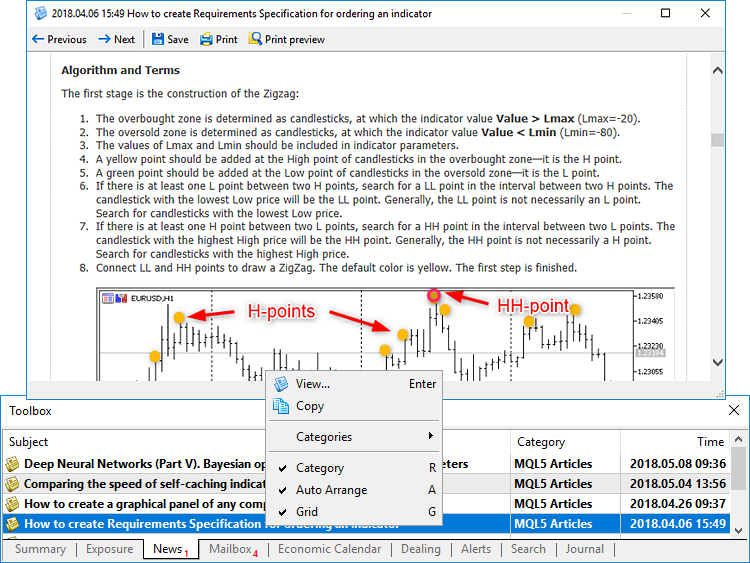
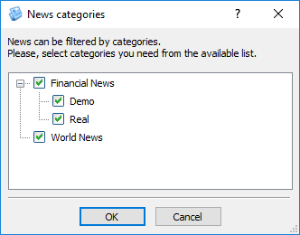
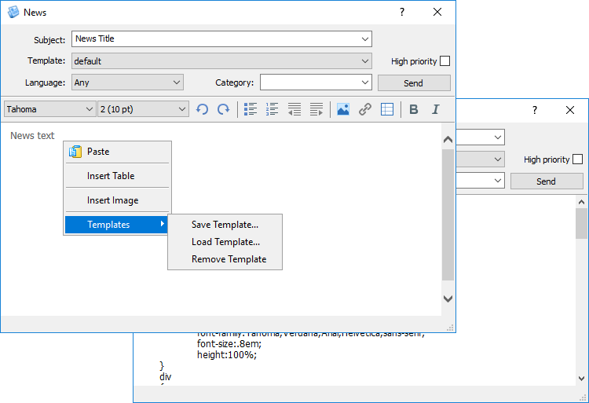
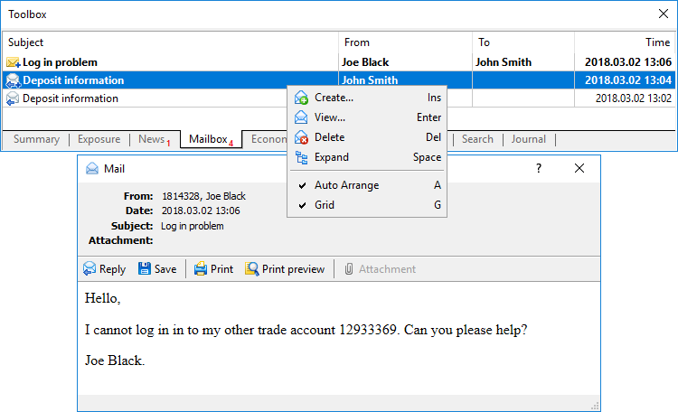
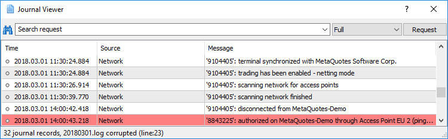
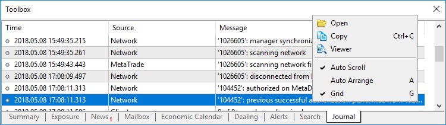

[🏠 Document Start](../README.md) / [User Interface](README.md) / Toolbox

[Previous](Toolbar.md) | [Next](Navigator.md)

# Toolbox (#toolbox)

Toolbox is a multi-functional window. It is used for risk management and allows viewing [summary positions](../Dealing-and-Risk-Management/Summary-Positions-and-Coverage.md) and [client assets](../Dealing-and-Risk-Management/Exposure.md). It also provides access to news, emails and [economic calendar](../Trading-Operations/Economic-Calendar.md).

In the Toolbox window, managers can configure [notifications on market events](../Trading-Operations/Trading-Notifications.md), view search results, as well as [journal of trade request processing (#journal)](../Dealing-and-Risk-Management/Dealing.md#journal) and terminal operation.

You can show or hide this window using the " Toolbox" command of the [View (#view)](Main-Menu.md#view) window or on the [toolbar](Toolbar.md).

## Summary positions (#summary)

The Summary Positions tab contains data on client's summary open positions grouped by financial symbols. More detailed information can be found in the [appropriate section](../Dealing-and-Risk-Management/Summary-Positions-and-Coverage.md).

## Exposure (#exposure)

The Exposure tab contains the assets of clients and the covered assets of a company grouped by currencies. More detailed information can be found in the [appropriate section](../Dealing-and-Risk-Management/Exposure.md).

## News (#news)

Here you can read incoming news.

News messages that have not been read yet are displayed in bold and are marked with icon . Read news have icon . Icon  means that the news has a high priority. Double-click its name to read it. In the news preview window, there are several commands available on the toolbar. They allow you to scroll through the news, save them as HTML files (in Unicode format), as well as print them.

Release time and category is displayed for each news. Use the context menu to select the category of displayed news. Go to the Categories submenu, select the necessary ones from the list and click Settings.

### Sending news (#news-send)

  * Only managers with sufficient rights can distribute news. Such rights can be granted by a trading platform administrator.
  * News can be sent only when connected to the main trade server.

  
---  
  
To send news, click " New" in the context menu.

The news creation window contains the following fields:

  * Subject — news subject.
  * Template — any news can be saved as a template using the context menu. For example, you can save a typical maintenance works news as a template. To get a ready-made news afterwards, simply select the template in this field.
  * High Priority — if enabled, the news will have a high priority. High priority news are marked with a special icon .
  * Language — in client and manager terminals, you can [configure the language (#news-language)](../MetaTrader-5-Manager/Terminal-Settings.md#news-language) of incoming news. A user can choose to receive news on one of the languages. Specify a language in this field if you want to send news to a specific language group of users. If Any is set, news is sent to all users regardless of their terminal settings.
  * Category — news category name. To create a subcategory, specify its name with the "\" character after the title of the main category. For example, "Financial news\Free".

Below is a window for working with the news text. Commands for creating lists and inserting images, links and tables, etc. are available in the editor. To view or edit the source HTML code of the news, click  on the toolbar.

The context menu of the text editing window contains standard commands for working with the text: Copy, Cut, Paste, Insert Hyperlink, Insert Table and Insert Image. From the context menu, you can also work with news templates.

### News templates (#news-template)

The Templates submenu on the context menu of the news editing window allows working with templates:

  * Save Template — save the current news text as a template in the *.htm format. All news templates are stored in [/templates/news (#news-templates)](../MetaTrader-5-Manager/For-Advanced-Users/Files-and-Folders.md#news-templates) folder of the Manager terminal.
  * Load Template — open a window for selecting a previously saved template.
  * Remove Template — delete the currently selected template. Be careful, the template is deleted from your computer permanently.

## Mailbox (#mail)

The trading platform contains the internal mail system. It allows you to receive important information from your broker: information about open accounts, useful information about the platform features, upcoming events, etc. Clients can also send emails to managers via the system.

All the emails are displayed in the Mailbox tab of the Toolbox window.

Unread messages are marked with icon , read ones — . Outgoing emails are marked with icon . When the function of response to an email is used, messages are joint into threads, which makes it easy to navigate in conversations with clients. Email threads are marked with icon . Click on it to expand the chain.

To read an email, click on its title in the list. In the email view window, there are several commands available on the toolbar. They allow you to reply to an email, save it as HTML files (in Unicode format), as well as print it. If files are attached to an email, you can open them by selecting " Attachment".

  * A name of a mailbox should be specified in a manager's account on the trade server for sending emails. Also, the manager should have sufficient permissions. Contact the platform administrator to configure the account.

  * Emails are stored on the trade server. If an email is deleted in the terminal interface, it will not be re-downloaded. However, if you delete the mail base of the terminal (the "/bases/server_name/mail/mail-account_number.dat" file) or connect using another terminal, all the mails for the last 30 days are downloaded again.
  * [Configure the directory (#server)](../MetaTrader-5-Manager/Terminal-Settings.md#server) email attachments to be saved to. When you open an attached file, the terminal checks its extension and the correspondence of file contents to this extension. If the file type is allowed and its contents is checked, the terminal opens the file and saves it to the specified directory. Otherwise, a warning is displayed, notifying that the file may harm the computer, and it is not saved. The following file types are allowed: PNG, JPG/JPEG, BMP, ZIP, 7Z, GIF, DOC, XLS, DOCX, XSLX, ODT, RTF, CSV, TXT and LOG.  
If a file with the same name and a different content exists in the directory, the manager's login and email arrival date/time up to a second will be added to the saved file name: [login]-[file name]-[date and time].[extension]. For example, the log file 20170501.log will be saved as 1001-20170501-20170502-170038.log.  
By default, files are saved to C:\Users\\[Windows username]\Downloads\MetaTrader.

  
---  
  

### Viewing attached log files (#journal-viewer)

If a log file (file with *.log extension) is attached to a client's email, it can be viewed using a special viewer. To do this, just click on the file name in the email header.

A search bar (search is performed by exact words, case sensitive) and the filter of entries (Full, No connection, Errors only) are available at the top of the window. Enter a word to search for and click Request.

> If a client has manually changed any of the journal entries, all records starting from it will be highlighted in red. When trying to save such a file, you will see a warning of what line of the file has been changed.

### Sending emails (#mail-send)

Check out the [Push notifications, SMS and emails](../Clients-and-Trading-Accounts/Push-Notifications-SMS-and-Mail.md) sections for further details about how to contact traders via emails.

## Find (#search)

Results of the [global search (#search)](Toolbar.md#search) through the Manager terminal are displayed on this tab.

To view the found element, double-click on it or execute the Open command in the context menu. You will be moved to the appropriate section of the terminal.

## Log (#journal)

The Journal tab contains information about all manager actions in the Manager terminal: launch, connection to server, trade operations, etc. The tab displays events that occurred during the current server connection session only. To see previous entries, click  Open in the context menu.

Journal logs are represented in a table with the following fields:

  * Time — event date and time.
  * Source — event type: Network, server name (event related to the trade server), LiveUpdate (auto update), etc.
  * Message — event description.

Events are divided into several types and marked by special icons:

  *  — information message.
  *  — warning.
  *  — error message.

Press Ctrl+C or executed the " Copy" command in the context menu to copy an entry to clipboard.
